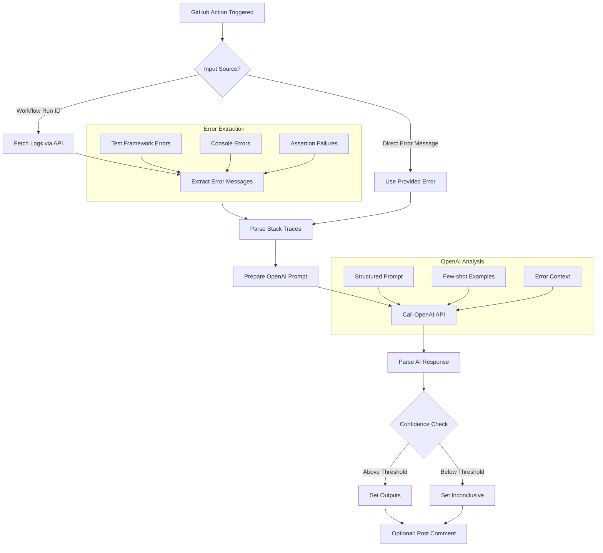

# Adept Triage Agent GitHub Action - Implementation Plan

## Overview

AI-powered GitHub Action that analyzes test failures to determine whether they are test issues or product issues, without requiring source code access.

## 1. Repository Structure

```
adept-triage-agent/
├── .github/
│   └── workflows/
│       ├── test.yml           # Test the action itself
│       └── release.yml        # Auto-release workflow
├── src/
│   ├── index.ts              # Main entry point
│   ├── analyzer.ts           # Core triage logic
│   ├── openai-client.ts     # OpenAI API wrapper
│   └── types.ts              # TypeScript interfaces
├── dist/                     # Compiled JavaScript
├── action.yml                # Action metadata
├── package.json
├── tsconfig.json
├── .gitignore
├── README.md
└── LICENSE
```

## 2. Action Configuration (action.yml)

```yaml
name: 'Adept Triage Agent'
description: 'AI-powered test failure triage to determine if failures are test or product issues'
author: 'Adept'
branding:
    icon: 'search'
    color: 'blue'

inputs:
    GITHUB_TOKEN:
        description: 'GitHub token for API access'
        required: false
        default: ${{ github.token }}
    OPENAI_API_KEY:
        description: 'OpenAI API key for AI analysis'
        required: true
    ERROR_MESSAGE:
        description: 'Error message to analyze (optional if using workflow artifacts)'
        required: false
    WORKFLOW_RUN_ID:
        description: 'Workflow run ID to fetch logs from'
        required: false
    JOB_NAME:
        description: 'Specific job name to analyze'
        required: false
    CONFIDENCE_THRESHOLD:
        description: 'Minimum confidence level for verdict (0-100)'
        required: false
        default: '70'

outputs:
    verdict:
        description: 'TEST_ISSUE or PRODUCT_ISSUE'
    confidence:
        description: 'Confidence score (0-100)'
    reasoning:
        description: 'Detailed explanation of the decision'
    summary:
        description: 'Brief summary for PR comments'
```

## 3. Core Analysis Flow



## 4. OpenAI Integration Strategy

### Prompt Engineering Approach

```typescript
interface TriagePrompt {
    systemPrompt: string;
    errorContext: {
        errorMessage: string;
        stackTrace?: string;
        testFramework?: string;
        failureType?: string;
    };
    examples: FewShotExample[];
}
```

### Analysis Categories

- **Test Issues**: Timing problems, test data issues, mock failures, assertion logic errors
- **Product Issues**: Logic errors, missing implementations, API changes, runtime exceptions

## 5. Key Features to Implement

### Phase 1: Core Functionality

1. **Error Extraction**
    - Support for multiple test frameworks (Jest, Mocha, Cypress, etc.)
    - Stack trace parsing
    - Error message normalization

2. **OpenAI Analysis**
    - Structured prompts with few-shot learning
    - Response validation
    - Confidence scoring based on AI certainty

3. **Output Generation**
    - Clear verdict with reasoning
    - Actionable recommendations
    - Markdown-formatted summaries

### Phase 2: Enhanced Features

1. **Pattern Recognition**
    - Common error pattern library
    - Framework-specific knowledge base
    - Historical analysis caching

2. **Integration Options**
    - PR comment posting
    - Issue creation
    - Slack/Discord notifications

## 6. Technical Implementation Details

### Error Processing Pipeline

```
Raw Logs → Error Detection → Stack Trace Extraction →
Context Building → AI Analysis → Verdict Generation
```

### OpenAI API Configuration

- Model: GPT-4 (with fallback to GPT-3.5)
- Temperature: 0.3 (for consistency)
- Max tokens: 1500
- Response format: JSON structured output

## 7. Usage Scenarios

### Scenario 1: Direct Error Analysis

```yaml
- uses: adept-at/adept-triage-agent@v1
  with:
      OPENAI_API_KEY: ${{ secrets.OPENAI_API_KEY }}
      ERROR_MESSAGE: ${{ steps.test.outputs.error }}
```

### Scenario 2: Workflow Log Analysis

```yaml
- uses: adept-at/adept-triage-agent@v1
  with:
      OPENAI_API_KEY: ${{ secrets.OPENAI_API_KEY }}
      WORKFLOW_RUN_ID: ${{ github.event.workflow_run.id }}
      JOB_NAME: 'cypress-tests'
```

### Scenario 3: Complete Workflow Integration

```yaml
name: Test and Triage
on: [pull_request]

jobs:
    test:
        runs-on: ubuntu-latest
        steps:
            - uses: actions/checkout@v3
            - name: Run Tests
              id: test
              continue-on-error: true
              run: npm test

            - name: Triage Failure
              if: failure()
              uses: adept-at/adept-triage-agent@v1
              id: triage
              with:
                  OPENAI_API_KEY: ${{ secrets.OPENAI_API_KEY }}
                  WORKFLOW_RUN_ID: ${{ github.run_id }}

            - name: Comment on PR
              if: failure()
              uses: actions/github-script@v6
              with:
                  script: |
                      github.rest.issues.createComment({
                        issue_number: context.issue.number,
                        owner: context.repo.owner,
                        repo: context.repo.repo,
                        body: `## 🔍 Test Failure Triage
                        
                        **Verdict:** ${{ steps.triage.outputs.verdict }}
                        **Confidence:** ${{ steps.triage.outputs.confidence }}%
                        
                        ${{ steps.triage.outputs.summary }}`
                      });
```

## 8. Development Phases

### Week 1-2: Foundation

- Set up repository structure
- Implement basic error extraction
- Create OpenAI client wrapper
- Build core triage logic

### Week 3: Testing & Refinement

- Add comprehensive test suite
- Fine-tune prompts with real-world examples
- Implement confidence scoring
- Create example workflows

### Week 4: Polish & Release

- Documentation and examples
- GitHub Marketplace preparation
- Performance optimization
- Security review

## 9. Success Metrics

1. **Accuracy**: >80% correct classifications
2. **Confidence**: Average confidence >75%
3. **Speed**: Analysis under 30 seconds
4. **Adoption**: Usage in 10+ repositories within first month

## 10. Risk Mitigation

1. **API Rate Limits**: Implement caching and queuing
2. **Cost Management**: Token usage optimization
3. **False Positives**: Confidence thresholds and human review options
4. **Security**: No source code exposure, only error analysis

## 11. Differentiation from Existing Tools

Unlike existing solutions that focus on flaky test detection or general failure analysis, this action:

- Provides immediate, actionable classification
- Works with any test framework
- Requires no historical data or training
- Integrates seamlessly with existing workflows
- Focuses specifically on the test vs. product question

## 12. Example Implementation Structure

### src/index.ts (Main Entry Point)

```typescript
import * as core from '@actions/core';
import { Octokit } from '@octokit/rest';
import { analyzeFailure } from './analyzer';
import { OpenAIClient } from './openai-client';

async function run() {
    try {
        // Get inputs
        const githubToken = core.getInput('GITHUB_TOKEN');
        const openaiKey = core.getInput('OPENAI_API_KEY');
        const errorMessage = core.getInput('ERROR_MESSAGE');
        const workflowRunId = core.getInput('WORKFLOW_RUN_ID');

        // Initialize clients
        const octokit = new Octokit({ auth: githubToken });
        const openaiClient = new OpenAIClient(openaiKey);

        // Get error data
        const errorData = await getErrorData(octokit, errorMessage, workflowRunId);

        // Analyze with AI
        const result = await analyzeFailure(openaiClient, errorData);

        // Set outputs
        core.setOutput('verdict', result.verdict);
        core.setOutput('confidence', result.confidence);
        core.setOutput('reasoning', result.reasoning);
        core.setOutput('summary', result.summary);
    } catch (error) {
        core.setFailed(`Action failed: ${error.message}`);
    }
}

run();
```

### src/analyzer.ts (Core Logic)

```typescript
import { OpenAIClient } from './openai-client';
import { AnalysisResult, ErrorData } from './types';

export async function analyzeFailure(client: OpenAIClient, errorData: ErrorData): Promise<AnalysisResult> {
    // Prepare the prompt
    const prompt = buildPrompt(errorData);

    // Get AI analysis
    const response = await client.analyze(prompt);

    // Parse and validate response
    const result = parseResponse(response);

    // Calculate confidence
    const confidence = calculateConfidence(result, errorData);

    return {
        verdict: result.verdict,
        confidence,
        reasoning: result.reasoning,
        summary: generateSummary(result)
    };
}

function buildPrompt(errorData: ErrorData): string {
    return `
        Analyze this test failure and determine if it's a TEST_ISSUE or PRODUCT_ISSUE.
        
        Error: ${errorData.message}
        Stack Trace: ${errorData.stackTrace}
        Test Framework: ${errorData.framework}
        
        Consider:
        - Is the error in test setup/assertions?
        - Does it indicate product code failure?
        - Are there timing/async issues?
        
        Respond with JSON: {
            "verdict": "TEST_ISSUE" or "PRODUCT_ISSUE",
            "reasoning": "explanation",
            "indicators": ["list", "of", "key", "indicators"]
        }
    `;
}
```

### src/openai-client.ts

```typescript
import { Configuration, OpenAIApi } from 'openai';

export class OpenAIClient {
    private openai: OpenAIApi;

    constructor(apiKey: string) {
        const configuration = new Configuration({ apiKey });
        this.openai = new OpenAIApi(configuration);
    }

    async analyze(prompt: string): Promise<any> {
        const response = await this.openai.createChatCompletion({
            model: 'gpt-4',
            messages: [
                {
                    role: 'system',
                    content: 'You are an expert at analyzing test failures...'
                },
                {
                    role: 'user',
                    content: prompt
                }
            ],
            temperature: 0.3,
            max_tokens: 1500,
            response_format: { type: 'json_object' }
        });

        return JSON.parse(response.data.choices[0].message.content);
    }
}
```

## 13. Example Error Patterns

### Test Issues

```
- "Cannot read property 'X' of undefined" in test setup
- "Timeout waiting for element" in UI tests
- "Mock function not called" assertions
- "Test data file not found"
- Race conditions in async test code
```

### Product Issues

```
- "500 Internal Server Error" from API calls
- "Database connection failed"
- "Required field missing" validation errors
- "Method not implemented" exceptions
- Business logic assertion failures
```

## 14. Future Enhancements

1. **Machine Learning Integration**
    - Train custom models on organization's test data
    - Pattern learning from historical verdicts

2. **Advanced Analytics**
    - Trend analysis across test suites
    - Predictive failure analysis
    - Test quality metrics

3. **Ecosystem Integration**
    - VS Code extension
    - CLI tool for local development
    - Browser extension for GitHub UI

This simplified approach removes the complexity of source code analysis while still providing valuable insights through AI-powered error interpretation.
