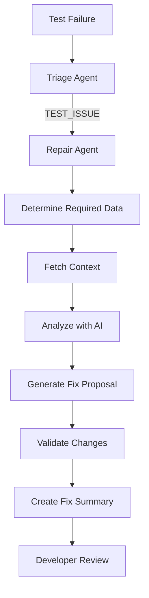

# Repair Agent MVP - Fix Summary Generation

## Overview

The Repair Agent MVP provides automated fix proposals for failing Cypress tests without creating pull requests. This approach prioritizes safety and human review while delivering immediate value to developers.

## What's Implemented

### Phase 1 ✅ Complete
- **RepairContext Type System**: Full type definitions for repair context
- **Error Classification**: Automatic categorization of error types (ELEMENT_NOT_FOUND, TIMEOUT, etc.)
- **Selector Extraction**: Intelligent extraction of selectors from error messages
- **Integration with Triage Agent**: Seamless handoff from triage to repair

### Phase 2 ✅ Complete  
- **Modular Architecture**:
  - `ContextFetcher`: Determines and fetches only required data
  - `SearchStrategy`: AI-driven search for finding fixes
  - `RepairEngine`: Core repair logic with evidence validation
  - `RepairValidator`: Ensures proposed fixes are safe
  - `GitHubIntegration`: PR creation capability (disabled in MVP)
  
### MVP Features 🎯
- **Fix Summary Generation**: Human-readable proposals with:
  - Clear problem description
  - Proposed code changes with diffs
  - Confidence scores
  - Evidence supporting the fix
  - Step-by-step implementation guide
- **Smart Context Fetching**: Only retrieves data needed for the specific error type
- **Evidence-Based Repairs**: All fixes must have traceable evidence
- **Validation**: Proposed changes are validated for syntax and best practices

## How It Works



## Usage

### Basic Test

Run the MVP demonstration:
```bash
node test-repair-mvp.js
```

This creates a sample fix summary showing how the repair agent would fix a selector issue.

### Real Workflow Test

Test with actual GitHub workflow data:
```bash
# Triage only
node test-repair-agent-e2e.js

# Include repair agent (summary only)
node test-repair-agent-e2e.js --test-repair

# Clean up generated files after
node test-repair-agent-e2e.js --test-repair --cleanup
```

### Integration Example

```javascript
const { RepairAgent } = require('./dist/repair/index');

// Configure repair agent
const config = {
  testRepoToken: process.env.GITHUB_TOKEN,
  appRepoToken: process.env.CROSS_REPO_PAT,
  openaiApiKey: process.env.OPENAI_API_KEY,
  testRepo: 'org/test-repo',
  appRepo: 'org/app-repo',
  minConfidence: 70,
  requireEvidence: true,
  createPr: false, // MVP: Summary only
};

const repairAgent = new RepairAgent(config);

// Attempt repair
const result = await repairAgent.attemptRepair(repairContext);

if (result.canRepair) {
  console.log(result.fixSummary);
  // Developer reviews and applies fix manually
}
```

## Example Output

When a test fails with a selector issue, the repair agent generates:

```markdown
## 🔧 Proposed Fix Summary

### 🔍 Issue Detected
- **Error Type:** ELEMENT_NOT_FOUND
- **Test File:** `cypress/e2e/auth/login.cy.ts`
- **Failed Selector:** `[data-testid='submit-btn']`

### 📊 Analysis Confidence
- **Confidence Level:** 85%
- **Evidence Sources:**
  - Application PR #456 changed selector
  - New selector found in LoginForm.tsx
  - Test previously passed

### 📋 Proposed Changes

#### Change 1: login.cy.ts (Line 42)
**Reason:** Update selector to match application

```diff
- cy.get('[data-testid="submit-btn"]').click()
+ cy.get('[data-testid="submit-button"]').click()
```

### 💡 Recommendation
✅ High confidence fix - Apply and test locally

### 👉 Next Steps
1. Review the proposed changes
2. Apply changes to test file
3. Run test locally
4. Create PR
```

## Benefits of MVP Approach

1. **Safety First**: No automatic code changes or PR creation
2. **Human Review**: Developers maintain control over fixes
3. **Learning Tool**: Teams can understand why tests fail
4. **Quick Value**: Immediate fix proposals without complex setup
5. **Evidence-Based**: All proposals backed by concrete evidence

## Supported Error Types

| Error Type | Detection | Fix Strategy |
|------------|-----------|--------------|
| ELEMENT_NOT_FOUND | ✅ | Find new selector in app |
| ELEMENT_NOT_VISIBLE | ✅ | Check visibility changes |
| TIMEOUT | ✅ | Analyze timing issues |
| ASSERTION_FAILED | ✅ | Compare expected vs actual |
| NETWORK_ERROR | ✅ | Check API changes |
| ELEMENT_DETACHED | ✅ | Handle DOM updates |
| ELEMENT_COVERED | ✅ | Fix overlapping elements |

## Architecture

```
src/repair/
├── index.ts              # Main entry point
├── types.ts              # TypeScript definitions
├── context-fetcher.ts    # Smart data fetching
├── search-strategy.ts    # AI-driven search
├── repair-engine.ts      # Core repair logic
├── validator.ts          # Change validation
└── github-integration.ts # PR creation (future)
```

## Key Design Principles

1. **Minimal Context Passing**: Only essential data flows between agents
2. **Autonomous Operation**: Repair agent fetches what it needs
3. **Evidence Required**: No guessing - fixes must have proof
4. **Progressive Enhancement**: MVP provides value, can add features later

## Limitations (MVP Scope)

- ❌ No automatic PR creation
- ❌ No cross-repository authentication (uses same token)
- ❌ No batch processing of multiple failures
- ❌ No self-learning from successful fixes
- ❌ Limited to Cypress tests only

## Future Enhancements

### Phase 3: Production Ready
- [ ] Real cross-repository token support
- [ ] Metrics collection and reporting
- [ ] Webhook integration for automatic triggering
- [ ] Caching of frequently used data

### Phase 4: Advanced Features
- [ ] Optional automatic PR creation
- [ ] Multi-framework support (Jest, Playwright)
- [ ] Pattern learning from successful fixes
- [ ] Batch processing capabilities
- [ ] Integration with CI/CD pipelines

## Testing

Run the test suite:
```bash
npm test
```

Build the project:
```bash
npm run build
```

## Configuration

### Environment Variables
```bash
# Required
OPENAI_API_KEY=sk-...
GITHUB_TOKEN=ghp_...

# Optional (for cross-repo access)
CROSS_REPO_PAT=ghp_...
```

### Repair Config Options
```typescript
interface RepairConfig {
  testRepoToken: string;      // GitHub token for test repo
  appRepoToken: string;       // Token for app repo (if different)
  openaiApiKey: string;       // OpenAI API key
  testRepo: string;           // Format: "owner/repo"
  appRepo: string;            // Format: "owner/repo"
  minConfidence: number;      // Minimum confidence to propose fix (0-100)
  requireEvidence: boolean;   // Require evidence for fixes
  createPr: boolean;          // Create PR (false for MVP)
  debugMode?: boolean;        // Enable debug logging
}
```

## Metrics

The repair agent tracks:
- **Confidence scores** for each fix proposal
- **Analysis duration** for performance monitoring
- **Data sources used** to understand complexity
- **Evidence quality** to ensure reliable fixes

## Support

For issues or questions:
1. Check the [full design document](REPAIR_AGENT_DESIGN.md)
2. Review [usage guide](USAGE_GUIDE.md)
3. Run the MVP test: `node test-repair-mvp.js`

## Conclusion

The Repair Agent MVP delivers immediate value by providing actionable fix proposals for failing tests. While it doesn't create PRs automatically (by design), it gives developers the information they need to fix tests quickly and confidently.

This approach balances automation with safety, ensuring that teams can benefit from AI-assisted test repair while maintaining full control over their codebase.
