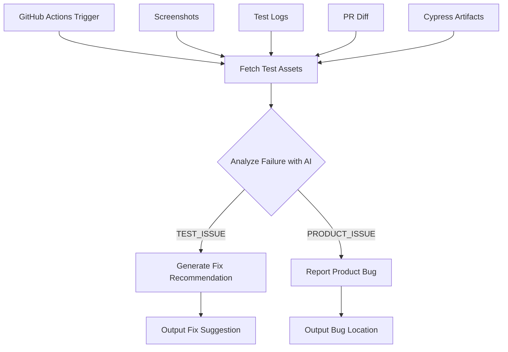

# Triage Agent Workflow & Architecture

## Overview

The Triage Agent is an intelligent GitHub Actions tool that automatically analyzes test failures to determine whether they are caused by **test issues** (problems with the test code itself) or **product issues** (actual bugs in the application). When a test issue is identified, the agent can automatically generate fix recommendations using AI-powered analysis of test assets and PR code diffs.

## Core Workflow



## Detailed Architecture

### 1. Entry Point & Orchestration (`src/index.ts`)

The main orchestrator that coordinates the entire triage process:

```typescript
async function run(): Promise<void> {
  // 1. Initialize clients
  const octokit = new Octokit({ auth: inputs.githubToken });
  const openaiClient = new OpenAIClient(inputs.openaiApiKey);
  const artifactFetcher = new ArtifactFetcher(octokit);
  
  // 2. Gather error data from multiple sources
  const errorData = await getErrorData(octokit, artifactFetcher, inputs);
  
  // 3. Analyze with AI to determine verdict
  const result = await analyzeFailure(openaiClient, errorData);
  
  // 4. If TEST_ISSUE, generate fix recommendation
  if (result.verdict === 'TEST_ISSUE') {
    const repairContext = buildRepairContext({...});
    const repairAgent = new SimplifiedRepairAgent(inputs.openaiApiKey);
    fixRecommendation = await repairAgent.generateFixRecommendation(repairContext, errorData);
  }
}
```

### 2. Test Asset Collection (`src/artifact-fetcher.ts`)

The ArtifactFetcher aggregates multiple data sources to build comprehensive failure context:

#### 2.1 Screenshots Collection

```typescript
async fetchScreenshots(runId: string, jobName?: string): Promise<Screenshot[]>
```

- Downloads artifacts from workflow run
- Extracts screenshot images from ZIP archives
- Filters for relevant screenshots (failure states, errors)
- Encodes images as base64 for multimodal AI analysis

#### 2.2 Cypress Artifact Logs

```typescript
async fetchCypressArtifactLogs(runId: string, jobName?: string): Promise<string>
```

- Retrieves Cypress-specific test artifacts
- Extracts structured test logs
- Parses test execution details
- Captures browser console output

#### 2.3 PR Diff Fetching

```typescript
async fetchPRDiff(prNumber: string, repository?: string): Promise<PRDiff | null>
```

- **Critical for accurate triage**: Fetches the actual code changes
- Retrieves file modifications with patches
- Sorts files by relevance (test files → source files → config)
- Provides context for correlation analysis

**PR Diff Structure:**

```typescript
interface PRDiff {
  files: PRDiffFile[];  // Individual file changes
  totalChanges: number; // Total files modified
  additions: number;    // Lines added
  deletions: number;    // Lines removed
}
```

### 3. Failure Analysis (`src/simplified-analyzer.ts`)

The analyzer uses OpenAI GPT-4.1 to determine the root cause:

#### 3.1 Error Classification Logic

```typescript
export async function analyzeFailure(client: OpenAIClient, errorData: ErrorData): Promise<AnalysisResult>
```

**The analysis considers multiple factors:**

1. **Error Pattern Matching**
   - Timeout errors → Often TEST_ISSUE (synchronization)
   - Network errors (500, 404) → Usually PRODUCT_ISSUE
   - Element not found → Could be either (needs context)
   - Null pointer in app code → PRODUCT_ISSUE
   - Assertion failures → Requires deeper analysis

2. **PR Diff Correlation**
   - If test file modified → Higher chance of TEST_ISSUE
   - If related source files changed → Lean towards PRODUCT_ISSUE
   - Unrelated failures → Likely TEST_ISSUE (flaky test)

3. **Screenshot Analysis**
   - Visible error dialogs → PRODUCT_ISSUE
   - UI rendered but selector fails → TEST_ISSUE
   - Blank/broken UI → PRODUCT_ISSUE
   - Elements covered by overlays → TEST_ISSUE

#### 3.2 Confidence Calculation

```typescript
function calculateConfidence(response: OpenAIResponse, errorData: ErrorData): number {
  let confidence = 70; // Base confidence
  
  // Boost confidence based on available evidence:
  confidence += indicatorCount * 5;      // Clear indicators
  confidence += screenshots ? 10 : 0;     // Visual evidence
  confidence += prDiff ? 5 : 0;          // Code change context
  confidence += logs ? 5 : 0;            // Detailed logs
  
  return Math.min(confidence, 95); // Cap at 95%
}
```

### 4. OpenAI Integration (`src/openai-client.ts`)

The OpenAI client builds sophisticated prompts that leverage all available context:

#### 4.1 Multimodal Analysis

When screenshots are available, the agent uses GPT-4.1's vision capabilities:

```typescript
private buildUserContent(errorData: ErrorData, examples: FewShotExample[]) {
  if (errorData.screenshots?.length > 0) {
    // Build multimodal content with images
    content.push({
      type: 'image_url',
      image_url: {
        url: `data:image/png;base64,${screenshot.base64Data}`,
        detail: 'high'
      }
    });
  }
}
```

#### 4.2 PR Diff Analysis Integration

The system specifically instructs the AI to correlate failures with code changes:

```typescript
"When PR changes are provided:
- Analyze if the test failure is related to the changed code
- If a test is failing and it tests functionality that was modified in the PR, lean towards PRODUCT_ISSUE
- If a test is failing in an area unrelated to the PR changes, it's more likely a TEST_ISSUE
- Look for correlations between changed files and the failing test file/functionality"
```

### 5. Test Issue Repair (`src/repair/simplified-repair-agent.ts`)

When a TEST_ISSUE is identified, the repair agent generates fix recommendations:

#### 5.1 Context Building (`src/repair-context.ts`)

```typescript
export function buildRepairContext(analysisData): RepairContext {
  const errorType = classifyErrorType(analysisData.errorMessage);
  const errorSelector = extractSelector(analysisData.errorMessage);
  
  return {
    errorType,        // ELEMENT_NOT_FOUND, TIMEOUT, etc.
    errorSelector,    // The failing selector if applicable
    errorMessage,     // Full error context
    // ... repository and PR context
  };
}
```

**Error Type Classification:**

- `ELEMENT_NOT_FOUND`: Selector doesn't match any element
- `ELEMENT_NOT_VISIBLE`: Element exists but isn't visible
- `TIMEOUT`: Operation exceeded time limit
- `ASSERTION_FAILED`: Test expectation not met
- `ELEMENT_COVERED`: Element obscured by overlay

#### 5.2 Fix Generation Process

The repair agent uses the full context to generate targeted fixes:

```typescript
async generateFixRecommendation(repairContext: RepairContext, errorData?: ErrorData): Promise<FixRecommendation | null> {
  // Build comprehensive prompt including:
  // - Error type and message
  // - Stack traces
  // - Test logs
  // - Screenshots metadata
  // - PR diff (crucial for understanding what changed)
  
  const prompt = this.buildPrompt(repairContext, errorData);
  const recommendation = await this.getRecommendationFromAI(prompt, repairContext, errorData);
}
```

**The fix recommendation includes:**

1. **Confidence Score**: How certain the agent is about the fix
2. **Proposed Changes**: Specific code modifications
3. **Justification**: Why each change fixes the issue
4. **Evidence**: Supporting facts from the analysis

### 6. PR Diff Analysis - The Key Differentiator

The PR diff is **critical** for accurate triage because it provides:

#### 6.1 Change Context

```typescript
// From artifact-fetcher.ts - sortFilesByRelevance
private sortFilesByRelevance(files: PRDiffFile[]): PRDiffFile[] {
  // Priority 1: Test files (most relevant)
  // Priority 2: Source files that tests might be testing
  // Priority 3: Files with more changes
  // Priority 4: Configuration files
}
```

#### 6.2 Correlation Analysis

The agent correlates test failures with code changes:

**For PRODUCT_ISSUE Detection:**

- New null checks missing → NullPointerException
- Changed API calls → Network errors
- Modified component logic → Rendering issues
- Updated validation → Form submission failures

**For TEST_ISSUE Detection:**

- Selectors changed in source → Test needs update
- Timing changes in app → Test synchronization issues
- UI structure modified → Element finding problems

### 7. Decision Flow Example

Let's trace through a real scenario:

#### Scenario: Button Click Test Failure

1. **Test fails** with: "Element [data-testid='submit-button'] not found"

2. **Asset Collection:**
   - Screenshot shows the UI rendered correctly
   - Logs show element search timeout after 10 seconds
   - PR diff shows the button component was modified

3. **Analysis Process:**

   ```typescript
   // The analyzer examines:
   // 1. Screenshot: UI is visible, button appears present
   // 2. PR Diff: Button component changed from:
   //    <button data-testid="submit-button">
   //    to:
   //    <button data-testid="submit-btn">
   
   // Verdict: TEST_ISSUE - selector needs updating
   ```

4. **Fix Generation:**

   ```typescript
   // Repair agent generates:
   {
     confidence: 85,
     proposedChanges: [{
       file: "cypress/e2e/form.test.js",
       oldCode: "cy.get('[data-testid=\"submit-button\"]')",
       newCode: "cy.get('[data-testid=\"submit-btn\"]')",
       justification: "Update selector to match renamed data-testid in PR"
     }]
   }
   ```

## Output Structure

### For TEST_ISSUE

```json
{
  "verdict": "TEST_ISSUE",
  "confidence": 85,
  "reasoning": "Test selector outdated after UI component change",
  "fixRecommendation": {
    "confidence": 85,
    "summary": "Update data-testid selector to match component change",
    "proposedChanges": [...],
    "evidence": ["Button testid changed from 'submit-button' to 'submit-btn' in PR"]
  }
}
```

### For PRODUCT_ISSUE

```json
{
  "verdict": "PRODUCT_ISSUE",
  "confidence": 90,
  "reasoning": "Null pointer exception in UserProfile component",
  "suggestedSourceLocations": [{
    "file": "src/components/UserProfile.tsx",
    "lines": "45-47",
    "reason": "Missing null check for user.profile property"
  }]
}
```

## Key Design Principles

1. **Comprehensive Context**: Aggregates all available data sources
2. **PR-Aware Analysis**: Uses code changes as primary triage signal
3. **Multimodal Intelligence**: Leverages both text and visual analysis
4. **Actionable Output**: Provides specific fixes, not just problem identification
5. **Confidence-Based**: Acknowledges uncertainty with confidence scores

## Advanced Features

### Intelligent Selector Extraction

The system can extract selectors from various formats:

- CSS selectors: `#id`, `.class`
- Data attributes: `[data-testid="value"]`
- Complex selectors: `button[data-testid="submit"]`
- HTML snippets: `<button data-testid="submit">`

### Error Pattern Recognition

Built-in knowledge of common patterns:

- Long timeouts (>10s) → Element state issues
- Alt text selectors failing → Often overlay/coverage issues
- Viewport-specific failures → Responsive design problems

### PR Risk Assessment

Evaluates change risk:

- Test file modifications → Higher TEST_ISSUE probability
- Core logic changes → Higher PRODUCT_ISSUE probability
- Unrelated changes → Likely flaky test

## Conclusion

The Triage Agent's power comes from its holistic approach to failure analysis. By combining:

- **Visual evidence** (screenshots)
- **Execution context** (logs, artifacts)
- **Code changes** (PR diffs)
- **AI reasoning** (GPT-4.1)

It can accurately differentiate between test issues and product bugs, and even suggest specific fixes for test issues. The PR diff analysis is particularly crucial, as it provides the "what changed" context that often determines whether a failure is due to a legitimate product regression or simply an outdated test that needs updating.
