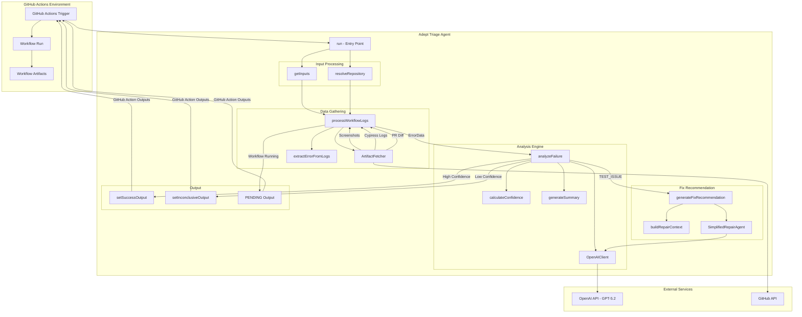
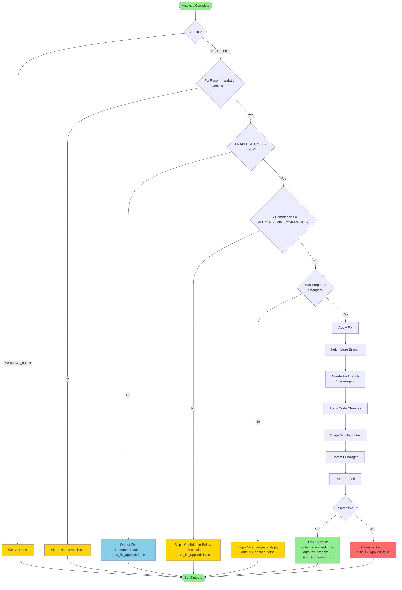

# Adept Triage Agent - Architecture Documentation

## Overview

The Adept Triage Agent is a GitHub Action that automatically analyzes test failures in CI/CD workflows and determines whether failures are caused by **TEST_ISSUE** (problems with test code) or **PRODUCT_ISSUE** (actual bugs in the application). For test issues, it can also generate fix recommendations using AI-powered analysis.

### Key Features

- **Intelligent Failure Classification**: Uses OpenAI GPT-5.2 to analyze test failures
- **Multimodal Analysis**: Processes screenshots, logs, and PR diffs
- **Fix Recommendations**: Generates actionable fix suggestions for test issues
- **GitHub Integration**: Seamlessly integrates with GitHub Actions workflows
- **Configurable Confidence Thresholds**: Allows tuning of analysis certainty

---

## Architecture Diagram



---

## Detailed Flow Diagram

```mermaid
flowchart TD
    START([GitHub Action Triggered]) --> GET_INPUTS[getInputs - Parse Action Inputs]

    GET_INPUTS --> INIT_CLIENTS[Initialize Clients]
    INIT_CLIENTS --> |Octokit| INIT_CLIENTS
    INIT_CLIENTS --> |OpenAIClient| INIT_CLIENTS
    INIT_CLIENTS --> |ArtifactFetcher| INIT_CLIENTS

    INIT_CLIENTS --> PROCESS_LOGS[processWorkflowLogs]

    subgraph "Data Gathering Phase"
        PROCESS_LOGS --> CHECK_DIRECT{Direct Error<br/>Message?}
        CHECK_DIRECT --> |Yes| USE_DIRECT[Use Provided Error]
        CHECK_DIRECT --> |No| GET_RUN_ID[Determine Workflow Run ID]

        GET_RUN_ID --> CHECK_STATUS{Workflow<br/>Completed?}
        CHECK_STATUS --> |No| RETURN_NULL[Return null]
        CHECK_STATUS --> |Yes| GET_JOBS[List Jobs for Workflow]

        GET_JOBS --> FIND_JOB[findTargetJob]
        FIND_JOB --> |Not Found| RETURN_NULL
        FIND_JOB --> |Found| DOWNLOAD_LOGS[Download Job Logs]

        DOWNLOAD_LOGS --> EXTRACT_ERROR[extractErrorFromLogs]
        EXTRACT_ERROR --> FETCH_PARALLEL[Fetch Artifacts in Parallel]

        FETCH_PARALLEL --> SCREENSHOTS[fetchScreenshots]
        FETCH_PARALLEL --> CYPRESS_LOGS[fetchCypressArtifactLogs]
        FETCH_PARALLEL --> PR_DIFF[fetchPRDiff]

        SCREENSHOTS --> BUILD_CONTEXT[buildErrorContext]
        CYPRESS_LOGS --> BUILD_CONTEXT
        PR_DIFF --> BUILD_CONTEXT

        BUILD_CONTEXT --> BUILD_SUMMARY[buildStructuredSummary]
        BUILD_SUMMARY --> CREATE_ERROR_DATA[Create ErrorData Object]
        USE_DIRECT --> CREATE_ERROR_DATA
    end

    CREATE_ERROR_DATA --> CHECK_ERROR{ErrorData<br/>Available?}
    RETURN_NULL --> CHECK_RUNNING{Check Workflow<br/>Status}

    CHECK_RUNNING --> |Still Running| SET_PENDING[Set PENDING Output]
    CHECK_RUNNING --> |Other| SET_FAILED[Set Failed - No Data]

    SET_PENDING --> END_PENDING([End - Pending])
    SET_FAILED --> END_FAILED([End - Failed])

    CHECK_ERROR --> |No| CHECK_RUNNING
    CHECK_ERROR --> |Yes| ANALYZE[analyzeFailure]

    subgraph "Analysis Phase"
        ANALYZE --> BUILD_MESSAGES[Build OpenAI Messages]
        BUILD_MESSAGES --> |System Prompt| BUILD_MESSAGES
        BUILD_MESSAGES --> |Few-Shot Examples| BUILD_MESSAGES
        BUILD_MESSAGES --> |User Content| BUILD_MESSAGES
        BUILD_MESSAGES --> |Screenshots| BUILD_MESSAGES

        BUILD_MESSAGES --> CALL_OPENAI[Call OpenAI API]
        CALL_OPENAI --> |Retry Logic| CALL_OPENAI
        CALL_OPENAI --> PARSE_RESPONSE[Parse JSON Response]

        PARSE_RESPONSE --> CALC_CONF[calculateConfidence]
        CALC_CONF --> |Base: 70| CALC_CONF
        CALC_CONF --> |+Indicators| CALC_CONF
        CALC_CONF --> |+Screenshots| CALC_CONF
        CALC_CONF --> |+Logs| CALC_CONF
        CALC_CONF --> |+PR Diff| CALC_CONF
        CALC_CONF --> |+Framework| CALC_CONF
        CALC_CONF --> |Max: 95| CALC_CONF

        CALC_CONF --> GEN_SUMMARY[generateAnalysisSummary]
        GEN_SUMMARY --> CHECK_VERDICT{Verdict?}
    end

    CHECK_VERDICT --> |TEST_ISSUE| ADD_EVIDENCE[Extract Evidence & Category]
    CHECK_VERDICT --> |PRODUCT_ISSUE| ANALYSIS_RESULT[Create AnalysisResult]
    ADD_EVIDENCE --> ANALYSIS_RESULT

    ANALYSIS_RESULT --> CHECK_TEST_ISSUE{Is TEST_ISSUE?}
    CHECK_TEST_ISSUE --> |Yes| GEN_FIX[generateFixRecommendation]
    CHECK_TEST_ISSUE --> |No| CHECK_THRESHOLD

    subgraph "Fix Recommendation Phase"
        GEN_FIX --> BUILD_REPAIR[buildRepairContext]
        BUILD_REPAIR --> |Classify Error| BUILD_REPAIR
        BUILD_REPAIR --> |Extract Selector| BUILD_REPAIR

        BUILD_REPAIR --> REPAIR_AGENT[SimplifiedRepairAgent]
        REPAIR_AGENT --> BUILD_FIX_PROMPT[Build Fix Prompt]
        BUILD_FIX_PROMPT --> |Include Logs| BUILD_FIX_PROMPT
        BUILD_FIX_PROMPT --> |Include Screenshots| BUILD_FIX_PROMPT
        BUILD_FIX_PROMPT --> |Include PR Diff| BUILD_FIX_PROMPT

        BUILD_FIX_PROMPT --> CALL_AI_FIX[Call OpenAI for Fix]
        CALL_AI_FIX --> PARSE_FIX[Parse Fix Recommendation]
        PARSE_FIX --> CHECK_FIX_CONF{Confidence >= 50?}

        CHECK_FIX_CONF --> |No| NO_FIX[Return null]
        CHECK_FIX_CONF --> |Yes| CREATE_FIX[Create FixRecommendation]
    end

    CREATE_FIX --> ATTACH_FIX[Attach to Result]
    NO_FIX --> CHECK_THRESHOLD
    ATTACH_FIX --> CHECK_THRESHOLD

    subgraph "Output Phase"
        CHECK_THRESHOLD{Confidence >= Threshold?}
        CHECK_THRESHOLD --> |No| SET_INCONCLUSIVE[setInconclusiveOutput]
        CHECK_THRESHOLD --> |Yes| SET_SUCCESS[setSuccessOutput]

        SET_SUCCESS --> OUTPUT_VERDICT[Output: verdict]
        SET_SUCCESS --> OUTPUT_CONF[Output: confidence]
        SET_SUCCESS --> OUTPUT_REASONING[Output: reasoning]
        SET_SUCCESS --> OUTPUT_SUMMARY[Output: summary]
        SET_SUCCESS --> OUTPUT_JSON[Output: triage_json]
        SET_SUCCESS --> OUTPUT_FIX{Has Fix?}
        OUTPUT_FIX --> |Yes| OUTPUT_FIX_DATA[Output: fix_recommendation]

        SET_INCONCLUSIVE --> OUTPUT_INCONC[Output: INCONCLUSIVE verdict]
    end

    OUTPUT_VERDICT --> END_SUCCESS([End - Success])
    OUTPUT_FIX_DATA --> END_SUCCESS
    OUTPUT_INCONC --> END_INCONC([End - Inconclusive])

    style START fill:#90EE90
    style END_SUCCESS fill:#90EE90
    style END_PENDING fill:#FFD700
    style END_FAILED fill:#FF6B6B
    style END_INCONC fill:#FFD700
```



---

## Component Documentation

### Entry Point (`src/index.ts`)

The main entry point that orchestrates the entire triage process.

#### Key Functions

| Function | Purpose | Inputs | Outputs |
|----------|---------|--------|---------|
| `run()` | Main orchestrator | None (reads from Action inputs) | GitHub Action outputs |
| `getInputs()` | Parse Action inputs | None | `ActionInputs` |
| `resolveRepository()` | Resolve repo from input or context | `ActionInputs` | `{ owner, repo }` |
| `generateFixRecommendation()` | Generate fix for TEST_ISSUE | Context, OpenAIClient | `FixRecommendation \| null` |
| `setSuccessOutput()` | Set successful analysis outputs | `AnalysisResult`, `ErrorData` | void |
| `setInconclusiveOutput()` | Set inconclusive outputs | Result, inputs, errorData | void |

#### Dependencies
- `@actions/core` - GitHub Actions toolkit
- `@actions/github` - GitHub context access
- `@octokit/rest` - GitHub API client

---

### Log Processor (`src/services/log-processor.ts`)

Handles extraction and processing of workflow logs and artifacts.

#### Key Functions

| Function | Purpose | Inputs | Outputs |
|----------|---------|--------|---------|
| `processWorkflowLogs()` | Main log processing | Octokit, ArtifactFetcher, inputs, repoDetails | `ErrorData \| null` |
| `findTargetJob()` | Find the failed job | Jobs array, inputs, isCurrentJob | `JobInfo \| null` |
| `fetchArtifactsParallel()` | Fetch all artifacts concurrently | ArtifactFetcher, runId, jobName, repoDetails, inputs | `[Screenshots, Logs, PRDiff]` |
| `buildErrorContext()` | Combine all context | Job, error, logs, fullLogs, inputs | Combined context string |
| `capArtifactLogs()` | Truncate large logs | Raw logs | Capped logs string |
| `buildStructuredSummary()` | Create error summary | `ErrorData` | `StructuredErrorSummary` |

#### Data Flow
1. Check for direct error message input
2. Determine workflow run ID from context
3. Verify workflow completion status
4. Find the target/failed job
5. Download job logs
6. Extract structured error from logs
7. Fetch artifacts in parallel (screenshots, Cypress logs, PR diff)
8. Build combined error context
9. Return `ErrorData` object

---

### Simplified Analyzer (`src/simplified-analyzer.ts`)

Core analysis engine that uses OpenAI to classify test failures.

#### Key Functions

| Function | Purpose | Inputs | Outputs |
|----------|---------|--------|---------|
| `analyzeFailure()` | Main analysis function | OpenAIClient, ErrorData | `AnalysisResult` |
| `extractErrorFromLogs()` | Extract error from log text | Logs string | `ErrorData \| null` |
| `calculateConfidence()` | Calculate confidence score | OpenAIResponse, ErrorData | number (0-95) |
| `generateSummary()` | Generate human-readable summary | OpenAIResponse, ErrorData | string |

#### Error Pattern Matching (Priority Order)

1. **Cypress Server Errors** (Priority 12) - Server verification failures
2. **JavaScript Type Errors** (Priority 10) - Null/undefined property access
3. **Cypress-specific Errors** (Priority 7-8) - Assertions, timeouts
4. **General JavaScript Errors** (Priority 5-6) - TypeError, ReferenceError
5. **Generic Test Failures** (Priority 1-3) - FAIL, Failed markers

#### Few-Shot Examples
The analyzer uses 7 curated examples to guide classification:
- Intentional test failures (TEST_ISSUE)
- Server verification errors (PRODUCT_ISSUE)
- Element visibility timeouts (TEST_ISSUE)
- Element not found errors (TEST_ISSUE)
- Null pointer in product code (PRODUCT_ISSUE)
- Database connection errors (PRODUCT_ISSUE)
- HTTP 500 errors (PRODUCT_ISSUE)

---

### OpenAI Client (`src/openai-client.ts`)

Handles all communication with the OpenAI API.

#### Key Functions

| Function | Purpose | Inputs | Outputs |
|----------|---------|--------|---------|
| `analyze()` | Main analysis call | ErrorData, FewShotExamples | `OpenAIResponse` |
| `buildMessages()` | Build chat messages | ErrorData, examples | ChatCompletionMessageParam[] |
| `buildUserContent()` | Build multimodal content | ErrorData, examples | string \| ContentPart[] |
| `getSystemPrompt()` | Get the system prompt | None | string |
| `buildPrompt()` | Build user prompt | ErrorData, examples | string |
| `parseResponse()` | Parse API response | Content string | `OpenAIResponse` |
| `generateWithCustomPrompt()` | Generic prompt call | Params object | string |

#### Configuration
- **Model**: `gpt-5.2` (GPT-5.2 Codex)
- **Temperature**: 0.3 (deterministic)
- **Max Completion Tokens**: 16,384
- **Max Retries**: 3
- **Response Format**: JSON

#### Multimodal Support
When screenshots are available:
1. Text content is added first
2. Screenshot analysis prompt is added
3. Each screenshot is added as `image_url` with `detail: 'high'`
4. Screenshot context (name, timestamp) is added after each image

---

### Artifact Fetcher (`src/artifact-fetcher.ts`)

Fetches and processes workflow artifacts from GitHub.

#### Key Functions

| Function | Purpose | Inputs | Outputs |
|----------|---------|--------|---------|
| `fetchScreenshots()` | Fetch screenshot images | runId, jobName, repoDetails | `Screenshot[]` |
| `fetchLogs()` | Fetch job logs | runId, jobId, repoDetails | `string[]` |
| `fetchCypressArtifactLogs()` | Fetch Cypress-specific logs | runId, jobName, repoDetails | string |
| `fetchPRDiff()` | Fetch PR changes | prNumber, repository | `PRDiff \| null` |
| `sortFilesByRelevance()` | Sort files by relevance | PRDiffFile[] | PRDiffFile[] |

#### Screenshot Detection
Detects screenshots by:
1. Artifact name contains: `screenshot`, `cypress`, `cy-logs`, `cy-artifacts`
2. File extension: `.png`, `.jpg`, `.jpeg`, `.gif`, `.webp`
3. File name contains: `screenshot`, `failure`, `error`, `(failed)`

#### PR Diff Sorting
Files are sorted by relevance:
1. Test files (highest priority)
2. Source files
3. Files with more changes
4. Configuration files
5. Alphabetical (default)

---

### Simplified Repair Agent (`src/repair/simplified-repair-agent.ts`)

Generates fix recommendations for TEST_ISSUE verdicts.

#### Key Functions

| Function | Purpose | Inputs | Outputs |
|----------|---------|--------|---------|
| `generateFixRecommendation()` | Main recommendation generator | RepairContext, ErrorData | `FixRecommendation \| null` |
| `buildPrompt()` | Build fix prompt | RepairContext, ErrorData | string |
| `getRecommendationFromAI()` | Get AI recommendation | Prompt, context, errorData | `AIRecommendation \| null` |
| `extractChangesFromText()` | Fallback change extraction | Text, context | `AIChange[]` |
| `generateSummary()` | Generate fix summary | Recommendation, context | string |

#### Fix Recommendation Structure
```typescript
interface FixRecommendation {
  confidence: number;        // 0-100
  summary: string;           // Human-readable summary
  proposedChanges: {
    file: string;            // Path to file
    line: number;            // Line number
    oldCode: string;         // Current code
    newCode: string;         // Suggested fix
    justification: string;   // Why this fixes the issue
  }[];
  evidence: string[];        // Supporting evidence
  reasoning: string;         // Detailed reasoning
}
```

---

### Repair Context Builder (`src/repair-context.ts`)

Builds context objects for the repair agent.

#### Key Functions

| Function | Purpose | Inputs | Outputs |
|----------|---------|--------|---------|
| `buildRepairContext()` | Build repair context | Analysis data | `RepairContext` |
| `enhanceAnalysisWithRepairContext()` | Add repair context to result | AnalysisResult, testData | Enhanced `AnalysisResult` |

---

### Fix Applier (`src/repair/fix-applier.ts`)

Applies automated fixes by creating branches and committing changes.

#### Key Functions

| Function | Purpose | Inputs | Outputs |
|----------|---------|--------|---------|
| `createFixApplier()` | Factory for fix appliers | `FixApplierConfig` | `FixApplier` |
| `canApply()` | Check if fix meets threshold | `FixRecommendation` | boolean |
| `applyFix()` | Apply the fix to codebase | `FixRecommendation` | `ApplyResult` |
| `generateFixBranchName()` | Generate branch name | testFile, timestamp | string |
| `generateFixCommitMessage()` | Generate commit message | `FixRecommendation` | string |

#### ApplyResult Interface
```typescript
interface ApplyResult {
  success: boolean;        // Whether fix was successfully applied
  modifiedFiles: string[]; // Files that were modified
  error?: string;          // Error message if fix failed
  commitSha?: string;      // Git commit SHA if committed
  branchName?: string;     // Branch name that was created
}
```

#### FixApplierConfig Interface
```typescript
interface FixApplierConfig {
  baseBranch: string;     // Base branch to create fix branch from
  minConfidence: number;  // Minimum confidence threshold to apply fix
}
```

#### Fix Application Process

1. **Confidence Check**: Verify fix recommendation meets minimum confidence threshold
2. **Branch Creation**: Fetch base branch and create new fix branch
3. **Apply Changes**: For each proposed change, read file, apply string replacement, write back
4. **Stage & Commit**: Stage modified files and create commit with structured message
5. **Push**: Push the branch to origin
6. **Cleanup on Failure**: If any step fails, delete the branch and return to original state

---

### Error Classifier (`src/analysis/error-classifier.ts`)

Classifies and categorizes test errors.

#### Key Functions

| Function | Purpose | Inputs | Outputs |
|----------|---------|--------|---------|
| `classifyErrorType()` | Classify error type | Error message | `ErrorType` |
| `categorizeTestIssue()` | Categorize for fix | Error message | `TestIssueCategory` |
| `extractSelector()` | Extract CSS selector | Error message | `string \| undefined` |
| `extractTestIssueEvidence()` | Extract evidence | Error message | `string[]` |

#### Error Types
- `ELEMENT_NOT_FOUND`
- `TIMEOUT`
- `ASSERTION_FAILED`
- `NETWORK_ERROR`
- `ELEMENT_NOT_VISIBLE`
- `ELEMENT_COVERED`
- `ELEMENT_DETACHED`
- `INVALID_ELEMENT_TYPE`
- `UNKNOWN`

---

### Summary Generator (`src/analysis/summary-generator.ts`)

Generates human-readable summaries for various outputs.

#### Key Functions

| Function | Purpose | Inputs | Outputs |
|----------|---------|--------|---------|
| `generateAnalysisSummary()` | Generate analysis summary | OpenAIResponse, ErrorData | string |
| `generateFixSummary()` | Generate fix summary | Recommendation, context, includeCode | string |
| `createBriefSummary()` | Create brief summary | Verdict, confidence, summary, testName | string |
| `formatVerdict()` | Format verdict for display | Verdict | string |

---

### Configuration Constants (`src/config/constants.ts`)

Centralized configuration values.

#### Log Limits
| Constant | Value | Description |
|----------|-------|-------------|
| `GITHUB_MAX_SIZE` | 50,000 | Max GitHub Actions log size |
| `ARTIFACT_SOFT_CAP` | 20,000 | Soft cap for artifact logs |
| `ERROR_CONTEXT_BEFORE` | 500 | Chars before error |
| `ERROR_CONTEXT_AFTER` | 1,500 | Chars after error |
| `SERVER_ERROR_CONTEXT_BEFORE` | 1,000 | Extended context before server errors |
| `SERVER_ERROR_CONTEXT_AFTER` | 2,000 | Extended context after server errors |

#### Confidence Calculation
| Constant | Value | Description |
|----------|-------|-------------|
| `BASE` | 70 | Base confidence score |
| `INDICATOR_BONUS` | 5 | Bonus per indicator |
| `MAX_INDICATOR_BONUS` | 15 | Max indicator bonus |
| `SCREENSHOT_BONUS` | 10 | Bonus for screenshots |
| `MULTIPLE_SCREENSHOT_BONUS` | 5 | Bonus for multiple screenshots |
| `LOGS_BONUS` | 5 | Bonus for logs |
| `PR_DIFF_BONUS` | 5 | Bonus for PR diff |
| `FRAMEWORK_BONUS` | 5 | Bonus for known framework |
| `MAX_CONFIDENCE` | 95 | Maximum confidence cap |
| `MIN_FIX_CONFIDENCE` | 50 | Minimum for fix recommendation |

#### OpenAI Configuration
| Constant | Value | Description |
|----------|-------|-------------|
| `MODEL` | `gpt-5.2` | Model to use |
| `TEMPERATURE` | 0.3 | Response temperature |
| `MAX_COMPLETION_TOKENS` | 16,384 | Max tokens |
| `MAX_RETRIES` | 3 | Retry attempts |
| `RETRY_DELAY_MS` | 1,000 | Base retry delay |

---

## Data Types (`src/types.ts`)

### Core Types

```typescript
type Verdict = 'TEST_ISSUE' | 'PRODUCT_ISSUE';

interface ErrorData {
  message: string;
  stackTrace?: string;
  framework?: string;
  failureType?: string;
  context?: string;
  testName?: string;
  fileName?: string;
  screenshots?: Screenshot[];
  logs?: string[];
  cypressArtifactLogs?: string;
  prDiff?: PRDiff;
  structuredSummary?: StructuredErrorSummary;
}

interface AnalysisResult {
  verdict: Verdict;
  confidence: number;
  reasoning: string;
  summary?: string;
  indicators?: string[];
  suggestedSourceLocations?: SourceLocation[];
  evidence?: string[];
  category?: string;
  repairContext?: RepairContext;
  fixRecommendation?: FixRecommendation;
}

interface ActionInputs {
  githubToken: string;
  openaiApiKey: string;
  errorMessage?: string;
  workflowRunId?: string;
  jobName?: string;
  confidenceThreshold: number;
  prNumber?: string;
  commitSha?: string;
  repository?: string;
  testFrameworks?: string;
  enableAutoFix?: boolean;         // Enable automatic branch creation
  autoFixBaseBranch?: string;      // Base branch to create fix from
  autoFixMinConfidence?: number;   // Minimum confidence for auto-fix
}
```

---

## GitHub Action Outputs

| Output | Type | Description |
|--------|------|-------------|
| `verdict` | string | `TEST_ISSUE`, `PRODUCT_ISSUE`, `INCONCLUSIVE`, or `PENDING` |
| `confidence` | string | Confidence percentage (0-95) |
| `reasoning` | string | Detailed reasoning for the verdict |
| `summary` | string | Human-readable summary |
| `triage_json` | string | Full JSON output with all data |
| `has_fix_recommendation` | string | `true` or `false` |
| `fix_recommendation` | string | JSON fix recommendation (if available) |
| `fix_summary` | string | Human-readable fix summary (if available) |
| `fix_confidence` | string | Fix recommendation confidence (if available) |
| `auto_fix_applied` | string | `true` or `false` - whether auto-fix branch was created |
| `auto_fix_branch` | string | Name of the created branch (if auto-fix applied) |
| `auto_fix_commit` | string | SHA of the fix commit (if auto-fix applied) |
| `auto_fix_files` | string | JSON array of modified files (if auto-fix applied) |

---

## Error Handling

### Retry Logic
- OpenAI API calls retry up to 3 times with exponential backoff
- Initial delay: 1,000ms, then 2,000ms, then 3,000ms

### Graceful Degradation
1. **Workflow still running**: Returns `PENDING` verdict
2. **No error data**: Fails with descriptive message
3. **Low confidence**: Returns `INCONCLUSIVE` verdict
4. **Fix generation fails**: Continues without fix recommendation

### Error Recovery
- Screenshots fetch failure: Continues with text-only analysis
- Cypress artifact fetch failure: Uses GitHub Actions logs only
- PR diff fetch failure: Analyzes without PR context
- JSON parse failure: Falls back to text extraction

---

## Usage Example

```yaml
- name: Analyze Test Failure
  uses: adept-at/adept-triage-agent@v1
  with:
    GITHUB_TOKEN: ${{ secrets.GITHUB_TOKEN }}
    OPENAI_API_KEY: ${{ secrets.OPENAI_API_KEY }}
    WORKFLOW_RUN_ID: ${{ github.run_id }}
    JOB_NAME: 'test-job'
    CONFIDENCE_THRESHOLD: '70'
    PR_NUMBER: ${{ github.event.pull_request.number }}
```

---

## Auto-Fix Feature

The Auto-Fix feature allows the triage agent to automatically apply AI-generated fixes by creating a new branch with the proposed changes. This enables faster remediation of test issues while keeping engineers in control of the final review and merge.

### Overview

When a test failure is classified as `TEST_ISSUE` and the fix recommendation meets confidence requirements, the auto-fix feature can:
1. Create a new branch from your base branch
2. Apply the proposed code changes
3. Commit and push the changes
4. Provide branch details for manual PR creation

### Auto-Fix Decision Flow



### Auto-Fix Inputs

| Input | Type | Default | Description |
|-------|------|---------|-------------|
| `ENABLE_AUTO_FIX` | boolean | `false` | Enable automatic branch creation with fix. Must be explicitly set to `true` to enable. |
| `AUTO_FIX_BASE_BRANCH` | string | `main` | Base branch to create the fix branch from. |
| `AUTO_FIX_MIN_CONFIDENCE` | number | `70` | Minimum fix confidence (0-100) required to apply auto-fix. |

### Auto-Fix Outputs

| Output | Type | Description |
|--------|------|-------------|
| `auto_fix_applied` | string | `true` if auto-fix branch was created, `false` otherwise |
| `auto_fix_branch` | string | Name of the created branch (e.g., `fix/triage-agent/my-test-cy-ts-20240130`) |
| `auto_fix_commit` | string | SHA of the fix commit |
| `auto_fix_files` | string | JSON array of modified file paths |

### Example: Enabling Auto-Fix

```yaml
name: Triage Failed Tests with Auto-Fix

on:
  repository_dispatch:
    types: [triage-failed-test]

permissions:
  contents: write  # Required for creating branches and pushing commits

jobs:
  analyze:
    runs-on: ubuntu-latest
    steps:
      - name: Checkout repository
        uses: actions/checkout@v4
        with:
          fetch-depth: 0  # Required for branch operations

      - name: Analyze failure with auto-fix
        id: triage
        uses: adept-at/adept-triage-agent@v1
        with:
          GITHUB_TOKEN: ${{ secrets.GITHUB_TOKEN }}
          OPENAI_API_KEY: ${{ secrets.OPENAI_API_KEY }}
          WORKFLOW_RUN_ID: '${{ github.event.client_payload.workflow_run_id }}'
          JOB_NAME: '${{ github.event.client_payload.job_name }}'
          # Auto-fix configuration
          ENABLE_AUTO_FIX: 'true'
          AUTO_FIX_BASE_BRANCH: 'main'
          AUTO_FIX_MIN_CONFIDENCE: '75'

      - name: Notify about auto-fix
        if: steps.triage.outputs.auto_fix_applied == 'true'
        run: |
          echo "Auto-fix applied!"
          echo "Branch: ${{ steps.triage.outputs.auto_fix_branch }}"
          echo "Commit: ${{ steps.triage.outputs.auto_fix_commit }}"
          echo "Modified files: ${{ steps.triage.outputs.auto_fix_files }}"
          echo ""
          echo "Create a PR at: https://github.com/${{ github.repository }}/compare/${{ steps.triage.outputs.auto_fix_branch }}?expand=1"

      - name: Comment on PR with fix branch link
        if: steps.triage.outputs.auto_fix_applied == 'true' && github.event.client_payload.pr_number
        uses: actions/github-script@v7
        with:
          github-token: ${{ secrets.GITHUB_TOKEN }}
          script: |
            const branch = '${{ steps.triage.outputs.auto_fix_branch }}';
            const commit = '${{ steps.triage.outputs.auto_fix_commit }}';
            const files = JSON.parse('${{ steps.triage.outputs.auto_fix_files }}');

            const body = `## 🤖 Auto-Fix Generated

            The triage agent has generated a fix for this test failure.

            **Branch:** \`${branch}\`
            **Commit:** \`${commit}\`
            **Files modified:** ${files.join(', ')}

            [View changes](https://github.com/${{ github.repository }}/compare/${branch}) | [Create PR](https://github.com/${{ github.repository }}/compare/${branch}?expand=1)

            > **Note:** Please review the changes carefully before merging.`;

            github.rest.issues.createComment({
              owner: context.repo.owner,
              repo: context.repo.repo,
              issue_number: ${{ github.event.client_payload.pr_number }},
              body: body
            });
```

### Safety Guardrails

The auto-fix feature includes several safety measures to prevent unintended changes:

#### 1. Opt-In Only (Disabled by Default)

Auto-fix is **disabled by default**. You must explicitly set `ENABLE_AUTO_FIX: 'true'` to enable it. This ensures teams consciously decide to adopt automated fixes.

```yaml
# Auto-fix is OFF by default
- uses: adept-at/adept-triage-agent@v1
  with:
    OPENAI_API_KEY: ${{ secrets.OPENAI_API_KEY }}
    # ENABLE_AUTO_FIX defaults to 'false'
```

#### 2. Confidence Threshold Check

Auto-fix only applies when the fix recommendation confidence meets or exceeds the `AUTO_FIX_MIN_CONFIDENCE` threshold (default: 70%). Low-confidence fixes are reported but not automatically applied.

```yaml
# Only apply fixes with 80%+ confidence
ENABLE_AUTO_FIX: 'true'
AUTO_FIX_MIN_CONFIDENCE: '80'
```

#### 3. No Auto-PR Creation

The agent creates a **branch only** - it does **not** automatically create a pull request. This ensures:
- Engineers must explicitly review and create the PR
- No changes are merged without human approval
- Teams maintain full control over their codebase

After auto-fix applies, engineers receive:
- Branch name for inspection
- Commit SHA for verification
- List of modified files for review
- Direct link to create a PR when ready

#### 4. Required Permissions

Auto-fix requires explicit `contents: write` permission in your workflow:

```yaml
permissions:
  contents: write  # Required for auto-fix
```

Without this permission, the auto-fix will fail gracefully and the fix recommendation will still be output for manual application.

#### 5. Clean Rollback on Failure

If any step of the auto-fix process fails, the agent:
- Cleans up the partially created branch
- Returns to the original checkout state
- Reports the error in outputs
- Sets `auto_fix_applied: false`

### Configuration Constants

The auto-fix feature uses these constants from `src/config/constants.ts`:

| Constant | Value | Description |
|----------|-------|-------------|
| `AUTO_FIX.DEFAULT_MIN_CONFIDENCE` | `70` | Default minimum confidence threshold |
| `AUTO_FIX.BRANCH_PREFIX` | `fix/triage-agent/` | Prefix for auto-fix branch names |

### Branch Naming Convention

Auto-fix branches follow this naming pattern:

```
fix/triage-agent/{sanitized-test-file}-{YYYYMMDD}
```

Example: `fix/triage-agent/login-spec-cy-ts-20240130`

The test file name is sanitized (special characters replaced with hyphens) and truncated to 50 characters to ensure valid git branch names.

### Commit Message Format

Auto-fix commits include structured information:

```
fix(test): {summary - first 50 chars}

Automated fix generated by adept-triage-agent.

Files modified: {list of files}
Confidence: {confidence}%

{full reasoning}
```

---

## Development Notes

### Adding New Error Patterns
1. Add pattern to `errorPatterns` in `extractErrorFromLogs()`
2. Assign appropriate priority (higher = matched first)
3. Update `classifyErrorType()` if new error type
4. Add few-shot example if distinctive pattern

### Adjusting Confidence Calculation
1. Modify constants in `src/config/constants.ts`
2. Consider adding new bonus categories in `calculateConfidence()`

### Extending Fix Recommendations
1. Update `buildPrompt()` in `SimplifiedRepairAgent`
2. Add new error type handling in `extractChangesFromText()`
3. Update common patterns list in prompt
