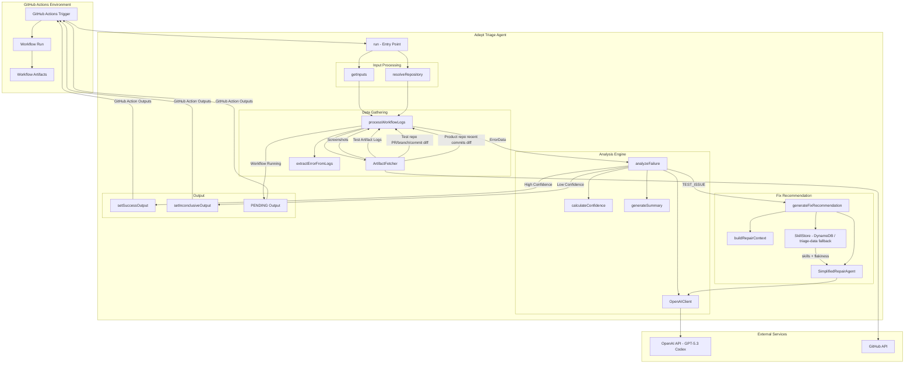
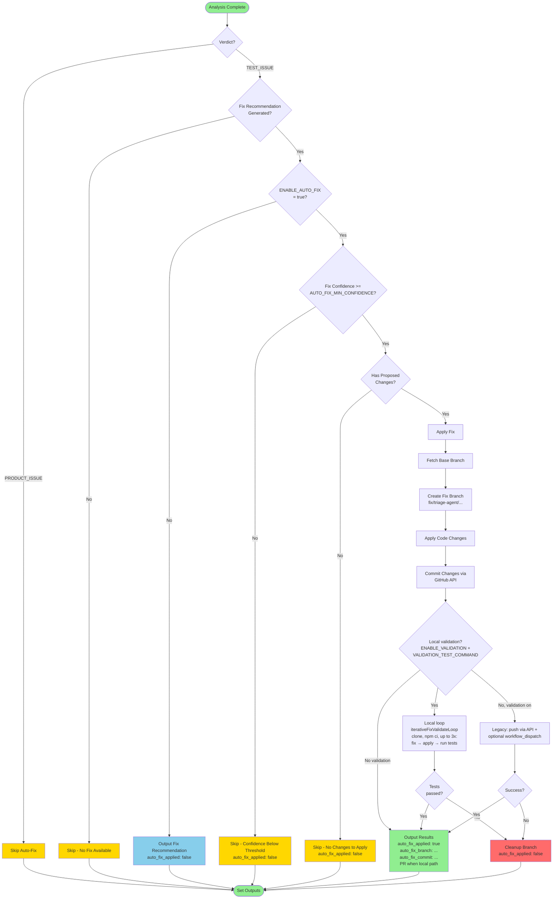

# Adept Triage Agent - Architecture Documentation

## Overview

The Adept Triage Agent is a GitHub Action that automatically analyzes test failures in CI/CD workflows and determines whether failures are caused by **TEST_ISSUE** (problems with test code) or **PRODUCT_ISSUE** (actual bugs in the application). For test issues, it can also generate fix recommendations using AI-powered analysis.

### Key Features

- **Intelligent Failure Classification**: Uses OpenAI GPT-5.3 Codex to analyze test failures
- **Multimodal Analysis**: Processes screenshots, logs, test-repo PR/branch/commit diffs, and a recent product-repo commit diff (default `adept-at/learn-webapp` when `PRODUCT_REPO` is unset)
- **Fix Recommendations**: Generates actionable fix suggestions for test issues
- **GitHub Integration**: Seamlessly integrates with GitHub Actions workflows
- **Configurable Confidence Thresholds**: Allows tuning of analysis certainty

### Repository Contexts

The action currently operates across up to three repository contexts:

- `github.context.repo`: the repository where the triage workflow is running. Workflow runs, job logs, screenshots, and uploaded test artifacts are always read from here.
- `REPOSITORY`: the app/source repository used for PR, branch, or commit diff lookup.
- `AUTO_FIX_TARGET_REPO`: the repository where repair source files are fetched and fix branches are created.

---

## Architecture Diagram


```mermaid
graph TB
    subgraph "GitHub Actions Environment"
        GHA[GitHub Actions Trigger]
        WF[Workflow Run]
        ARTIFACTS[Workflow Artifacts]
    end

    subgraph "Adept Triage Agent"
        ENTRY[run - Entry Point]

        subgraph "Input Processing"
            INPUTS[getInputs]
            REPO[resolveRepository]
        end

        subgraph "Data Gathering"
            LP[processWorkflowLogs]
            AF[ArtifactFetcher]
            EXT[extractErrorFromLogs]
        end

        subgraph "Analysis Engine"
            ANALYZE[analyzeFailure]
            OAI[OpenAIClient]
            CONF[calculateConfidence]
            SUM[generateSummary]
        end

        subgraph "Fix Recommendation"
            FIX[generateFixRecommendation]
            RC[buildRepairContext]
            RA[SimplifiedRepairAgent]
            SK[SkillStore - DynamoDB / triage-data fallback]
        end

        subgraph "Output"
            OUT_SUCCESS[setSuccessOutput]
            OUT_INCONC[setInconclusiveOutput]
            OUT_PENDING[PENDING Output]
        end
    end

    subgraph "External Services"
        OPENAI[OpenAI API - GPT-5.3 Codex]
        GITHUB[GitHub API]
    end

    GHA --> WF
    WF --> ARTIFACTS

    GHA --> ENTRY
    ENTRY --> INPUTS
    ENTRY --> REPO

    INPUTS --> LP
    REPO --> LP

    LP --> AF
    LP --> EXT
    AF --> GITHUB
    AF --> |Screenshots| LP
    AF --> |Test Artifact Logs| LP
    AF --> |Test repo PR/branch/commit diff| LP
    AF --> |Product repo recent commits diff| LP

    LP --> |ErrorData| ANALYZE
    ANALYZE --> OAI
    OAI --> OPENAI
    ANALYZE --> CONF
    ANALYZE --> SUM

    ANALYZE --> |TEST_ISSUE| FIX
    FIX --> RC
    FIX --> SK
    SK --> |skills + flakiness| RA
    FIX --> RA
    RA --> OAI

    ANALYZE --> |High Confidence| OUT_SUCCESS
    ANALYZE --> |Low Confidence| OUT_INCONC
    LP --> |Workflow Running| OUT_PENDING

    OUT_SUCCESS --> |GitHub Action Outputs| GHA
    OUT_INCONC --> |GitHub Action Outputs| GHA
    OUT_PENDING --> |GitHub Action Outputs| GHA
```

---

## Detailed Flow Diagram


```mermaid
flowchart TD
    START([GitHub Action Triggered]) --> GET_INPUTS[getInputs - Parse Action Inputs]

    GET_INPUTS --> INIT_CLIENTS[Initialize Clients]
    INIT_CLIENTS --> |Octokit| INIT_CLIENTS
    INIT_CLIENTS --> |OpenAIClient| INIT_CLIENTS
    INIT_CLIENTS --> |ArtifactFetcher| INIT_CLIENTS

    INIT_CLIENTS --> PROCESS_LOGS[processWorkflowLogs]

    subgraph "Data Gathering Phase"
        PROCESS_LOGS --> CHECK_DIRECT{Direct Error<br/>Message?}
        CHECK_DIRECT --> |Yes| USE_DIRECT[Use Provided Error]
        CHECK_DIRECT --> |No| GET_RUN_ID[Determine Workflow Run ID]

        GET_RUN_ID --> CHECK_STATUS{Workflow<br/>Completed?}
        CHECK_STATUS --> |No| RETURN_NULL[Return null]
        CHECK_STATUS --> |Yes| GET_JOBS[List Jobs for Workflow]

        GET_JOBS --> FIND_JOB[findTargetJob]
        FIND_JOB --> |Not Found| RETURN_NULL
        FIND_JOB --> |Found| DOWNLOAD_LOGS[Download Job Logs]

        DOWNLOAD_LOGS --> EXTRACT_ERROR[extractErrorFromLogs]
        EXTRACT_ERROR --> FETCH_PARALLEL[Fetch Artifacts in Parallel]

        FETCH_PARALLEL --> SCREENSHOTS[fetchScreenshots]
        FETCH_PARALLEL --> TEST_ARTIFACT_LOGS[fetchTestArtifactLogs]
        FETCH_PARALLEL --> PR_DIFF[fetchDiffWithFallback]
        FETCH_PARALLEL --> PRODUCT_DIFF[fetchProductDiff]

        SCREENSHOTS --> BUILD_CONTEXT[buildErrorContext]
        TEST_ARTIFACT_LOGS --> BUILD_CONTEXT
        PR_DIFF --> BUILD_CONTEXT
        PRODUCT_DIFF --> BUILD_CONTEXT

        BUILD_CONTEXT --> BUILD_SUMMARY[buildStructuredSummary]
        BUILD_SUMMARY --> CREATE_ERROR_DATA[Create ErrorData Object]
        USE_DIRECT --> CREATE_ERROR_DATA
    end

    CREATE_ERROR_DATA --> CHECK_ERROR{ErrorData<br/>Available?}
    RETURN_NULL --> CHECK_RUNNING{Check Workflow<br/>Status}

    CHECK_RUNNING --> |Still Running| SET_PENDING[Set PENDING Output]
    CHECK_RUNNING --> |Other| SET_FAILED[Set Failed - No Data]

    SET_PENDING --> END_PENDING([End - Pending])
    SET_FAILED --> END_FAILED([End - Failed])

    CHECK_ERROR --> |No| CHECK_RUNNING
    CHECK_ERROR --> |Yes| ANALYZE[analyzeFailure]

    subgraph "Analysis Phase"
        ANALYZE --> BUILD_MESSAGES[Build OpenAI Messages]
        BUILD_MESSAGES --> |System Prompt| BUILD_MESSAGES
        BUILD_MESSAGES --> |Few-Shot Examples| BUILD_MESSAGES
        BUILD_MESSAGES --> |User Content| BUILD_MESSAGES
        BUILD_MESSAGES --> |Screenshots| BUILD_MESSAGES

        BUILD_MESSAGES --> CALL_OPENAI[Call OpenAI API]
        CALL_OPENAI --> |Retry Logic| CALL_OPENAI
        CALL_OPENAI --> PARSE_RESPONSE[Parse JSON Response]

        PARSE_RESPONSE --> CALC_CONF[calculateConfidence]
        CALC_CONF --> |Base: 70| CALC_CONF
        CALC_CONF --> |+Indicators| CALC_CONF
        CALC_CONF --> |+Screenshots| CALC_CONF
        CALC_CONF --> |+Logs| CALC_CONF
        CALC_CONF --> |+PR Diff| CALC_CONF
        CALC_CONF --> |+Framework| CALC_CONF
        CALC_CONF --> |Max: 95| CALC_CONF

        CALC_CONF --> GEN_SUMMARY[generateAnalysisSummary]
        GEN_SUMMARY --> CHECK_VERDICT{Verdict?}
    end

    CHECK_VERDICT --> |TEST_ISSUE| ADD_EVIDENCE[Extract Evidence & Category]
    CHECK_VERDICT --> |PRODUCT_ISSUE| ANALYSIS_RESULT[Create AnalysisResult]
    ADD_EVIDENCE --> ANALYSIS_RESULT

    ANALYSIS_RESULT --> CHECK_THRESHOLD{Confidence >= Threshold?}
    CHECK_THRESHOLD --> |No| SET_INCONCLUSIVE[setInconclusiveOutput]
    CHECK_THRESHOLD --> |Yes| CHECK_TEST_ISSUE{Is TEST_ISSUE?}
    CHECK_TEST_ISSUE --> |No| SET_SUCCESS[setSuccessOutput]
    CHECK_TEST_ISSUE --> |Yes| LOAD_SKILLS[Load SkillStore + Detect Flakiness]
    LOAD_SKILLS --> GEN_FIX[generateFixRecommendation]

    subgraph "Fix Recommendation Phase"
        GEN_FIX --> BUILD_REPAIR[buildRepairContext]
        BUILD_REPAIR --> |Classify Error| BUILD_REPAIR
        BUILD_REPAIR --> |Extract Selector| BUILD_REPAIR

        BUILD_REPAIR --> REPAIR_AGENT[SimplifiedRepairAgent]
        REPAIR_AGENT --> BUILD_FIX_PROMPT[Build Fix Prompt]
        BUILD_FIX_PROMPT --> |Include Logs| BUILD_FIX_PROMPT
        BUILD_FIX_PROMPT --> |Include Screenshots| BUILD_FIX_PROMPT
        BUILD_FIX_PROMPT --> |Include PR Diff| BUILD_FIX_PROMPT

        BUILD_FIX_PROMPT --> CALL_AI_FIX[Call OpenAI for Fix]
        CALL_AI_FIX --> PARSE_FIX[Parse Fix Recommendation]
        PARSE_FIX --> CHECK_FIX_CONF{Confidence >= 50?}

        CHECK_FIX_CONF --> |No| NO_FIX[Return null]
        CHECK_FIX_CONF --> |Yes| CREATE_FIX[Create FixRecommendation]
    end

    CREATE_FIX --> ATTACH_FIX[Attach to Result]
    NO_FIX --> SET_SUCCESS
    ATTACH_FIX --> SET_SUCCESS

    subgraph "Output Phase"

        SET_SUCCESS --> OUTPUT_VERDICT[Output: verdict]
        SET_SUCCESS --> OUTPUT_CONF[Output: confidence]
        SET_SUCCESS --> OUTPUT_REASONING[Output: reasoning]
        SET_SUCCESS --> OUTPUT_SUMMARY[Output: summary]
        SET_SUCCESS --> OUTPUT_JSON[Output: triage_json]
        SET_SUCCESS --> OUTPUT_FIX{Has Fix?}
        OUTPUT_FIX --> |Yes| OUTPUT_FIX_DATA[Output: fix_recommendation]

        SET_INCONCLUSIVE --> OUTPUT_INCONC[Output: INCONCLUSIVE verdict]
    end

    OUTPUT_VERDICT --> END_SUCCESS([End - Success])
    OUTPUT_FIX_DATA --> END_SUCCESS
    OUTPUT_INCONC --> END_INCONC([End - Inconclusive])

    style START fill:#90EE90
    style END_SUCCESS fill:#90EE90
    style END_PENDING fill:#FFD700
    style END_FAILED fill:#FF6B6B
    style END_INCONC fill:#FFD700
```

---

## Component Documentation

### Entry Point (`src/index.ts`)

A thin wrapper that parses Action inputs, constructs clients, and delegates to `PipelineCoordinator`.

#### Key Functions

| Function | Purpose | Inputs | Outputs |
|----------|---------|--------|---------|
| `run()` | Parse inputs, build clients, call `PipelineCoordinator.execute()` | None (reads from Action inputs) | GitHub Action outputs |
| `getInputs()` | Parse Action inputs | None | `ActionInputs` |
| `resolveRepository()` | Resolve repo from input or context | `ActionInputs` | `{ owner, repo }` |

All pipeline logic lives in dedicated modules:
- **`src/pipeline/coordinator.ts`** — `PipelineCoordinator` class: skill store selection, `classify()`, `repair()`, `execute()`
- **`src/pipeline/output.ts`** — `setSuccessOutput()`, `setInconclusiveOutput()`, `setErrorOutput()`, `resolveAutoFixTargetRepo()`
- **`src/pipeline/validator.ts`** — `generateFixRecommendation()`, `iterativeFixValidateLoop()`, `attemptAutoFix()`

#### Dependencies
- `@actions/core` - GitHub Actions toolkit
- `@actions/github` - GitHub context access
- `@octokit/rest` - GitHub API client

---

### Log Processor (`src/services/log-processor.ts`)

Handles extraction and processing of workflow logs and artifacts.

#### Key Functions

| Function | Purpose | Inputs | Outputs |
|----------|---------|--------|---------|
| `processWorkflowLogs()` | Main log processing | Octokit, ArtifactFetcher, inputs, repoDetails | `ErrorData \| null` |
| `findTargetJob()` | Find the failed job | Jobs array, inputs, isCurrentJob | `JobInfo \| null` |
| `fetchArtifactsParallel()` | Fetch all artifacts concurrently | ArtifactFetcher, runId, jobName, artifactRepoDetails, diffRepoDetails, inputs | Tuple: screenshots, artifact logs, test-repo diff or null, product-repo diff or null |
| `fetchProductDiff()` | Recent commits diff for product repo | ArtifactFetcher, inputs (`productRepo` defaults to `DEFAULT_PRODUCT_REPO`) | `PRDiff \| null` |
| `buildErrorContext()` | Combine all context | Job, error, logs, fullLogs, inputs | Combined context string |
| `capArtifactLogs()` | Truncate large logs | Raw logs | Capped logs string |
| `fetchDiffWithFallback()` | Try PR diff → branch diff → commit diff | ArtifactFetcher, inputs, repoDetails | `PRDiff \| null` |
| `buildStructuredSummary()` | Create error summary | `ErrorData` | `StructuredErrorSummary` |

#### Data Flow
1. Check for direct error message input
2. Determine workflow run ID from context
3. Verify workflow completion status
4. Find the target/failed job
5. Download job logs
6. Extract structured error from logs
7. Fetch artifacts in parallel (screenshots, test artifact logs, test-repo PR/branch/commit diff, product-repo recent commit diff)
8. Build combined error context
9. Return `ErrorData` object

---

### Simplified Analyzer (`src/simplified-analyzer.ts`)

Core analysis engine that uses OpenAI to classify test failures.

#### Key Functions

| Function | Purpose | Inputs | Outputs |
|----------|---------|--------|---------|
| `analyzeFailure()` | Main analysis function | OpenAIClient, ErrorData | `AnalysisResult` |
| `extractErrorFromLogs()` | Extract error from log text | Logs string | `ErrorData \| null` |
| `calculateConfidence()` | Calculate confidence score | OpenAIResponse, ErrorData | number (0-95) |
| `generateSummary()` | Generate human-readable summary | OpenAIResponse, ErrorData | string |

#### Error Pattern Matching (Priority Order)

1. **Cypress Server Errors** (Priority 12) - Server verification failures
2. **JavaScript Type Errors** (Priority 10) - Null/undefined property access
3. **Cypress-specific Errors** (Priority 7-8) - Assertions, timeouts
4. **General JavaScript Errors** (Priority 5-6) - TypeError, ReferenceError
5. **Generic Test Failures** (Priority 1-3) - FAIL, Failed markers

#### Few-Shot Examples
The analyzer uses 7 curated examples to guide classification:
- Intentional test failures (TEST_ISSUE)
- WebDriver session termination (INCONCLUSIVE)
- Server verification errors (PRODUCT_ISSUE)
- Element visibility timeouts (TEST_ISSUE)
- Element not found errors (TEST_ISSUE)
- Null pointer in product code (PRODUCT_ISSUE)
- Cypress login/deployment failure (PRODUCT_ISSUE)

Note: Browser renderer crashes are handled separately via `INFRASTRUCTURE_FAILURE_PATTERNS` (short-circuits to INCONCLUSIVE without an LLM call).

---

### OpenAI Client (`src/openai-client.ts`)

Handles all communication with the OpenAI API.

#### Key Functions

| Function | Purpose | Inputs | Outputs |
|----------|---------|--------|---------|
| `analyze()` | Main analysis call | ErrorData, FewShotExamples | `OpenAIResponse` |
| `convertToResponsesInput()` | Convert prompt parts to Responses API input | userContent | Responses API input |
| `buildUserContent()` | Build multimodal content | ErrorData, examples | string \| ContentPart[] |
| `getSystemPrompt()` | Get the system prompt | None | string |
| `buildPrompt()` | Build user prompt (includes `formatPRDiffSection` and `formatProductDiffSection` when diffs exist) | ErrorData, examples | string |
| `formatProductDiffSection()` | Format product-repo diff for classification prompt | `PRDiff` | string |
| `parseResponse()` | Parse API response | Content string | `OpenAIResponse` |
| `generateWithCustomPrompt()` | Generic prompt call (optional `previousResponseId` chains to prior Responses API turn) | Params object | `{ text, responseId }` |

#### Configuration
- **Model**: `gpt-5.3-codex` (GPT-5.3 Codex)
- **Temperature**: 0.3 (deterministic)
- **Max Completion Tokens**: 16,384
- **Max Retries**: 3
- **Response Format**: JSON

#### Multimodal Support
When screenshots are available:
1. Text content is added first
2. Screenshot analysis prompt is added
3. Each screenshot is added as `image_url` with `detail: 'high'`
4. Screenshot context (name, timestamp) is added after each image

---

### Artifact Fetcher (`src/artifact-fetcher.ts`)

Fetches and processes workflow artifacts from GitHub.

#### Key Functions

| Function | Purpose | Inputs | Outputs |
|----------|---------|--------|---------|
| `fetchScreenshots()` | Fetch screenshot images | runId, jobName, repoDetails | `Screenshot[]` |
| `fetchLogs()` | Fetch job logs | runId, jobId, repoDetails | `string[]` |
| `fetchTestArtifactLogs()` | Fetch uploaded Cypress or WebDriverIO logs | runId, jobName, repoDetails | string |
| `fetchPRDiff()` | Fetch PR changes | prNumber, repository | `PRDiff \| null` |
| `fetchCommitDiff()` | Fetch diff for single commit | commitSha, repository | `PRDiff \| null` |
| `fetchBranchDiff()` | Fetch diff between branch and base | branch, baseBranch, repository | `PRDiff \| null` |
| `fetchRecentProductDiff()` | Diff across last N commits on default branch | productRepo (owner/repo), commitCount | `PRDiff \| null` |
| `sortFilesByRelevance()` | Sort files by relevance | PRDiffFile[] | PRDiffFile[] |

#### Screenshot Detection
Detects screenshots by:
1. Artifact name contains: `screenshot`, `cypress`, `cy-logs`, `cy-artifacts`, `wdio`, `wdio-logs`, `webdriver`
2. File extension: `.png`, `.jpg`, `.jpeg`, `.gif`, `.webp`
3. File name contains: `screenshot`, `failure`, `error`, `(failed)`, or resides in a `data/` path
4. Any image inside a `wdio`/`webdriver` artifact is treated as a screenshot

#### PR Diff Sorting
Files are sorted by relevance:
1. Test files (highest priority)
2. Source files
3. Files with more changes
4. Configuration files
5. Alphabetical (default)

---

### Simplified Repair Agent (`src/repair/simplified-repair-agent.ts`)

Generates fix recommendations for TEST_ISSUE verdicts.

#### Key Functions

| Function | Purpose | Inputs | Outputs |
|----------|---------|--------|---------|
| `generateFixRecommendation()` | Main recommendation generator | RepairContext, ErrorData | `FixRecommendation \| null` |
| `buildPrompt()` | Build fix prompt | RepairContext, ErrorData | string |
| `getRecommendationFromAI()` | Get AI recommendation | Prompt, context, errorData | `AIRecommendation \| null` |
| `extractChangesFromText()` | Fallback change extraction | Text, context | `AIChange[]` |
| `generateSummary()` | Generate fix summary | Recommendation, context | string |

#### Fix Recommendation Structure
```typescript
interface FixRecommendation {
  confidence: number;        // 0-100
  summary: string;           // Human-readable summary
  proposedChanges: {
    file: string;            // Path to file
    line: number;            // Line number
    oldCode: string;         // Current code
    newCode: string;         // Suggested fix
    justification: string;   // Why this fixes the issue
  }[];
  evidence: string[];        // Supporting evidence
  reasoning: string;         // Detailed reasoning
}
```

---

### Repair Context Builder (`src/repair-context.ts`)

Builds context objects for the repair agent.

#### Key Functions

| Function | Purpose | Inputs | Outputs |
|----------|---------|--------|---------|
| `buildRepairContext()` | Build repair context | Analysis data | `RepairContext` |

---

### Fix Applier (`src/repair/fix-applier.ts`)

Applies automated fixes by creating branches and committing changes.

#### Key Functions

| Function | Purpose | Inputs | Outputs |
|----------|---------|--------|---------|
| `createFixApplier()` | Factory for fix appliers | `FixApplierConfig` | `FixApplier` |
| `canApply()` | Check if fix meets threshold | `FixRecommendation` | boolean |
| `applyFix()` | Apply the fix to codebase | `FixRecommendation` | `ApplyResult` |
| `generateFixBranchName()` | Generate branch name | testFile, timestamp | string |

#### ApplyResult Interface
```typescript
interface ApplyResult {
  success: boolean;        // Whether fix was successfully applied
  modifiedFiles: string[]; // Files that were modified
  error?: string;          // Error message if fix failed
  commitSha?: string;      // Git commit SHA if committed
  branchName?: string;     // Branch name that was created
  validationRunId?: number;
  validationStatus?: 'pending' | 'passed' | 'failed' | 'skipped';
  validationUrl?: string;
}
```

#### FixApplierConfig Interface
```typescript
interface FixApplierConfig {
  octokit: Octokit;       // Authenticated GitHub API client
  owner: string;          // Repository owner
  repo: string;           // Repository name
  baseBranch: string;     // Base branch to create fix branch from
  minConfidence: number;  // Minimum confidence threshold to apply fix
  enableValidation?: boolean;
  validationWorkflow?: string;
}
```

#### Fix Application Process

**Local validation path** (when `ENABLE_AUTO_FIX`, `ENABLE_VALIDATION`, and `VALIDATION_TEST_COMMAND` are all set — see `iterativeFixValidateLoop` in `src/index.ts` and `LocalFixValidator` in `src/services/local-fix-validator.ts`):

1. **Confidence Check**: Verify fix recommendation meets minimum confidence threshold
2. **Clone test repo locally**: Check out the failing branch in a temporary directory
3. **Install dependencies**: Run `npm ci` in the clone
4. **Iterative loop** (up to 3 attempts): LLM generates a fix → apply changes on disk → run `VALIDATION_TEST_COMMAND` locally → on success, push and create a PR; on failure, reset working tree, feed test logs back to the next iteration. **Outer iterations continue the same OpenAI conversation:** `lastResponseId` from the orchestrator is passed into the next pipeline run so agents see prior turns plus the new validation failure context (inner fix/review loops already chain within one orchestration via `previous_response_id`).
5. **Cleanup**: Remove the temporary directory

**Legacy path** (when `VALIDATION_TEST_COMMAND` is not set): create/update the fix branch and apply changes via the GitHub API, then optionally dispatch `validate-fix.yml` (or the configured validation workflow) via `workflow_dispatch` instead of running tests locally.

For either path, **cleanup on failure** still applies: if a step fails, delete the branch when appropriate and return to a safe state.

---

### Skill Store (`src/services/skill-store.ts`, `src/services/dynamo-skill-store.ts`)

Stores and retrieves historical fix patterns (skills). Two backends are available:

- **DynamoDB** (`DynamoSkillStore`) — primary backend when `AWS_ACCESS_KEY_ID` is present in the environment (provided via OIDC). Table schema uses `pk = REPO#<owner>/<repo>`, `sk = SKILL#<id>`. Outcome writes use atomic `ADD` expressions to avoid lost updates.
- **Git triage-data branch** (`SkillStore`) — fallback when no AWS credentials are available. Skills live as a single `skills.json` file on the `triage-data` branch of each test repo, with SHA-based conflict resolution.

`PipelineCoordinator.execute()` selects the backend at runtime:

```typescript
if (process.env.AWS_ACCESS_KEY_ID) {
  skillStore = new DynamoSkillStore(region, table, owner, repo);
} else {
  skillStore = new SkillStore(octokit, owner, repo);
}
```

#### How It Works

1. **Loading**: When `AUTO_FIX_TARGET_REPO` is set, the coordinator creates a skill store and calls `load()`. DynamoDB uses a paginated `Query` on the partition key; Git fetches `skills.json` from the `triage-data` branch. If no data exists, skills start empty.
2. **Classification Injection**: `findForClassifier()` returns validated-only skills (non-retired, `validatedLocally === true`), scored by spec match (+15), error similarity (Jaccard, ×5), and recency bonus (+3 if used within 7 days). Results (max 3) are formatted by `formatForClassifier()` and injected into the classifier prompt alongside any flakiness signal.
3. **Investigation Injection**: `formatForInvestigation()` returns up to 3 skills with `investigationFindings`, formatted with prior root-cause chains and classification outcomes. Injected into the repair pipeline's investigation context.
4. **Agent Prompt Injection**: `formatSkillsForPrompt()` formats skills differently per agent role:
   - **Investigation**: "Use as background context. Base findings on CURRENT evidence."
   - **Fix Generation**: "CONSIDER these approaches as starting points."
   - **Review**: "Flag if fix contradicts a prior pattern without justification."
   - Each skill entry includes a **track record** line (`successCount/total successful`, classification outcome) so agents can weigh pattern reliability.
5. **Relevance Matching**: `findRelevant()` scores skills by exact spec match (+10) then error-message similarity (Jaccard token overlap, ×5). Skills filtered by framework (cypress/webdriverio/unknown), retired skills excluded. Used by the repair pipeline for fix generation and review.
6. **Flakiness Detection**: `detectFlakiness()` checks if a spec has been auto-fixed >1 time in 3 days or >2 times in 7 days. The signal is injected into agent prompts and included in the `triage_json` output.
7. **Saving**: Skills are saved after every fix attempt (both successful and failed) to preserve trajectories. DynamoDB uses `PutCommand`; Git creates/updates the `triage-data` branch.
8. **Outcome Tracking**: After save, the coordinator calls:
   - `recordOutcome(skillId, success)` — increments `successCount` or `failCount`. DynamoDB uses an atomic `ADD` expression; Git does read-modify-write with conflict retry.
   - `recordClassificationOutcome(skillId, 'correct' | 'incorrect')` — records whether the classification was accurate.
9. **Auto-retirement**: On every `recordOutcome` call, if `failCount / (successCount + failCount) > 0.4` and `failCount >= 3`, the skill is marked `retired: true` and excluded from future queries.
10. **Pruning**: Both backends enforce `MAX_SKILLS` (100) per repo on `save()`. DynamoDB individually deletes the oldest overflow skills; Git slices the array.

#### Key Functions

| Function | Purpose | Inputs | Outputs |
|----------|---------|--------|---------|
| `load()` | Fetch skills from DynamoDB or `triage-data` branch | None | `TriageSkill[]` |
| `save()` | Persist a skill, prune if over `MAX_SKILLS` | `TriageSkill` | void |
| `findRelevant()` | Score and return matching skills | framework, spec, errorMessage | `TriageSkill[]` |
| `findForClassifier()` | Validated-only, recency-weighted skills for classification | framework, spec, errorMessage | `TriageSkill[]` (max 3) |
| `formatForClassifier()` | Format classifier skills as numbered text | framework, spec, errorMessage | string |
| `formatForInvestigation()` | Format skills with investigation findings | framework, spec, errorMessage | string |
| `detectFlakiness()` | Check if spec is chronically flaky | spec name | `FlakinessSignal` |
| `recordOutcome()` | Increment success/fail counter, auto-retire | skillId, success | void |
| `recordClassificationOutcome()` | Record classification correctness | skillId, outcome | void |
| `buildSkill()` | Factory for creating a `TriageSkill` | fix result params | `TriageSkill` |
| `formatSkillsForPrompt()` | Format skills for a specific agent role | skills, role, flakiness | string |

#### TriageSkill Structure

```typescript
interface TriageSkill {
  id: string;
  createdAt: string;
  repo: string;
  spec: string;
  testName: string;
  framework: 'cypress' | 'webdriverio' | 'unknown';

  errorPattern: string;        // Normalized error message
  rootCauseCategory: string;

  fix: {
    file: string;
    changeType: string;
    summary: string;
    pattern: string;           // Reusable description of the fix
  };

  confidence: number;
  iterations: number;          // How many fix-validate iterations it took
  prUrl: string;
  validatedLocally: boolean;
  priorSkillCount: number;     // How many skills existed for this spec before this one

  successCount: number;        // Atomic counter — incremented on successful outcome
  failCount: number;           // Atomic counter — incremented on failed outcome
  lastUsedAt: string;          // ISO timestamp, updated on each outcome
  retired: boolean;            // Auto-set when failure rate > 40% with >= 3 failures

  investigationFindings?: string;       // Deep investigation notes from InvestigationAgent
  classificationOutcome?: 'correct' | 'incorrect' | 'unknown';
  rootCauseChain?: string;              // e.g. "SELECTOR_MISMATCH → Updated data-testid..."
  repoContext?: string;                 // Repository-specific notes
}
```

#### Configuration Constants

| Constant | Value | Description |
|----------|-------|-------------|
| `SKILLS_BRANCH` | `triage-data` | Branch where skills are stored (Git backend) |
| `SKILLS_FILE` | `skills.json` | File name within the branch (Git backend) |
| `MAX_SKILLS` | `100` | Maximum skills per repo — enforced on `save()`, oldest entries pruned when exceeded |
| `FLAKY_THRESHOLDS.SHORT_WINDOW_DAYS` | `3` | Short flakiness window |
| `FLAKY_THRESHOLDS.SHORT_WINDOW_MAX` | `1` | Max fixes before flagging (short) |
| `FLAKY_THRESHOLDS.LONG_WINDOW_DAYS` | `7` | Long flakiness window |
| `FLAKY_THRESHOLDS.LONG_WINDOW_MAX` | `2` | Max fixes before flagging (long) |

---

### Error Classifier (`src/analysis/error-classifier.ts`)

Classifies and categorizes test errors.

#### Key Functions

| Function | Purpose | Inputs | Outputs |
|----------|---------|--------|---------|
| `classifyErrorType()` | Classify error type | Error message | `ErrorType` |
| `categorizeTestIssue()` | Categorize for fix | Error message | `TestIssueCategory` |
| `extractSelector()` | Extract CSS selector | Error message | `string \| undefined` |
| `extractTestIssueEvidence()` | Extract evidence | Error message | `string[]` |

#### Error Types
- `ELEMENT_NOT_FOUND`
- `TIMEOUT`
- `ASSERTION_FAILED`
- `NETWORK_ERROR`
- `ELEMENT_NOT_VISIBLE`
- `ELEMENT_COVERED`
- `ELEMENT_DETACHED`
- `INVALID_ELEMENT_TYPE`
- `UNKNOWN`

---

### Summary Generator (`src/analysis/summary-generator.ts`)

Generates human-readable summaries for various outputs.

#### Key Functions

| Function | Purpose | Inputs | Outputs |
|----------|---------|--------|---------|
| `generateAnalysisSummary()` | Generate analysis summary | OpenAIResponse, ErrorData | string |
| `generateFixSummary()` | Generate fix summary | Recommendation, context, includeCode | string |

---

### Configuration Constants (`src/config/constants.ts`)

Centralized configuration values.

#### Log Limits
| Constant | Value | Description |
|----------|-------|-------------|
| `GITHUB_MAX_SIZE` | 50,000 | Max GitHub Actions log size |
| `ARTIFACT_SOFT_CAP` | 20,000 | Soft cap for artifact logs |
| `ERROR_CONTEXT_BEFORE` | 500 | Chars before error |
| `ERROR_CONTEXT_AFTER` | 1,500 | Chars after error |
| `SERVER_ERROR_CONTEXT_BEFORE` | 1,000 | Extended context before server errors |
| `SERVER_ERROR_CONTEXT_AFTER` | 2,000 | Extended context after server errors |

#### Confidence Calculation
| Constant | Value | Description |
|----------|-------|-------------|
| `BASE` | 70 | Base confidence score |
| `INDICATOR_BONUS` | 5 | Bonus per indicator |
| `MAX_INDICATOR_BONUS` | 15 | Max indicator bonus |
| `SCREENSHOT_BONUS` | 10 | Bonus for screenshots |
| `MULTIPLE_SCREENSHOT_BONUS` | 5 | Bonus for multiple screenshots |
| `LOGS_BONUS` | 5 | Bonus for logs |
| `PR_DIFF_BONUS` | 5 | Bonus for PR diff |
| `FRAMEWORK_BONUS` | 5 | Bonus for known framework |
| `MAX_CONFIDENCE` | 95 | Maximum confidence cap |
| `MIN_FIX_CONFIDENCE` | 50 | Minimum for fix recommendation |

#### OpenAI Configuration
| Constant | Value | Description |
|----------|-------|-------------|
| `MODEL` | `gpt-5.3-codex` | Model to use |
| `TEMPERATURE` | 0.3 | Response temperature |
| `MAX_COMPLETION_TOKENS` | 16,384 | Max tokens |
| `MAX_RETRIES` | 3 | Retry attempts |
| `RETRY_DELAY_MS` | 1,000 | Base retry delay |

#### DynamoDB Skill Store Defaults
| Constant | Value | Description |
|----------|-------|-------------|
| `TRIAGE_AWS_REGION` | `us-east-1` | Default AWS region for DynamoDB skill store |
| `TRIAGE_DYNAMO_TABLE` | `triage-skills-v1-live` | Default DynamoDB table name |

#### Fix-Validate Loop
| Constant | Value | Description |
|----------|-------|-------------|
| `FIX_VALIDATE_LOOP.MAX_ITERATIONS` | `3` | Maximum fix-validate attempts |
| `FIX_VALIDATE_LOOP.TEST_TIMEOUT_MS` | `300000` | Maximum time for a single local test run (5 min) |

---

## Data Types (`src/types.ts`)

### Core Types

```typescript
type Verdict = 'TEST_ISSUE' | 'PRODUCT_ISSUE' | 'INCONCLUSIVE' | 'PENDING' | 'ERROR' | 'NO_FAILURE';

interface ErrorData {
  message: string;
  stackTrace?: string;
  framework?: string;
  failureType?: string;
  context?: string;
  testName?: string;
  fileName?: string;
  screenshots?: Screenshot[];
  logs?: string[];
  testArtifactLogs?: string;
  prDiff?: PRDiff;
  productDiff?: PRDiff;
  structuredSummary?: StructuredErrorSummary;
}

interface AnalysisResult {
  verdict: Verdict;
  confidence: number;
  reasoning: string;
  summary?: string;
  indicators?: string[];
  suggestedSourceLocations?: SourceLocation[];
  evidence?: string[];
  category?: string;
  fixRecommendation?: FixRecommendation;
}

interface ActionInputs {
  githubToken: string;
  openaiApiKey: string;
  errorMessage?: string;
  workflowRunId?: string;
  jobName?: string;
  confidenceThreshold: number;
  prNumber?: string;
  commitSha?: string;
  repository?: string;
  productRepo: string;
  productDiffCommits?: number;
  testFrameworks?: string;
  enableAutoFix?: boolean;         // Enable automatic branch creation
  autoFixBaseBranch?: string;      // Base branch to create fix from
  autoFixMinConfidence?: number;   // Minimum confidence for auto-fix
  autoFixTargetRepo?: string;
  branch?: string;
  enableValidation?: boolean;
  validationWorkflow?: string;
  validationPreviewUrl?: string;
  validationSpec?: string;
  validationTestCommand?: string;
  npmToken?: string;
  enableAgenticRepair?: boolean;   // Defaults to true (action.yml default: 'true')
  triageAwsRegion?: string;        // AWS region for DynamoDB skill store (default: us-east-1)
  triageDynamoTable?: string;      // DynamoDB table name (default: triage-skills-v1-live)
}
```

---

## GitHub Action Outputs

| Output | Type | Description |
|--------|------|-------------|
| `verdict` | string | `TEST_ISSUE`, `PRODUCT_ISSUE`, `INCONCLUSIVE`, `PENDING`, `ERROR`, or `NO_FAILURE` |
| `confidence` | string | Confidence percentage (0-100, capped at 95 by `MAX_CONFIDENCE` constant) |
| `reasoning` | string | Detailed reasoning for the verdict |
| `summary` | string | Human-readable summary |
| `triage_json` | string | Full JSON output with all data |
| `has_fix_recommendation` | string | `true` or `false` |
| `fix_recommendation` | string | JSON fix recommendation (if available) |
| `fix_summary` | string | Human-readable fix summary (if available) |
| `fix_confidence` | string | Fix recommendation confidence (if available) |
| `auto_fix_applied` | string | `true` or `false` - whether auto-fix branch was created |
| `auto_fix_branch` | string | Name of the created branch (if auto-fix applied) |
| `auto_fix_commit` | string | Last commit SHA created while applying the fix (if auto-fix applied) |
| `auto_fix_files` | string | JSON array of modified files (if auto-fix applied) |
| `validation_run_id` | string | Validation workflow run ID when discovered after dispatch |
| `validation_status` | string | Validation status reported by this action: `pending`, `passed`, `failed`, or `skipped` (aligns with local validation and legacy dispatch outcomes) |
| `validation_url` | string | URL for the dispatched validation workflow run when GitHub returns it |

---

## Error Handling

### Retry Logic
- OpenAI API calls retry up to 3 times with linear backoff
- Initial delay: 1,000ms on first retry, 2,000ms on second retry, then fail

### Graceful Degradation
1. **Workflow still running**: Returns `PENDING` verdict
2. **No error data**: Returns `ERROR` outputs and fails the action with a descriptive message
3. **Low confidence**: Returns `INCONCLUSIVE` verdict
4. **Fix generation fails**: Continues without fix recommendation

### Error Recovery
- Screenshots fetch failure: Continues with text-only analysis
- Uploaded test artifact fetch failure: Uses GitHub Actions logs only
- PR diff fetch failure: Analyzes without test-repo PR context
- Product diff fetch failure: Analyzes without product-repo diff context
- JSON parse failure: Falls back to text extraction

---

## Usage Example

```yaml
- name: Analyze Test Failure
  uses: adept-at/adept-triage-agent@v1
  with:
    GITHUB_TOKEN: ${{ secrets.GITHUB_TOKEN }}
    OPENAI_API_KEY: ${{ secrets.OPENAI_API_KEY }}
    WORKFLOW_RUN_ID: ${{ github.run_id }}
    JOB_NAME: 'test-job'
    CONFIDENCE_THRESHOLD: '70'
    BRANCH: ${{ github.ref_name }}
    COMMIT_SHA: ${{ github.sha }}
```

### Consumer Workflow Convention (Shared Actions)

Consumer repos should standardize on shared actions from `adept-at/adept-common`:

- Dispatch on test failure: `adept-at/adept-common/.github/actions/triage-dispatch@main`
- Reusable triage workflow: `adept-at/adept-common/.github/workflows/triage-failed-tests.yml@main`
- Slack notification in triage workflow: `adept-at/adept-common/.github/actions/triage-slack-notify@main`

As of March 2026, all four consumer repos (`lib-cypress-canary`, `lib-wdio-8-e2e-ts`, `lib-wdio-8-multi-remote`, `learn-webapp`) use the shared dispatch action and shared reusable triage workflow. `learn-webapp` passes `GITHUB_TOKEN` as `CROSS_REPO_PAT` since its tests and source code are in the same repo.

---

## Auto-Fix Feature

The Auto-Fix feature allows the triage agent to automatically apply AI-generated fixes by creating a new branch with the proposed changes. This enables faster remediation of test issues while keeping engineers in control of the final review and merge.

### Overview

When a test failure is classified as `TEST_ISSUE` and the fix recommendation meets confidence requirements, the auto-fix feature can:
1. Create a new branch from your base branch (or work in a local clone when the local validation path is active)
2. Apply the proposed code changes
3. Commit the changes through the GitHub API, **or** run the **local validation** loop: clone the test repo, `npm ci`, then up to three iterations of generate-fix → apply on disk → run `VALIDATION_TEST_COMMAND` → push and open a PR when tests pass
4. When `VALIDATION_TEST_COMMAND` is unset, optionally dispatch a validation workflow (`workflow_dispatch` to `validate-fix.yml` or the configured workflow) instead of executing tests in the runner
5. Provide branch, PR, and validation details for downstream automation or manual review

### Auto-Fix Decision Flow


```mermaid
flowchart TD
    START([Analysis Complete]) --> CHECK_VERDICT{Verdict?}

    CHECK_VERDICT --> |PRODUCT_ISSUE| SKIP_PRODUCT[Skip Auto-Fix]
    CHECK_VERDICT --> |TEST_ISSUE| CHECK_FIX{Fix Recommendation<br/>Generated?}

    CHECK_FIX --> |No| SKIP_NO_FIX[Skip - No Fix Available]
    CHECK_FIX --> |Yes| CHECK_ENABLED{ENABLE_AUTO_FIX<br/>= true?}

    CHECK_ENABLED --> |No| OUTPUT_FIX_ONLY[Output Fix Recommendation<br/>auto_fix_applied: false]
    CHECK_ENABLED --> |Yes| CHECK_CONFIDENCE{Fix Confidence >=<br/>AUTO_FIX_MIN_CONFIDENCE?}

    CHECK_CONFIDENCE --> |No| SKIP_LOW_CONF[Skip - Confidence Below Threshold<br/>auto_fix_applied: false]
    CHECK_CONFIDENCE --> |Yes| CHECK_CHANGES{Has Proposed<br/>Changes?}

    CHECK_CHANGES --> |No| SKIP_NO_CHANGES[Skip - No Changes to Apply<br/>auto_fix_applied: false]
    CHECK_CHANGES --> |Yes| APPLY_FIX[Apply Fix]

    APPLY_FIX --> FETCH_BASE[Fetch Base Branch]
    FETCH_BASE --> CREATE_BRANCH[Create Fix Branch<br/>fix/triage-agent/...]
    CREATE_BRANCH --> APPLY_CHANGES[Apply Code Changes]
    APPLY_CHANGES --> COMMIT[Commit Changes via<br/>GitHub API]
    COMMIT --> VALIDATE{Local validation?<br/>ENABLE_VALIDATION +<br/>VALIDATION_TEST_COMMAND}
    VALIDATE -->|Yes| LOCAL_VAL[Local loop<br/>iterativeFixValidateLoop<br/>clone, npm ci, up to 3x:<br/>fix → apply → run tests]
    VALIDATE -->|No, validation on| LEGACY_VAL[Legacy: push via API +<br/>optional workflow_dispatch]
    VALIDATE -->|No validation| OUTPUT_SUCCESS

    LOCAL_VAL --> LOCAL_OK{Tests<br/>passed?}
    LOCAL_OK -->|Yes| OUTPUT_SUCCESS[Output Results<br/>auto_fix_applied: true<br/>auto_fix_branch: ...<br/>auto_fix_commit: ...<br/>PR when local path]
    LOCAL_OK -->|No| CLEANUP[Cleanup Branch<br/>auto_fix_applied: false]

    LEGACY_VAL --> LEGACY_OK{Success?}
    LEGACY_OK --> |Yes| OUTPUT_SUCCESS
    LEGACY_OK --> |No| CLEANUP

    SKIP_PRODUCT --> END_OUTPUT([Set Outputs])
    SKIP_NO_FIX --> END_OUTPUT
    OUTPUT_FIX_ONLY --> END_OUTPUT
    SKIP_LOW_CONF --> END_OUTPUT
    SKIP_NO_CHANGES --> END_OUTPUT
    OUTPUT_SUCCESS --> END_OUTPUT
    CLEANUP --> END_OUTPUT

    style START fill:#90EE90
    style OUTPUT_SUCCESS fill:#90EE90
    style SKIP_PRODUCT fill:#FFD700
    style SKIP_NO_FIX fill:#FFD700
    style OUTPUT_FIX_ONLY fill:#87CEEB
    style SKIP_LOW_CONF fill:#FFD700
    style SKIP_NO_CHANGES fill:#FFD700
    style CLEANUP fill:#FF6B6B
    style END_OUTPUT fill:#90EE90
```

### Auto-Fix Inputs

| Input | Type | Default | Description |
|-------|------|---------|-------------|
| `ENABLE_AUTO_FIX` | boolean | `false` | Enable automatic branch creation with fix. Must be explicitly set to `true` to enable. |
| `AUTO_FIX_BASE_BRANCH` | string | `main` | Base branch to create the fix branch from. |
| `AUTO_FIX_MIN_CONFIDENCE` | number | `70` | Minimum fix confidence (0-100) required to apply auto-fix. |

### Auto-Fix Outputs

| Output | Type | Description |
|--------|------|-------------|
| `auto_fix_applied` | string | `true` if auto-fix branch was created, `false` otherwise |
| `auto_fix_branch` | string | Name of the created branch (e.g., `fix/triage-agent/my-test-cy-ts-20240130`) |
| `auto_fix_commit` | string | Last commit SHA created while applying the fix |
| `auto_fix_files` | string | JSON array of modified file paths |

### Example: Enabling Auto-Fix

```yaml
name: Triage Failed Tests with Auto-Fix

on:
  repository_dispatch:
    types: [triage-failed-test]

permissions:
  contents: write  # Required for creating branches and committing via GitHub API

jobs:
  analyze:
    runs-on: ubuntu-latest
    steps:
      - name: Analyze failure with auto-fix
        id: triage
        uses: adept-at/adept-triage-agent@v1
        with:
          GITHUB_TOKEN: ${{ secrets.GITHUB_TOKEN }}
          OPENAI_API_KEY: ${{ secrets.OPENAI_API_KEY }}
          WORKFLOW_RUN_ID: '${{ github.event.client_payload.workflow_run_id }}'
          JOB_NAME: '${{ github.event.client_payload.job_name }}'
          # Auto-fix configuration
          ENABLE_AUTO_FIX: 'true'
          AUTO_FIX_BASE_BRANCH: 'main'
          AUTO_FIX_MIN_CONFIDENCE: '75'

      - name: Notify about auto-fix
        if: steps.triage.outputs.auto_fix_applied == 'true'
        run: |
          echo "Auto-fix applied!"
          echo "Branch: ${{ steps.triage.outputs.auto_fix_branch }}"
          echo "Commit: ${{ steps.triage.outputs.auto_fix_commit }}"
          echo "Modified files: ${{ steps.triage.outputs.auto_fix_files }}"
          echo ""
          echo "Create a PR at: https://github.com/${{ github.repository }}/compare/${{ steps.triage.outputs.auto_fix_branch }}?expand=1"

      - name: Comment on PR with fix branch link
        if: steps.triage.outputs.auto_fix_applied == 'true' && github.event.client_payload.pr_number
        uses: actions/github-script@v7
        with:
          github-token: ${{ secrets.GITHUB_TOKEN }}
          script: |
            const branch = '${{ steps.triage.outputs.auto_fix_branch }}';
            const commit = '${{ steps.triage.outputs.auto_fix_commit }}';
            const files = JSON.parse('${{ steps.triage.outputs.auto_fix_files }}');

            const body = `## 🤖 Auto-Fix Generated

            The triage agent has generated a fix for this test failure.

            **Branch:** \`${branch}\`
            **Commit:** \`${commit}\`
            **Files modified:** ${files.join(', ')}

            [View changes](https://github.com/${{ github.repository }}/compare/${branch}) | [Create PR](https://github.com/${{ github.repository }}/compare/${branch}?expand=1)

            > **Note:** Please review the changes carefully before merging.`;

            github.rest.issues.createComment({
              owner: context.repo.owner,
              repo: context.repo.repo,
              issue_number: ${{ github.event.client_payload.pr_number }},
              body: body
            });
```

### Safety Guardrails

The auto-fix feature includes several safety measures to prevent unintended changes:

#### 1. Opt-In Only (Disabled by Default)

Auto-fix is **disabled by default**. You must explicitly set `ENABLE_AUTO_FIX: 'true'` to enable it. This ensures teams consciously decide to adopt automated fixes.

```yaml
# Auto-fix is OFF by default
- uses: adept-at/adept-triage-agent@v1
  with:
    OPENAI_API_KEY: ${{ secrets.OPENAI_API_KEY }}
    # ENABLE_AUTO_FIX defaults to 'false'
```

#### 2. Confidence Threshold Check

Auto-fix only applies when the fix recommendation confidence meets or exceeds the `AUTO_FIX_MIN_CONFIDENCE` threshold (default: 70%). Low-confidence fixes are reported but not automatically applied.

```yaml
# Only apply fixes with 80%+ confidence
ENABLE_AUTO_FIX: 'true'
AUTO_FIX_MIN_CONFIDENCE: '80'
```

#### 3. Pull Request Creation (Path-Dependent)

- **Local validation path** (`ENABLE_AUTO_FIX`, `ENABLE_VALIDATION`, and `VALIDATION_TEST_COMMAND` all set): when local tests pass after applying the fix, the agent **opens a pull request** (after push) so the change is reviewable in GitHub. Merging still requires normal repo policies and human review.
- **Legacy path** (no `VALIDATION_TEST_COMMAND`): the agent typically creates a **branch only** and does **not** automatically open a PR, so engineers explicitly create the PR from the branch if they want one.

After auto-fix applies, engineers receive:
- Branch name for inspection
- Commit SHA for verification
- List of modified files for review
- A PR link when the local validation path succeeded, or optional validation run details if a validation workflow was dispatched on the legacy path

#### 4. Required Permissions

Auto-fix requires explicit `contents: write` permission in your workflow:

```yaml
permissions:
  contents: write  # Required for auto-fix
```

Without this permission, the auto-fix will fail gracefully and the fix recommendation will still be output for manual application.

#### 5. Clean Rollback on Failure

If any step of the auto-fix process fails, the agent:
- Cleans up the partially created branch
- Reports the error in outputs
- Sets `auto_fix_applied: false`

### Configuration Constants

The auto-fix feature uses these constants from `src/config/constants.ts`:

| Constant | Value | Description |
|----------|-------|-------------|
| `AUTO_FIX.DEFAULT_MIN_CONFIDENCE` | `70` | Default minimum confidence threshold |
| `AUTO_FIX.BRANCH_PREFIX` | `fix/triage-agent/` | Prefix for auto-fix branch names |

### Branch Naming Convention

Auto-fix branches follow this naming pattern:

```
fix/triage-agent/{sanitized-test-file}-{YYYYMMDD}-{suffix}
```

Example: `fix/triage-agent/login-spec-cy-ts-20240130-123`

The test file name is sanitized (special characters replaced with hyphens) and truncated to 40 characters to ensure valid git branch names.

### Commit Message Format

Auto-fix commits include structured information:

```
fix(test): {change.justification - first 50 chars}

Automated fix generated by adept-triage-agent.

File: {filePath}
Confidence: {confidence}%
```

---

## Multi-Agent Orchestration Pipeline

Fix generation uses a 5-agent pipeline by default (`ENABLE_AGENTIC_REPAIR` defaults to `true` in `action.yml`). Set to `'false'` to fall back to a single-shot LLM call. The orchestrator is in `src/agents/agent-orchestrator.ts`.

### Agent Pipeline

| Step | Agent | File | LLM? | Purpose |
|------|-------|------|------|---------|
| 1 | AnalysisAgent | `src/agents/analysis-agent.ts` | Yes | Classify root cause (SELECTOR_MISMATCH, TIMING_ISSUE, etc.) |
| 2 | CodeReadingAgent | `src/agents/code-reading-agent.ts` | No | Fetch test source, helpers, and page objects from GitHub |
| 3 | InvestigationAgent | `src/agents/investigation-agent.ts` | Yes | Deep investigation, identify fixable selectors |
| 4 | FixGenerationAgent | `src/agents/fix-generation-agent.ts` | Yes | Generate exact oldCode → newCode changes |
| 5 | ReviewAgent | `src/agents/review-agent.ts` | Yes | Validate fix quality, approve or reject with feedback |

Steps 4 and 5 loop up to 3 times (configurable via `AGENT_CONFIG.MAX_AGENT_ITERATIONS`). If review rejects, feedback is passed back to the fix generator.

**Conversation chaining (Responses API):** All LLM agents in this pipeline share one OpenAI conversation. Each agent call passes the previous turn’s response ID as `previous_response_id`; the API returns a new `response_id` that is forwarded to the next agent. That way Fix Generation and Review (and retries) see the full prior reasoning, not only the structured outputs the orchestrator also carries in `AgentContext`. `AgentResult` includes `responseId`; `OrchestrationResult` includes `lastResponseId` for the final turn.

### Orchestrator Flow

```
AgentOrchestrator.orchestrate(context, errorData, previousResponseId?, skills?)
  → Start timeout timer (120s)
  → AnalysisAgent.execute() → root cause, confidence, selectors; capture responseId
  → CodeReadingAgent.execute() → source files + related files (no LLM; responseId unchanged)
  → [if skills] inject skills into context.skillsPrompt (investigation framing)
  → InvestigationAgent.execute() → findings, recommended approach; chain responseId
  → Loop (max 3 iterations):
      → [if skills] inject skills into context.skillsPrompt (fix_generation framing)
      → FixGenerationAgent.execute() → code changes, confidence; chain responseId
      → [if confidence < threshold] → retry with feedback (same conversation)
      → autoCorrectOldCode() → validate/correct oldCode against source
      → [if all changes dropped] → retry with "copy oldCode exactly" feedback
      → [if skills] inject skills into context.skillsPrompt (review framing)
      → ReviewAgent.execute() → approved/rejected, issues; chain responseId
      → [if approved] → return fix
      → [if rejected] → retry with review feedback
  → [if max iterations reached and last fix confidence >= threshold] → return last fix as fallback
  → Convert to FixRecommendation; lastResponseId available on OrchestrationResult
```

### `autoCorrectOldCode` (v1.24.0)

After fix generation but before review, the orchestrator validates each change's `oldCode` against the actual source files (test file + related files fetched by CodeReadingAgent). Three correction strategies are attempted in order:

1. **Strip line-number prefixes** — the LLM may copy numbered lines like `  42: const x = 1;`; strip the prefix and re-check
2. **Whitespace-normalized matching** — collapse whitespace for fuzzy comparison, then extract the actual source region
3. **Line-range + signature matching** — use the approximate line number and code signatures to find the correct region

Changes that cannot be matched are dropped. If all changes are dropped, feedback is sent to the next fix-generation iteration.

### Agent Communication

LLM agents are linked by **OpenAI `previous_response_id`**: each call receives the prior response ID so the model retains full multi-turn reasoning. Structured handoffs still use `AgentContext` (defined in `src/agents/base-agent.ts`); the conversation thread is complementary to those fields, not replaced by them.

All agents receive an `AgentContext`:
- Error message, test file, test name
- Error type and failed selector (if applicable)
- Screenshots (base64), logs, stack trace
- PR diff (files + patches) and product-repo recent commit diff when present
- Source file content (added by CodeReadingAgent, with line numbers for the LLM)
- Related files map (helpers, page objects — added by CodeReadingAgent)
- Framework identifier (cypress/webdriverio)
- `skillsPrompt` — formatted skill memory text, set by the orchestrator before each agent step (Investigation, Fix Generation, Review) using `formatSkillsForPrompt()` with role-appropriate framing

Agents return `AgentResult<T>` with success/failure, typed output data, execution time, API call count, optional token usage, and **`responseId`** from the Responses API when an LLM ran.

### Skill Memory Integration

Skills are loaded before the orchestrator runs and injected at three points:

1. **Before Investigation Agent** — skills formatted with "use as background context" framing
2. **Before Fix Generation Agent** (each iteration) — skills formatted with "prefer proven approaches" framing
3. **Before Review Agent** (each iteration) — skills formatted with "flag contradictions with proven patterns" framing

If a flakiness signal is detected (spec auto-fixed too frequently), a warning is appended to the skill prompt and also included in the action's `triage_json` output.

### Fallback Behavior

If the agentic pipeline fails (timeout, all iterations rejected, agent error):
- Falls back to single-shot repair when `AGENT_CONFIG.FALLBACK_TO_SINGLE_SHOT` is true (default)
- If max iterations reached but the last fix has confidence >= `minConfidence`, returns that fix as a fallback (even without review approval — validation becomes the final gate)

---

## Causal Consistency (v1.21.0)

### Problem

The model would sometimes fabricate causal theories contradicted by the PR diff. For example: a login failure (`#password` not found) with a PR that only changed LMS rendering code. The model would claim "the login UI was changed to passwordless" — a theory unsupported by the diff — then generate a fix for a non-existent problem.

### Solution

Added explicit **Causal Consistency Rules** to all prompt layers:

| Layer | File | What was added |
|-------|------|---------------|
| Main analysis | `src/openai-client.ts` `getSystemPrompt()` | CAUSAL CONSISTENCY RULE — model must validate hypothesis against diff |
| PR diff section | `src/openai-client.ts` `formatPRDiffSection()` | CAUSAL CONSISTENCY CHECK — explicit wrong/correct reasoning examples |
| Product diff section | `src/openai-client.ts` `formatProductDiffSection()` | Recent product-repo file/patch context for classification, alongside test-repo PR diff |
| Fix generation | `src/agents/fix-generation-agent.ts` `getSystemPrompt()` | PR DIFF CONSISTENCY — no claiming code changed if diff doesn't show it |
| Review | `src/agents/review-agent.ts` `getSystemPrompt()` | New CRITICAL criterion — diff-contradiction means rejection |

### Validation

Integration test: `__tests__/integration/causal-consistency.integration.test.ts`

Hits the real model with a login failure + unrelated PR diff and verifies:
1. `analyzeFailure()` does NOT claim the login UI changed
2. `AnalysisAgent` identifies failure as unrelated to PR changes
3. `FixGenerationAgent` does not fabricate a "passwordless login" narrative
4. `ReviewAgent` rejects a fix whose reasoning contradicts the diff

---

## Development Notes

### Adding New Error Patterns
1. Add pattern to `errorPatterns` in `extractErrorFromLogs()`
2. Assign appropriate priority (higher = matched first)
3. Update `classifyErrorType()` if new error type
4. Add few-shot example if distinctive pattern

### Adjusting Confidence Calculation
1. Modify constants in `src/config/constants.ts`
2. Consider adding new bonus categories in `calculateConfidence()`

### Extending Fix Recommendations
1. Update `buildPrompt()` in `SimplifiedRepairAgent`
2. Add new error type handling in `extractChangesFromText()`
3. Update common patterns list in prompt

---

## Example: Tracing a Real Failure

**Scenario:** Button click test fails with `Element [data-testid='submit-button'] not found`

1. **Asset collection** — screenshot shows the UI rendered correctly; logs show element search timeout after 10s; PR diff shows the button component was modified.

2. **Analysis** — the model sees the UI is visible (screenshot), the selector timed out (logs), and the PR changed the button's `data-testid` from `submit-button` to `submit-btn` (diff). Verdict: **TEST_ISSUE** — selector needs updating.

3. **Fix generation:**

```json
{
  "confidence": 85,
  "proposedChanges": [{
    "file": "cypress/e2e/form.test.js",
    "oldCode": "cy.get('[data-testid=\"submit-button\"]')",
    "newCode": "cy.get('[data-testid=\"submit-btn\"]')",
    "justification": "Update selector to match renamed data-testid in PR"
  }]
}
```

This illustrates the core value: the PR diff provides the "what changed" context that determines whether a failure is a product regression or an outdated test.
