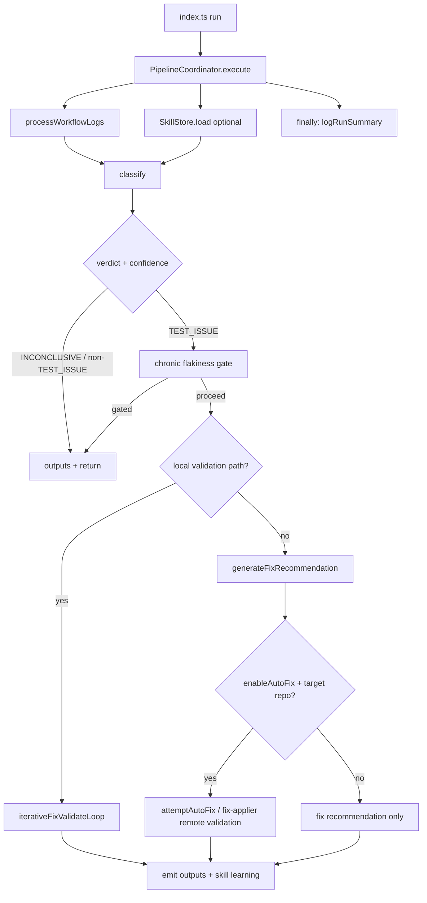

# Adept Triage Agent — Architecture Roadmap

Implementation-ready roadmap derived from the current codebase. Source-of-truth references: `src/index.ts`, `src/pipeline/coordinator.ts`, `src/pipeline/validator.ts`, `src/pipeline/output.ts`, `src/agents/agent-orchestrator.ts`, `src/repair/simplified-repair-agent.ts`, `src/services/skill-store.ts`, `src/services/local-fix-validator.ts`, `src/repair/fix-applier.ts`, `src/services/log-processor.ts`, `src/openai-client.ts`, `src/config/constants.ts`, `action.yml`, `src/agents/analysis-agent.ts`.

---

## Executive Summary

The triage agent should **keep** its proven pillars: the **five-stage agentic repair pipeline** (analysis → code reading → investigation → fix generation → review) orchestrated by `AgentOrchestrator`, **DynamoDB-backed** per-repo skill storage (`SkillStore`, partition `REPO#owner/repo`), and **local validation** (`LocalFixValidator`: clone, install, baseline, apply, test, optional push/PR) as the primary path when `ENABLE_LOCAL_VALIDATION` is true.

The highest-leverage redesign is **not** introducing new storage technology. It is **fixing confirmed accuracy bugs** that make the agent learn the wrong things, then layering **memory semantics**, **conversation chaining**, **case-file consistency**, and **remote-validation hardening** on top. The roadmap is ordered by **accuracy impact on test repair**, not by refactor cleanliness.

---

## Confirmed Bugs (motivation)

These are not speculative. Each is grounded in current source.

| # | Bug | Effect | Source |
|---|-----|--------|--------|
| **B1** | A passing local test followed by a `pushAndCreatePR` failure produces `ApplyResult { success: false, validationStatus: 'passed' }`. Coordinator sets `fixSucceeded = autoFixResult.success && validationStatus === 'passed'`, so a real validation success is recorded as `validatedLocally: false` **and** `recordOutcome(skill, false)`. | Skill store learns publish failures **as if they were fix failures**. `findForClassifier` then **excludes** the skill (it filters on `validatedLocally === true`). Repeated push failures (PAT scope, branch protection, etc.) silently retire valid patterns. | `src/pipeline/validator.ts:355-367`, `src/pipeline/coordinator.ts:407-481`, `src/services/skill-store.ts:693-698` |
| **B2** | Each iteration of `iterativeFixValidateLoop` calls `generateFixRecommendation` with `previousResponseId: undefined`, so every retry re-runs the **full** five-stage orchestrator (analysis → code reading → investigation → fix-gen → review) with no OpenAI Responses API conversation chaining. | Up to **9 LLM calls** per iteration × `MAX_ITERATIONS = 3` and orchestrator wall budget of **15 min**. Wasted spend dominates micro-optimizations. | `src/pipeline/validator.ts:208-219`, `src/agents/agent-orchestrator.ts:50-56`, `src/config/constants.ts:155-181` |
| **B3** | `detectFlakiness(spec)` counts **all** same-spec skills, including `isSeed` rows and retired rows. `coordinator.ts` chronic-flakiness gate fires when `isFlaky && fixCount >= CHRONIC_FLAKINESS_THRESHOLD` (default `3`). Three seed rows on the same spec satisfy this. | Repos that bootstrap with curated seeds can hit the gate **without ever auto-fixing**, silently disabling repair. | `src/services/skill-store.ts:758-768`, `src/pipeline/coordinator.ts:366-372`, `src/config/constants.ts:191` |
| **B4** | Log caps drift across the prompt path. `openai-client` uses `LOG_LIMITS.PROMPT_MAX_LOG_SIZE` (200 KB), but `analysis-agent.buildUserPrompt` slices logs at **3000 chars** independently. Other agents apply their own caps. | Classifier and analysis see materially different evidence on the same run. Drift between agents is a real source of disagreement that looks like model error. | `src/openai-client.ts` (`buildPrompt`/`capLogsForPrompt`), `src/agents/analysis-agent.ts:225` |
| **B5** | `triggerValidation` dispatches `workflow_dispatch` with `ref: 'main'` hardcoded. Consumers whose default branch is not `main` (e.g. `master`, `develop`) get a 422 or run against the wrong ref. | Remote validation path is unreliable for non-main repos. Independent reason to constrain remote (Phase 5). | `src/repair/fix-applier.ts:469` |
| **B6** | `analysis-agent.buildUserPrompt` (and peers) interpolate `context.errorMessage` raw inside a triple-backtick code fence; `sanitizeForPrompt` is not applied at this site. `sanitizeForPrompt` is used in skill formatters and the retry block, but **not uniformly** across the agent prompt path. | Prompt-injection patterns in test logs (e.g. `## SYSTEM:`, stray triple-backticks) reach the model verbatim. Today's risk is bounded by the test-evidence verifier, but the new memory kinds (Phase 2) widen the surface unless this is closed. | `src/agents/analysis-agent.ts:208-211`, `src/services/skill-store.ts:180-211` |

---

## Current Architecture Snapshot

### Entry and coordination

`src/index.ts` parses `ActionInputs`, constructs `Octokit`, `OpenAIClient`, `ArtifactFetcher`, and `PipelineCoordinator`, then calls `coordinator.execute()`.

`PipelineCoordinator.execute()` (`src/pipeline/coordinator.ts`):

1. Builds `ErrorData` via `processWorkflowLogs()` (`src/services/log-processor.ts`).
2. Optionally constructs `SkillStore` for `autoFixTargetRepo`, awaits `skillStore.load()`.
3. Runs `runClassifyAndRepair()` inside `try/finally`; `skillStore?.logRunSummary()` always runs.

Repair branches on inputs:

- **Local path**: `enableAutoFix && enableValidation && enableLocalValidation && validationTestCommand && autoFixTargetRepo` → `iterativeFixValidateLoop()`.
- **Otherwise**: `generateFixRecommendation()` then optional `attemptAutoFix()` (remote dispatch).

### Local fix / validate loop



**Ordering (as of today):** in `iterativeFixValidateLoop`, the first iteration calls `generateFixRecommendation` **before** `validator.setup()` / `baselineCheck()` (the validator is lazily initialized inside the loop on first need). Baseline requires **3 consecutive passes** (`BASELINE_PASS_COUNT = 3`) and short-circuits on the first failing pass.

### Skill store

`SkillStore` uses Dynamo keys `pk: REPO#<owner>/<repo>`, `sk: SKILL#<id>`. `load()` queries with `begins_with(sk, 'SKILL#')`, then casts items to `TriageSkill`. `findForClassifier` returns up to **3** validated, non-retired skills; `findRelevant` defaults to **5**.

### Outputs and telemetry merge

`finalizeRepairTelemetry()` upgrades `RepairStatus` to `validated` / `applied` only when `autoFixResult?.success`. `setSuccessOutput()` sets `auto_fix_applied = autoFixResult?.success`. This is where Bug B1 surfaces in outputs: a passed-test-then-push-fail produces `auto_fix_applied: false` alongside `validation_status: passed`, contradicting itself.

---

## Roadmap Overview (accuracy-ordered)

| Phase | Theme | Bugs closed | Accuracy lift |
|------:|--------|-------------|----------------|
| **0** | Decouple validation outcome from publish outcome | B1 | **High** — stops poisoning the skill store on every push failure |
| **1** | Conversation chaining across iteration loop | B2 | **Medium accuracy / high cost saving** — same prompt context, cheaper |
| **2** | Typed skill memory + role-gated retrieval + formatter branches | B3 (with seed exclusion) | **High** — better fix-gen prompts, honest negative evidence |
| **3** | Baseline before LLM repair (local path) | — (efficiency) | **Low accuracy / high cost saving** |
| **4** | Structured case file with single cap source | B4, B6 | **Medium** — agents agree on what evidence they saw; closes injection drift |
| **5** | Harden or deprecate remote validation | B5 | **Operational** — single supported validation story |

Each phase below is independent; nothing forces sequencing except this priority recommendation.

---

## Phase 0: Decouple Validation Outcome from Publish Outcome

### Problem

Bug B1: `fixSucceeded = autoFixResult?.success && validationStatus === 'passed'`. When local test passes but `pushAndCreatePR` throws, `success` is `false` while `validationStatus` is `passed`. The skill is then saved with `validatedLocally: false` and `recordOutcome(skill.id, false)` — a false-negative outcome that retires good patterns.

### Target

A successful **validation** is the source of truth for `validatedLocally` and skill outcome counters. Publish status is recorded **separately**.

### Implementation sketch

1. In `coordinator.ts:runClassifyAndRepair`, derive a new authoritative flag:

   ```typescript
   const validationPassed =
     (autoFixResult?.validationResult?.status ?? autoFixResult?.validationStatus) === 'passed';
   const publishSucceeded = !!autoFixResult?.success;
   ```

2. Use `validationPassed` to drive `validatedLocally` and `recordOutcome`. Use `publishSucceeded` to drive `prUrl` / `auto_fix_applied`.

3. Update `output.ts` so `auto_fix_applied`, `validation_status`, and `repair_status` agree on the matrix:

   | Validation | Publish | `validation_status` | `auto_fix_applied` | `repair_status` |
   |-----------|---------|---------------------|--------------------|-----------------|
   | passed    | success | `passed` | `true`  | `validated` |
   | passed    | failed  | `passed` | `false` | `validated_publish_failed` (new) |
   | passed    | n/a (no autofix branch) | `passed` | `false` | `validated_not_published` (new) |
   | failed    | n/a     | `failed` | `false` | `review_rejected` / `no_approved_fix` (existing) |
   | pending (remote) | n/a | `pending` | `false` | `applied` |
   | skipped (baseline / no spec) | n/a | `skipped` | `false` | `skipped` |

4. **Update `RepairStatus`** to introduce the publish dimension explicitly. Either:
   - **Option A (preferred):** add `validated_publish_failed` and `validated_not_published` and **stop** using `applied` ambiguously. Backward-compatible because consumers reading the old terminal `validated` still get it on the happy path.
   - **Option B:** ship `RepairLifecycle` (Phase 3 of original roadmap) as additional outputs while preserving `repair_status` semantics.

### Acceptance

- `recordOutcome(skill, true)` when validation passed, regardless of publish outcome.
- `validatedLocally === true` when validation passed.
- A new test (run only on user request) confirms the publish-failure-after-pass branch records `true`.
- Output matrix above is documented in `action.yml` and `README.md`.

### Why first

This is the **smallest patch with the largest accuracy impact**. It does not require schema changes, new Dynamo prefixes, or output additions beyond two new `repair_status` values. Every later phase assumes outcomes are honest.

---

## Phase 1: Conversation Chaining Across the Iteration Loop

### Problem

Bug B2: `iterativeFixValidateLoop` discards the OpenAI Responses API `lastResponseId` from one iteration to the next. Every retry re-runs analysis → code reading → investigation **from scratch**, even though that evidence rarely changes within a 3-iteration loop. With `MAX_ITERATIONS = 3` and orchestrator timeout 15 min, this is the dominant cost in any run that needs more than one iteration.

### Target

Within a single triage run, the outer loop's iterations chain via `previous_response_id` so analysis/code-reading/investigation are not re-emitted by the model when their inputs are unchanged.

### Implementation sketch

1. Capture `repairAgent.generateFixRecommendation(...).lastResponseId` in `validator.ts:208-219`.
2. Pass it into the next iteration's `generateFixRecommendation` (already a parameter; today the call site forces `undefined`).
3. Inside `AgentOrchestrator`, only re-run earlier stages when **inputs changed**: a new `previousAttempt` summary, validation logs from the prior iteration, or new investigation findings. Otherwise reuse the prior responses via the chain.
4. Keep budgets unchanged (`MIN_FIX_GEN_BUDGET_MS`, `MIN_REVIEW_BUDGET_MS`).

### Risks

- The Responses API may not preserve identical analysis verbatim; treat chaining as an optimization, not a contract. If the chained call deviates, fall back to full re-run.
- `responseId` is per OpenAI account; rotation must invalidate the chain. Guard with a try/catch that retries from scratch on `not_found`.

### Acceptance

- Average LLM calls per iteration > 1 drops measurably (target: ~50% reduction on iteration 2/3 vs today).
- No regression in fix correctness rate (existing skills + acceptance corpus).

---

## Phase 2: Typed Skill Memory & Anchoring Guardrails

### Problem

Today, `findRelevant` surfaces successful and failed skills together. The fix-gen prompt header explicitly contrasts them ("validated" vs "what did NOT work"), and `failedFixEvidence` renders as a clear negative-evidence block — **but** the surrounding skill body still presents the failed pattern in the same template (file, change type, root cause), which can anchor fix-gen toward similar bad approaches.

`detectFlakiness` (Bug B3) counts seeds toward the chronic-gate.

`findRelevant` defaults to `limit: 5` while `findForClassifier` caps at 3 — no role-specific budget on negative evidence.

### Target

1. **Logical record kinds**, accompanied by **explicit formatter and retrieval changes** that surface them differently to each role.
2. **Seed exclusion** for the chronic-flakiness gate.
3. **Role-specific retrieval budgets** with separate caps for positive vs negative memory.
4. **Anchoring guardrails** in formatters: `failed_attempt` content is rendered as compact "do-not-repeat" signatures, not as a full skill template.

### Memory kinds

| Kind | Purpose | Storage today | Storage after |
|------|---------|---------------|---------------|
| `seed_pattern` | Curated bootstrap (`isSeed`) | `SKILL#<id>` row with `isSeed: true` | unchanged |
| `learned_pattern` | Successful auto-learned template | `SKILL#<id>` row with `validatedLocally: true` | unchanged (most common case) |
| `failed_attempt` | Generated fix that reached terminal validation and did not pass | `SKILL#<id>` row with `failedFixEvidence` | optionally migrate to `FAILED#<runId>#<attempt>` rows; keep legacy reads |
| `usage_event` | Per-run skill attribution for analytics | not persisted | new `USAGE#<runId>#<role>` rows, store-flushed in coordinator finally |
| `flakiness_event` | Snapshot when chronic-flakiness gate fires | not persisted | optional `FLAKY#<runId>` rows |

### Formatter and retrieval changes (the work that actually moves the model)

`formatSkillsForPrompt` (`src/services/skill-store.ts:1149+`) must branch on kind. Concrete edits:

1. **`learned_pattern` and `seed_pattern`**: render today's full template (Pattern, Root cause, Trace if validated). Seeds keep their existing "curated seed" framing.
2. **`failed_attempt`**: render only as a one-line negative signature — `attempted: <changeType> in <file> → did not validate (<originalFailureSignature> → <validationFailureSignature>)`. **Do not** render `fix.pattern`, `fix.summary`, or `failureModeTrace` for failed attempts.
3. **Investigation role**: do not surface failed attempts at all — fresh evidence, no anchoring.
4. **Fix-gen and review roles**: surface failed attempts in a separate "negative evidence — do not reuse" section, capped at 1 entry by default.

`findRelevant` must accept a `kindFilter` and `limit` per role. Suggested defaults:

| Role | learned + seed | failed_attempt |
|------|----------------|----------------|
| classifier | ≤3 (current) | 0 |
| investigation | ≤3 | 0 |
| fix-generation | ≤2 | ≤1 |
| review | ≤2 | ≤1 |

### Seed exclusion for chronic flakiness

Behind input flag `SKILL_FLAKINESS_EXCLUDE_SEEDS` (does not exist in source today; this would be a new input). When enabled, filter `!s.isSeed` from the **base** `specSkills` set inside `detectFlakiness`, not just window-specific arrays — so both gate decision and returned `fixCount` are seed-free. Default `false` initially, flip after soak.

### Classifier feedback (`classificationOutcome = 'incorrect'`)

The deferred A1 writer (see `coordinator.ts:51-67` comment) should be implemented **only** with these guardrails:

1. Trigger: `classifierSkillIds` was non-empty **and** baseline check passed (3 consecutive passes).
2. Compensating writer: when classifier surfaced skills **and** the run produced a validated fix, write `'correct'` to those same IDs. Otherwise the only signal recorded is negative — biased.
3. Document explicitly: this is a **heuristic**, not truth. Baseline-pass conflates "classifier wrong" with "failure non-repro on clone runner". Operators must be able to disable via input.
4. Note: `classifierSkillIds` are the **prior run's** classifier population, distinct from the **newly saved** skill that today receives `recordClassificationOutcome('correct')` on success. Do not collapse the two populations.

### Token budget

Per-role caps above. Add a single per-skill `MAX_RENDERED_CHARS` constant for the failed-attempt block (~400 chars). Existing `TRACE_FIELD_MAX = 200` covers traces; do not render traces for failed attempts.

### Acceptance

- Chronic gate does not fire on seed-only repos when flag enabled.
- Fix-gen prompts contain at most 2 successful + 1 failed memory entry; failed entries are signature-only.
- A1 writer ships behind `SKILL_CLASSIFIER_FEEDBACK` flag, default off.
- Telemetry confirms: when failed-attempts are surfaced, fix-gen does not produce identical `fixFingerprint` to the failed entry.

---

## Phase 3: Baseline Before LLM Repair (Local Path)

### Problem

On a transient flake, the pipeline currently runs the orchestrator (≥3 LLM stages, up to 9 calls if iteration loop hits, up to 15 minutes wall) **before** clone + install + baseline. When the failure does not reproduce, that work is entirely wasted.

### Target

For local-validation runs, perform `validator.setup()` + `baselineCheck()` **once** before the first `generateFixRecommendation` invocation. Preserve the multi-pass baseline (`BASELINE_PASS_COUNT = 3`) and short-circuit-on-first-failure semantics.

### Numbers (anchored to current source)

- Saved on transient: up to 9 LLM calls × `gpt-5.5` xhigh + up to 15 min wall (`AGENT_CONFIG.AGENT_TIMEOUT_MS`).
- Added latency on real failures: clone (depth 50) + `npm ci` + 1 baseline test run. The same setup happens today right before the first apply; ordering shifts **when**, not **whether**, this cost is paid.
- Baseline short-circuits on the first failing pass, so real failures pay 1× test, not 3×. Only transient runs pay 3× — and that's the path being optimized for.

### Implementation sketch

1. In `iterativeFixValidateLoop`, hoist the `validatorReady` block **above** the iteration loop:

   ```typescript
   await validator.setup();
   const baseline = await validator.baselineCheck();
   if (baseline.passed) {
     return { /* skipped, transient flake */ };
   }
   for (let iteration = 0; iteration < maxIterations; iteration++) { /* unchanged */ }
   ```

2. Keep early-return shape and `repairTelemetry.status === 'skipped'`.
3. Maintain "one clone per run" invariant.

### Acceptance

- Zero orchestrator LLM calls when baseline early-exits (today: ≥1 full orchestration before exit).
- No semantic change to the skip telemetry already emitted today.

---

## Phase 4: Structured Case File With Single Cap Source

### Problem

Bugs B4 and B6: log caps and sanitization drift across `openai-client.buildPrompt`, `analysis-agent.buildUserPrompt` (3000-char log slice), per-agent `buildUserPrompt` helpers, and the retry block. Classifier and analysis can see materially different evidence on the same run, and `sanitizeForPrompt` is only applied at the skill-store boundary, not for `context.errorMessage` in agent code fences.

### Target

A canonical `TriageCaseFile` constructed once after `processWorkflowLogs`, with all caps centralized in `LOG_LIMITS`. Every prompt builder consumes pre-capped, pre-sanitized fields from the case file via an adapter. Existing `ErrorData` and `RepairContext` entry points are preserved during migration.

### Sketch

```typescript
interface TriageCaseFile {
  schemaVersion: 1;
  workflowRunId: string;
  jobName?: string;
  framework: string;
  normalizedSpec?: string;
  error: { messageSanitized: string; cappedContext: string };
  stackTraceSanitized?: string;
  artifacts: { name: string; cappedSnippet?: string }[];
  prDiff?: { cappedSummary: string };
  redactionFlags: { stripped: string[] };
}
```

Constructor invariants:
- All `messageSanitized` / `*Sanitized` fields run through `sanitizeForPrompt` with explicit per-field caps.
- All log slicing uses `LOG_LIMITS` constants. No agent slices independently.
- `redactionFlags.stripped` records what was removed (URLs, tokens, etc.) so reviewers can audit.

### Acceptance

- Only `TriageCaseFile` constructor invokes `LOG_LIMITS.*` slicing constants; no other agent does.
- All occurrences of `context.errorMessage` and similar untrusted strings inside code fences are `sanitizeForPrompt`-wrapped.
- Classifier and analysis agents render the same log/error excerpt on the same run.

---

## Phase 5: Harden or Deprecate Remote Validation

### Problem

Bug B5: `triggerValidation` hardcodes `ref: 'main'`. Plus the wider remote-path failure matrix the test-evidence verifier already partially mitigates.

### Failure matrix today

| Failure mode | Current handling | Source |
|--------------|------------------|--------|
| `dispatched-run-not-found` after 10 polls | Returns `{ status: 'pending', conclusion: 'dispatched-run-not-found' }` | `validator.ts:688-697`, `fix-applier.ts:484-518` |
| Workflow concludes `success` but no test evidence | Verifier flips to `failed` with `success-without-test-evidence` | `fix-applier.ts:591-628` |
| Bare-basename spec | Warns, may log "no spec files were found" and exit 0 (now caught by evidence verifier) | `fix-applier.ts:446-458` |
| `waitForValidation` 15-min timeout | Returns `{ status: 'pending', conclusion: 'timeout' }` | `fix-applier.ts:671-682` |
| Run-list time-window matching (`createdAt >= dispatchedAt - 30s`) | Could attach to a concurrent run on busy repos | `fix-applier.ts:503-512` |
| `ref: 'main'` hardcoded | Wrong for non-main default branches; 422 from GitHub | `fix-applier.ts:469` |

### Direction

1. **Immediate fix:** make `ref` configurable, default to the consumer's `defaultBranch` resolved via Octokit at startup.
2. **Hardening:** correlate dispatched runs by an `inputs.triage_run_id` rather than time window.
3. **Deprecation criteria:** once internal repos have moved to `ENABLE_LOCAL_VALIDATION`, gate remote behind explicit input `ALLOW_REMOTE_VALIDATION` (default `true` initially, flip to `false` after soak — **product decision**).

### Acceptance

- Non-main default branch repos work with remote validation.
- Concurrent triage runs on the same target repo do not cross-attach.
- Remote validation is documented as a compatibility path, not the recommended one.

---

## Data Model Sketches

### DynamoDB (existing)

- **Partition key:** `pk = REPO#<owner>/<repo>` (`src/services/skill-store.ts:407, 462, 550, ...`).
- **Sort key:** `sk = SKILL#<uuid>` for skills.

### Proposed sort-key prefixes (same table / partition)

| Sort key prefix | Purpose |
|-----------------|---------|
| `SKILL#...` | Existing `TriageSkill` JSON. Reads continue to use `begins_with(sk, 'SKILL#')`. |
| `USAGE#<githubRunId>#<role>` | Per-run skill attribution. Append-only. |
| `FAILED#<githubRunId>#<attempt>` | Optional negative-evidence row separate from `SKILL#`. |
| `FLAKY#<githubRunId>` | Optional materialized flakiness-gate event. |
| `CASE#<fingerprint>` | Optional dedup case-file cache (later phase). |

Non-`TriageSkill` shapes must **not** live under the `SKILL#` prefix because existing `load()` casts those rows to `TriageSkill`.

### TypeScript sketches (illustrative)

```typescript
type MemoryRecordKind =
  | 'triage_skill'
  | 'failed_attempt'
  | 'usage_event'
  | 'flakiness_event'
  | 'case_file_cache';

interface UsageAttributionRecord {
  kind: 'usage_event';
  githubRunId: string;
  role: 'classifier' | 'investigation' | 'fix_generation' | 'review' | 'analysis' | 'code_reading';
  skillIds: string[];
  createdAt: string;
}

interface FailedAttemptRecord {
  kind: 'failed_attempt';
  githubRunId: string;
  attempt: number;
  originalFailureSignature: string;
  validationFailureSignature: string;
  proposedFiles: string[];
  failedAt: string;
}

interface FlakinessEventRecord {
  kind: 'flakiness_event';
  githubRunId: string;
  normalizedSpec: string;
  fixCount: number;
  windowDays: number;
  createdAt: string;
}
```

### Repair lifecycle types (Phase 0 ships option A; option B is future)

```typescript
type ValidationPhase =
  | { phase: 'not_run' }
  | { phase: 'pending'; mode: 'local' | 'remote'; runId?: number }
  | { phase: 'complete'; outcome: 'passed' | 'failed' | 'inconclusive'; mode: 'local' | 'remote' };

type PublishPhase =
  | { phase: 'not_attempted' }
  | { phase: 'created'; prUrl?: string; branchName: string; commitSha: string }
  | { phase: 'failed'; error: string; branchName?: string; commitSha?: string };

/**
 * Future. When this lands, narrow `RepairStatus` so it no longer encodes
 * validation/publish outcomes:
 *   type OrchestrationStatus =
 *     | 'not_started' | 'in_progress' | 'no_fix_generated'
 *     | 'review_rejected' | 'timed_out' | 'cancelled'
 *     | 'no_approved_fix' | 'approved' | 'skipped';
 */
type RepairLifecycle = {
  orchestration: OrchestrationStatus;
  validation: ValidationPhase;
  publish: PublishPhase;
};
```

---

## Migration Plan

### Principles

1. **Backward-compatible reads:** `load()` continues to scan only `SKILL#`. New prefixes get their own queries.
2. **Phase 0 first:** ship the publish/validation decoupling and new `repair_status` values before any schema work.
3. **Phase 2 dual-write for failed_attempt:** optional. Either keep failed trajectories in legacy `SKILL#` rows behind a typed adapter, or dual-write `FAILED#` rows while leaving `SKILL#` reads unchanged.
4. **Usage attribution:** **store-owned**, not synchronous. `logSkillTelemetry` stays a module-private logger. `SkillStore` accumulates `(role, skillIds)` tuples in memory; the coordinator's existing `finally` block flushes one `USAGE#<runId>#<role>` item per role after `logRunSummary()`. Failures are swallowed.
5. **Flakiness exclusion:** behind `SKILL_FLAKINESS_EXCLUDE_SEEDS` input flag (does not exist today). Filter `!s.isSeed` from the base `specSkills` set inside `detectFlakiness` so both gate decision and `fixCount` are seed-free.
6. **Classifier feedback:** behind `SKILL_CLASSIFIER_FEEDBACK` flag. Document false-positive cases.
7. **Remote ref fix (Phase 5):** ship the `ref` resolution change immediately; deprecation flag (`ALLOW_REMOTE_VALIDATION`) is a separate decision.
8. **Audit tooling:** extend `scripts/audit-skills.ts` to optionally scan `USAGE#`, `FAILED#`, and `FLAKY#` prefixes once they exist.

### Rollback

- Phase 0 has no schema migration; revert is a code change only.
- Phase 1 wraps chaining in try/catch fallback to no-chain.
- Phase 2 record kinds default to `triage_skill`; new prefixes can be ignored by old binaries.
- Open question: TTL on attribute (`expiresAt`) for `USAGE#` items vs manual prune. **DynamoDB TTL is configured per attribute, not per sort-key prefix.**

---

## Acceptance Criteria

| Phase | Criteria |
|-------|----------|
| **0** | `recordOutcome(true)` and `validatedLocally: true` when validation passed, regardless of publish outcome. New `repair_status` values documented. Output matrix consistent across `auto_fix_applied`, `validation_status`, `repair_status`. |
| **1** | Demonstrable LLM-call reduction on iteration 2/3 retries via `previous_response_id` chaining; no regression in fix correctness rate. |
| **2** | Chronic-flakiness gate does not fire on seed-only repos when flag enabled. Fix-gen prompts cap negative evidence at 1 entry rendered as signature-only. A1 writer behind flag with compensating "correct" writer. |
| **3** | Zero orchestrator LLM calls when baseline early-exits on local path. |
| **4** | Only `TriageCaseFile` constructor calls `LOG_LIMITS.*` slicing. Classifier and analysis render identical log excerpts on the same run. All untrusted strings in agent code fences are `sanitizeForPrompt`-wrapped. |
| **5** | Non-main default branch repos work with remote validation. Concurrent triage runs do not cross-attach via run-list. Remote documented as legacy. |

**Tests:** follow repo norms (`npm test`, `npm run verify-dist` when shipping). No new tests added unless explicitly requested.

---

## Open Questions

1. **Usage retention:** TTL attribute (e.g. `expiresAt` 30 days) on `USAGE#` items vs manual prune?
2. **`failed_attempt` dual-write:** ship under separate `FAILED#` prefix, or keep nested in `SKILL#`?
3. **`RepairStatus` evolution:** Phase 0 option A (add two values) vs option B (introduce `RepairLifecycle` output)? Downstream Slack templates preference?
4. **Remote deprecation timeline:** who signs off on default-flip for `ALLOW_REMOTE_VALIDATION`?
5. **Classifier-feedback default:** ship A1 writer disabled and require explicit opt-in, or enable with a monitor and disable on regression?

---

## Appendix: File reference map

| Concern | File |
|---------|------|
| Run orchestration | `src/pipeline/coordinator.ts` |
| Local vs remote repair branching | `src/pipeline/validator.ts` |
| Action outputs | `src/pipeline/output.ts`, `action.yml` |
| Agent pipeline | `src/agents/agent-orchestrator.ts` |
| Per-agent prompts | `src/agents/analysis-agent.ts`, `investigation-agent.ts`, `fix-generation-agent.ts`, `review-agent.ts`, `code-reading-agent.ts` |
| Repair agent façade | `src/repair/simplified-repair-agent.ts` |
| Skills CRUD + retrieval + formatters | `src/services/skill-store.ts` |
| Clone / test / baseline | `src/services/local-fix-validator.ts` |
| Remote apply + dispatch | `src/repair/fix-applier.ts`, `attemptAutoFix` in `validator.ts` |
| Log ingestion | `src/services/log-processor.ts` |
| LLM transport (caps, retries, chaining) | `src/openai-client.ts` |
| Caps / loops / models | `src/config/constants.ts` |
