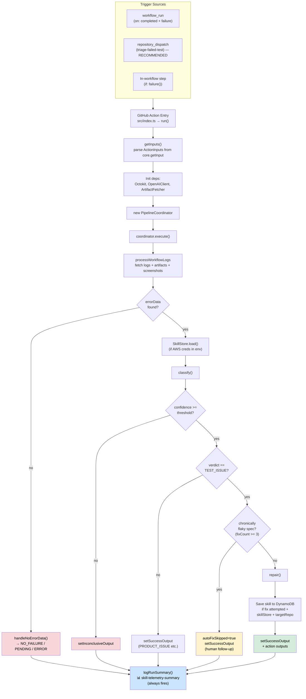
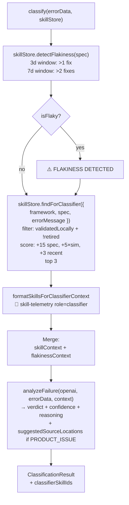
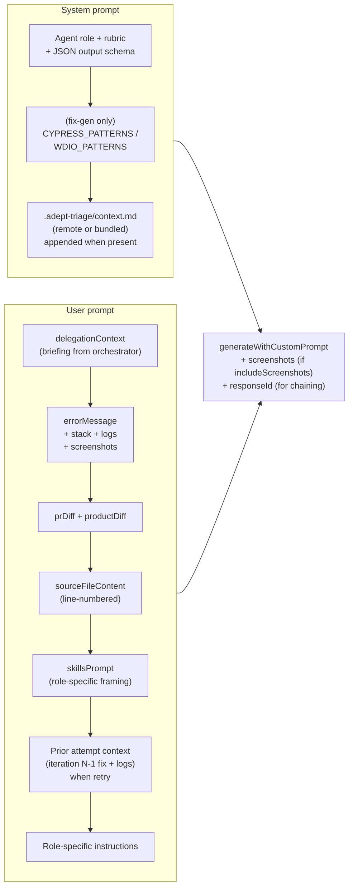
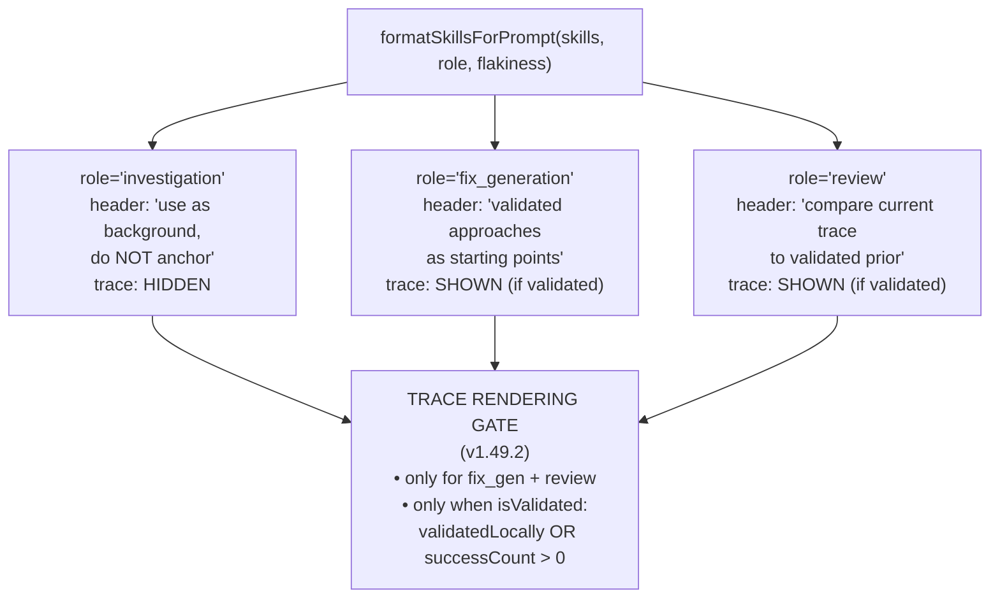
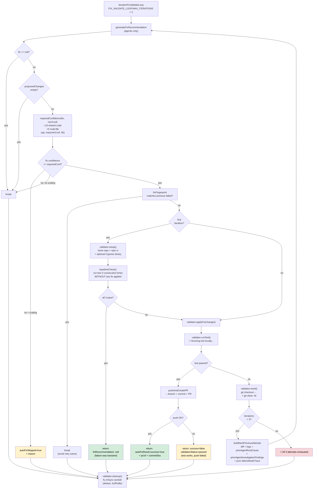
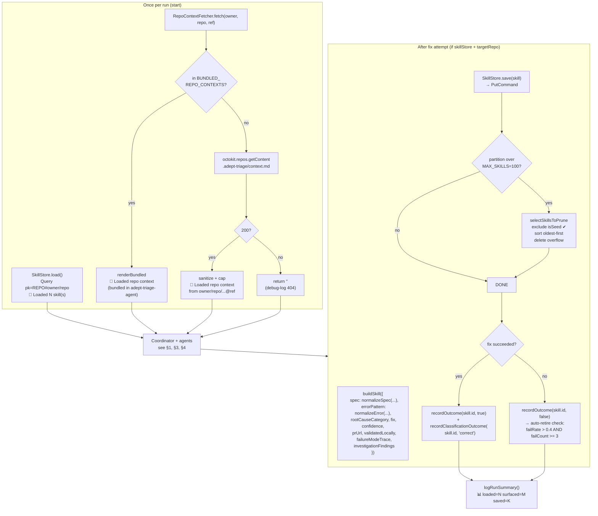
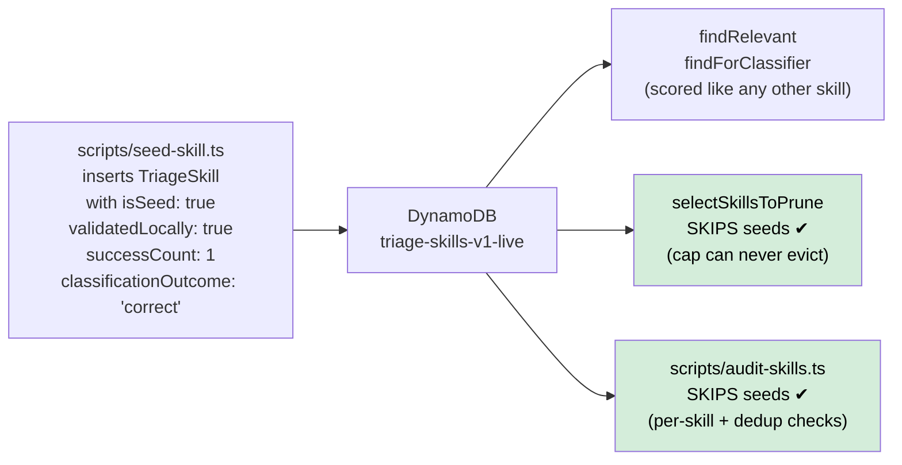
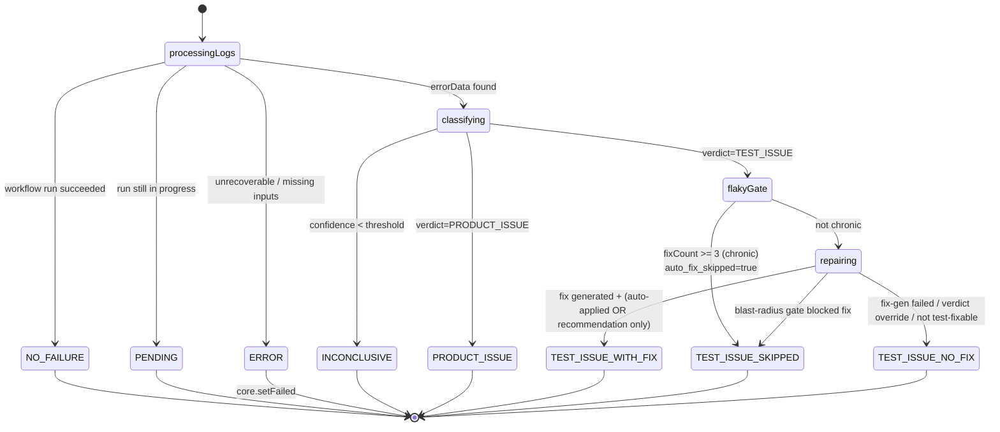
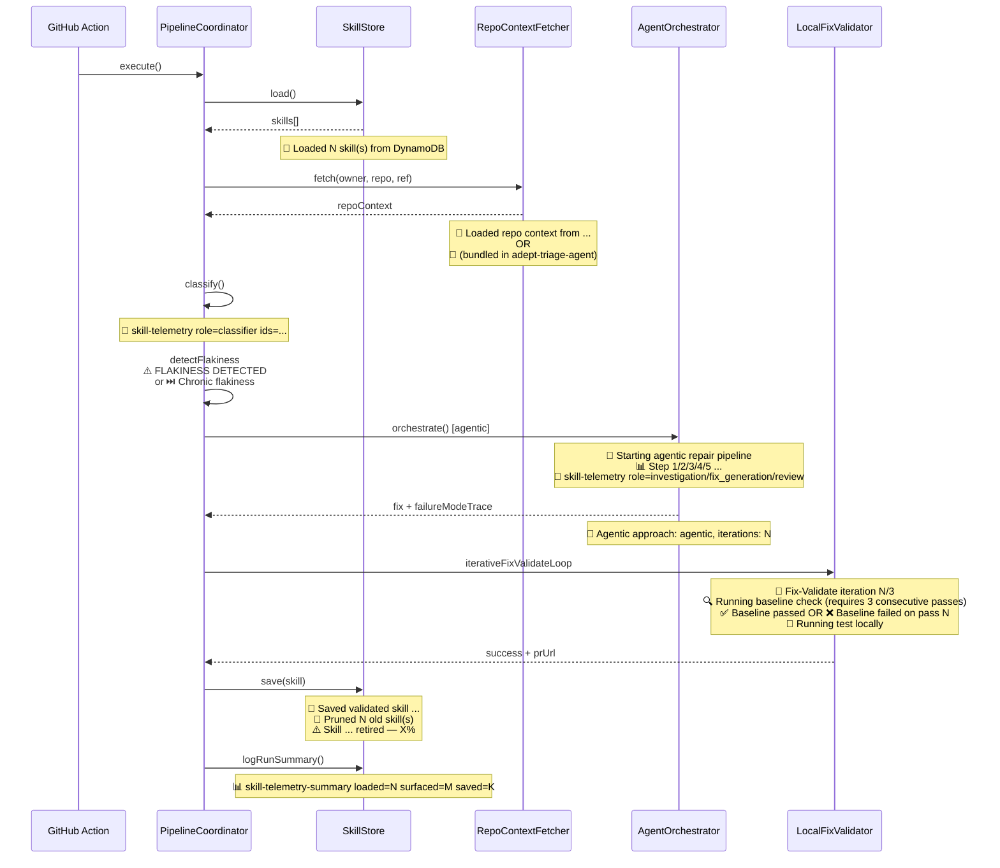

# Adept Triage Agent — Workflow Flowchart

> Visual reference for how a triage run flows end-to-end.
> For textual deep-dive, see [ARCHITECTURE.md](ARCHITECTURE.md).
> **Current version:** v1.52.0

---

## 1. Top-level: trigger → classify → repair → save skill → output

---

## 2. Classification phase

---

## 3. Agentic repair pipeline — the five-agent orchestrator

Happy path inside `AgentOrchestrator.orchestrate()` (`src/agents/agent-orchestrator.ts`). Wrapped in a `Promise.race` against `totalTimeoutMs = 300000` (v1.51.0 for xhigh latency).

```mermaid
flowchart TB
    START["orchestrate(context, errorData,<br/>previousResponseId, skills)"]
    START --> SKILL_PROMPT_A["context.skillsPrompt<br/>= formatSkillsForPrompt(skills, 'investigation', flakiness)"]
    SKILL_PROMPT_A --> ANALYSIS["<b>Analysis Agent</b><br/>gpt-5.3-codex<br/>→ rootCauseCategory, issueLocation,<br/>selectors, confidence"]

    ANALYSIS --> CODE_READ["<b>Code Reading Agent</b><br/>no LLM — direct octokit getContent<br/>→ test file + page objects + support files"]

    CODE_READ --> CHAIN_DECIDE{"analysis.confidence<br/>&lt; 80?"}
    CHAIN_DECIDE -- yes --> CHAIN_YES["investigationChainId =<br/>analysisResult.responseId"]
    CHAIN_DECIDE -- no --> CHAIN_NO["investigationChainId =<br/>undefined (fresh start)"]

    CHAIN_YES --> SKILL_PROMPT_I
    CHAIN_NO --> SKILL_PROMPT_I

    SKILL_PROMPT_I["context.skillsPrompt<br/>= priorInvestigationContext<br/>+ baseInvestigationSkills"]
    SKILL_PROMPT_I --> INVESTIGATION["<b>Investigation Agent</b><br/>gpt-5.3-codex<br/>→ findings, recommendedApproach,<br/>selectorsToUpdate, isTestCodeFixable,<br/>verdictOverride?"]

    INVESTIGATION --> OVERRIDE{"verdictOverride<br/>APP_CODE with<br/>higher conf?"}
    OVERRIDE -- yes --> ABORT_APP["ABORT:<br/>investigation outvoted analysis —<br/>not test-fixable"]
    OVERRIDE -- no --> TEST_FIXABLE{"isTestCodeFixable?"}
    TEST_FIXABLE -- no --> ABORT_TEST["ABORT:<br/>not test-code-fixable<br/>+ no override"]
    TEST_FIXABLE -- yes --> LOOP_START

    LOOP_START["Fix/Review loop<br/>maxIterations = 3"]
    LOOP_START --> FIX_GEN["<b>Fix Generation Agent</b><br/>gpt-5.4 xhigh<br/>+ CYPRESS_PATTERNS / WDIO_PATTERNS<br/>→ changes[], failureModeTrace (4 fields),<br/>confidence, reasoning"]

    FIX_GEN --> AUTO_CORRECT["autoCorrectOldCode<br/>(snap near-miss oldCode to source)"]

    AUTO_CORRECT --> CONF_GATE{"confidence >=<br/>70?"}
    CONF_GATE -- no --> FEEDBACK_CONF["reviewFeedback<br/>= low-confidence msg<br/>→ next iteration"]
    CONF_GATE -- yes --> REVIEW["<b>Review Agent</b><br/>gpt-5.4 xhigh<br/>audits: oldCode match, trace quality,<br/>logical strengthening, APP_CODE justification,<br/>verdictOverride alignment,<br/>recommendedApproach honored"]

    REVIEW --> APPROVED{"approved<br/>+ no CRITICAL?"}
    APPROVED -- yes --> SHIP["return fix<br/>approach: agentic"]
    APPROVED -- no --> BLOCKING{"blocking<br/>CRITICAL?"}
    BLOCKING -- yes --> TRACE_REPLAY["reviewFeedback<br/>+ prior failureModeTrace<br/>replay → next iteration"]
    BLOCKING -- no --> REGULAR_FEEDBACK["reviewFeedback<br/>= issue lines<br/>→ next iteration"]

    FEEDBACK_CONF --> LOOP_CHECK
    TRACE_REPLAY --> LOOP_CHECK
    REGULAR_FEEDBACK --> LOOP_CHECK
    LOOP_CHECK{"iterations<br/>&lt; 3?"}
    LOOP_CHECK -- yes --> FIX_GEN
    LOOP_CHECK -- no --> MAX_ITER{"lastFix<br/>confidence OK<br/>+ no blocking<br/>CRITICAL?"}
    MAX_ITER -- yes --> FALLBACK_SHIP["ship lastFix<br/>with warning<br/>(validation = final gate)"]
    MAX_ITER -- no --> FAIL["return error<br/>approach: failed"]

    style ABORT_APP fill:#f8d7da,color:#000
    style ABORT_TEST fill:#f8d7da,color:#000
    style SHIP fill:#d4edda,color:#000
    style FALLBACK_SHIP fill:#fff3cd,color:#000
    style FAIL fill:#f8d7da,color:#000
```

---

## 4. Prompt composition — per-agent

Applied in `BaseAgent.runAgentTask` for every LLM-calling agent.

### Skill-memory role framing

---

## 5. Local validation loop

---

## 6. Learning loop — skills + repo context

### Seed-skill protection

---

## 7. Verdict state machine

---

## 8. Log-line quick reference

Top-level spans every stage. Useful for `grep` in CI logs.

---

**Related**

- [ARCHITECTURE.md](ARCHITECTURE.md) — textual deep-dive.
- [../USAGE_GUIDE.md](../USAGE_GUIDE.md) — operator cookbook.
- [../README.md](../README.md) — features + inputs/outputs table.
