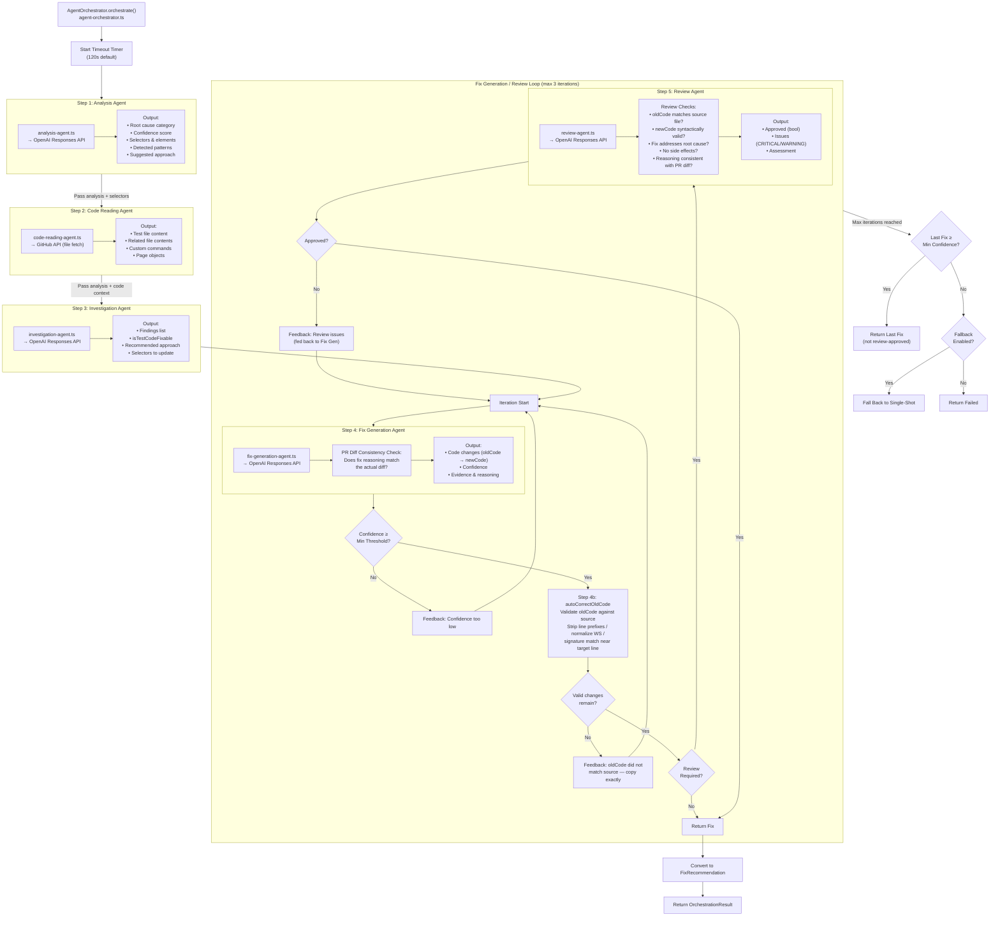
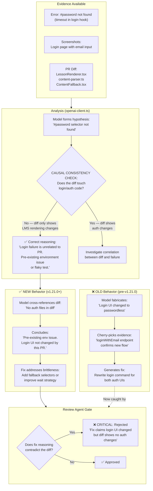
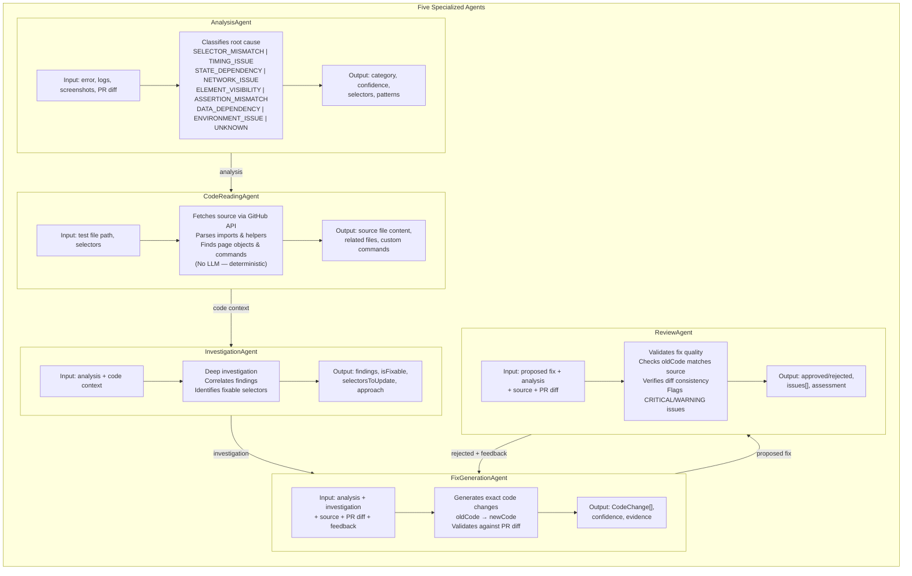

# Adept Triage Agent — Workflow Flowchart

## Main Triage Pipeline

```mermaid
flowchart TB
    subgraph TRIGGER["Trigger Sources"]
        T1["workflow_run<br/>(on: completed + failure)"]
        T2["repository_dispatch<br/>(triage-failed-test)"]
        T3["In-workflow step<br/>(if: failure())"]
    end

    TRIGGER --> GHA["GitHub Action Entry<br/>src/index.ts"]

    GHA --> INPUTS["Parse Inputs<br/>getInputs()"]
    INPUTS --> CLIENTS["Initialize Clients<br/>Octokit + OpenAIClient + ArtifactFetcher"]
    CLIENTS --> LOGS["Process Workflow Logs<br/>log-processor.ts"]

    LOGS --> FETCH_DATA
    subgraph FETCH_DATA["Data Collection"]
        direction TB
        WF_LOGS["Fetch Workflow Run Logs<br/>via GitHub API"]
        ARTIFACTS["Fetch Artifacts<br/>artifact-fetcher.ts"]
        SCREENSHOTS["Extract Screenshots<br/>(base64 encoded)"]
        PR_DIFF["Fetch PR Diff / Branch Diff<br/>via GitHub API"]
        WF_LOGS --> ARTIFACTS --> SCREENSHOTS
        WF_LOGS --> PR_DIFF
    end

    FETCH_DATA --> NULL_CHECK{Error Data<br/>Found?}
    NULL_CHECK -->|No| WF_STATUS{Workflow<br/>Still Running?}
    WF_STATUS -->|Yes| PENDING["Output: PENDING"]
    WF_STATUS -->|No| NO_DATA["Output: ERROR<br/>No error data found"]

    NULL_CHECK -->|Yes| INFRA_CHECK{"Infrastructure<br/>Failure Detected?<br/>detectInfrastructureFailure()"}

    INFRA_CHECK -->|Yes| INCONC_INFRA["Output: INCONCLUSIVE<br/>(session/browser crash)"]
    INFRA_CHECK -->|No| ANALYZE["Analyze with AI<br/>simplified-analyzer.ts"]

    ANALYZE --> AI_CALL["OpenAI Responses API<br/>gpt-5.3-codex<br/>openai-client.ts"]

    AI_CALL --> VERDICT{Verdict?}

    VERDICT -->|TEST_ISSUE| FIX_REC["Generate Fix Recommendation<br/>SimplifiedRepairAgent"]
    VERDICT -->|PRODUCT_ISSUE| CONFIDENCE_CHECK
    VERDICT -->|INCONCLUSIVE| CONFIDENCE_CHECK

    FIX_REC --> AGENTIC_CHECK{Agentic<br/>Repair Enabled?}

    AGENTIC_CHECK -->|Yes| ORCHESTRATOR
    AGENTIC_CHECK -->|No| SINGLE_SHOT["Single-Shot Repair<br/>simplified-repair-agent.ts"]

    SINGLE_SHOT --> FIX_RESULT
    ORCHESTRATOR --> FIX_RESULT

    FIX_RESULT{Fix<br/>Generated?}
    FIX_RESULT -->|Yes| AUTO_FIX_CHECK{Auto-Fix<br/>Enabled?}
    FIX_RESULT -->|No| CONFIDENCE_CHECK

    AUTO_FIX_CHECK -->|Yes| APPLY_FIX["Apply Fix<br/>fix-applier.ts"]
    AUTO_FIX_CHECK -->|No| CONFIDENCE_CHECK

    APPLY_FIX --> CREATE_BRANCH["Create Branch<br/>via GitHub API"]
    CREATE_BRANCH --> COMMIT["Commit Changes<br/>via GitHub API"]
    COMMIT --> VALIDATE_CHECK{Validation<br/>Enabled?}

    VALIDATE_CHECK -->|Yes| DISPATCH["Trigger Validation Workflow<br/>createWorkflowDispatch()"]
    VALIDATE_CHECK -->|No| CONFIDENCE_CHECK

    DISPATCH --> CONFIDENCE_CHECK

    CONFIDENCE_CHECK{Confidence ≥<br/>Threshold?}
    CONFIDENCE_CHECK -->|No| INCONCLUSIVE["Output: INCONCLUSIVE"]
    CONFIDENCE_CHECK -->|Yes| FINAL_OUTPUT["Set Success Output<br/>(verdict + fix + auto-fix results)"]
```

## Multi-Agent Orchestration Pipeline

## Causal Consistency — PR Diff Cross-Reference (v1.21.0)

Shows how the PR diff is validated against the model's reasoning at every stage.

## Repository Integration Map

```mermaid
flowchart LR
    subgraph TRIAGE["adept-triage-agent<br/>(GitHub Action)"]
        direction TB
        ACTION["action.yml<br/>Node.js 20 Runtime"]
        SRC["src/ TypeScript Source"]
        DIST["dist/ Compiled Bundle"]
    end

    subgraph CONSUMER_REPOS["Consumer Repositories"]
        direction TB

        subgraph LEARN["learn-webapp, lib-cypress-canary,<br/>lib-wdio-8-e2e-ts, lib-wdio-8-multi-remote<br/>(Consumer Repos)"]
            LW_WF["Test + triage-failed-tests.yml workflows"]
            LW_TESTS["E2E Tests<br/>• Cypress (learn-webapp, lib-cypress-canary)<br/>• WebDriverIO (lib-wdio-8-e2e-ts, multi-remote)"]
        end

        subgraph ANY_REPO["Any Repo<br/>(via examples)"]
            AR_INLINE["Inline Usage<br/>(same workflow, best-effort)"]
            AR_DISPATCH["Repository Dispatch<br/>(separate workflow)"]
            AR_WF_RUN["workflow_run Trigger<br/>(separate workflow)"]
        end
    end

    subgraph EXTERNAL["External Services"]
        OPENAI["OpenAI API<br/>gpt-5.3-codex<br/>Responses API"]
        GITHUB_API["GitHub REST API<br/>• Workflow logs<br/>• Artifacts<br/>• File content<br/>• PR diffs<br/>• Branch creation"]
        SLACK["Slack<br/>(via adept-common<br/>triage-slack-notify)"]
    end

    subgraph COMMON["adept-common<br/>(Shared Actions)"]
        DISPATCH["triage-dispatch<br/>GitHub Action"]
        TRIAGE_WF["triage-failed-tests.yml<br/>Reusable Workflow"]
        NOTIFY["triage-slack-notify<br/>GitHub Action"]
    end

    LEARN -->|"if: failure() uses triage-dispatch@main"| COMMON
    COMMON -->|"repository_dispatch: triage-failed-test"| LEARN
    LEARN -->|"all consumer repos use shared triage workflow"| COMMON
    LEARN -->|"uses: adept-at/adept-triage-agent@v1"| TRIAGE
    ANY_REPO -->|"uses: adept-at/adept-triage-agent@v1"| TRIAGE

    TRIAGE -->|"API calls"| OPENAI
    TRIAGE -->|"API calls"| GITHUB_API
    TRIAGE -->|"outputs (verdict, confidence, summary)"| COMMON
    COMMON -->|"webhook"| SLACK

    GITHUB_API -->|"logs, artifacts,<br/>screenshots, diffs"| TRIAGE
    OPENAI -->|"analysis JSON"| TRIAGE
```

## Data Flow Detail

```mermaid
flowchart LR
    subgraph INPUTS_LAYER["Inputs"]
        GH_TOKEN["GITHUB_TOKEN"]
        OAI_KEY["OPENAI_API_KEY"]
        WF_RUN_ID["WORKFLOW_RUN_ID"]
        JOB["JOB_NAME"]
        PR["PR_NUMBER + COMMIT_SHA"]
        REPO["REPOSITORY + BRANCH"]
        CONF_THRESH["CONFIDENCE_THRESHOLD"]
        FRAMEWORKS["TEST_FRAMEWORKS<br/>(cypress | webdriverio)"]
        AUTOFIX_IN["ENABLE_AUTO_FIX<br/>ENABLE_AGENTIC_REPAIR"]
    end

    subgraph COLLECTION["Data Collection Layer"]
        direction TB
        LOGS_RAW["Raw Workflow Logs"]
        SCREENSHOTS_RAW["Screenshots (PNG → base64)"]
        DIFF_RAW["PR/Branch/Commit Diff Patches"]
        ERROR_MSG["Error Messages + Stack Traces"]
        ARTIFACT_LOGS["Uploaded Test Artifact Logs"]
    end

    subgraph AI_LAYER["AI Analysis Layer"]
        direction TB
        PROMPT["Structured Prompt<br/>error + logs + screenshots + diff<br/>+ structured summary header"]
        MODEL["gpt-5.3-codex<br/>Responses API<br/>JSON output format<br/>max 16384 tokens"]
        RESPONSE["Structured JSON Response<br/>verdict + reasoning + indicators"]
    end

    subgraph OUTPUT_LAYER["Outputs"]
        direction TB
        VERDICT_OUT["verdict: TEST_ISSUE | PRODUCT_ISSUE | INCONCLUSIVE | PENDING | ERROR | NO_FAILURE"]
        CONF_OUT["confidence: 0-95"]
        REASON_OUT["reasoning: detailed explanation"]
        SUMMARY_OUT["summary: brief for PR comments"]
        JSON_OUT["triage_json: complete analysis"]
        FIX_OUT["fix_recommendation: proposed changes"]
        AUTOFIX_OUT["auto_fix_branch: branch name"]
        VALID_OUT["validation_status: pending | skipped"]
    end

    INPUTS_LAYER --> COLLECTION
    COLLECTION --> AI_LAYER
    AI_LAYER --> OUTPUT_LAYER
```

## Sub-Agent Architecture

