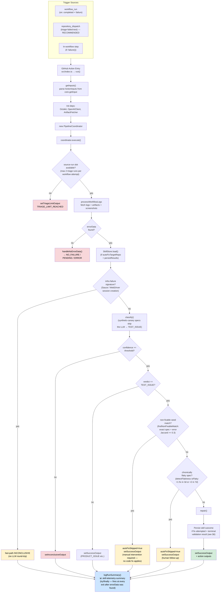
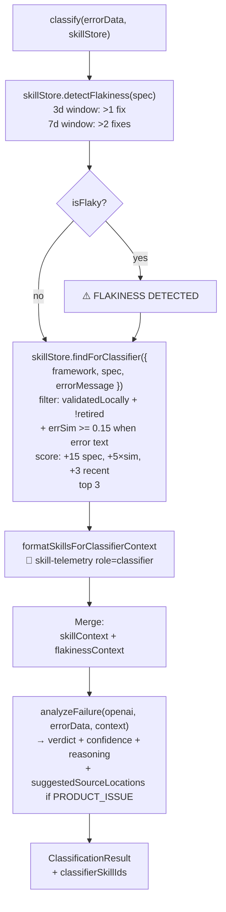
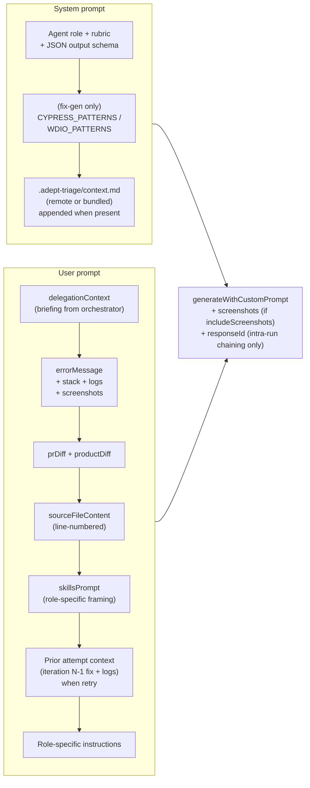
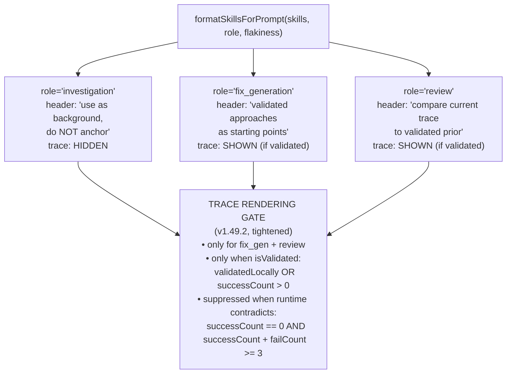
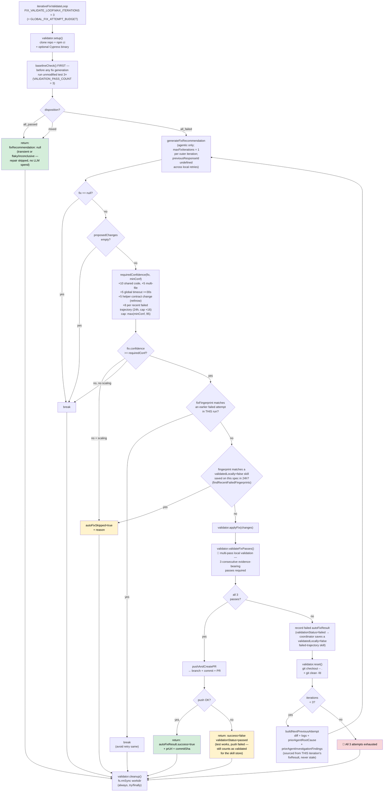
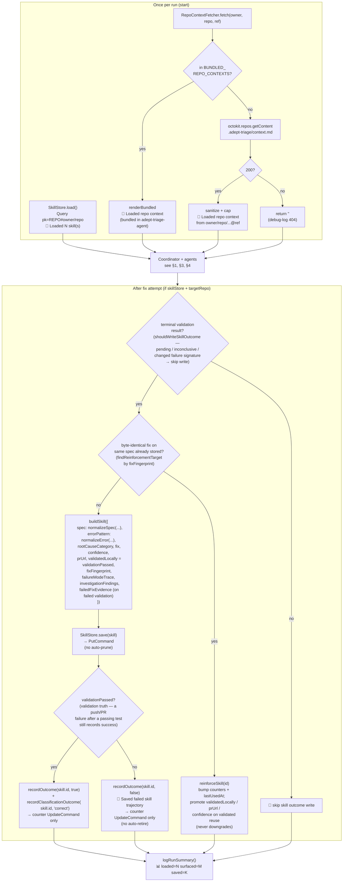
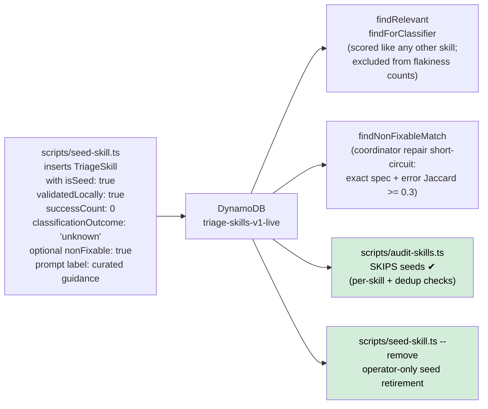
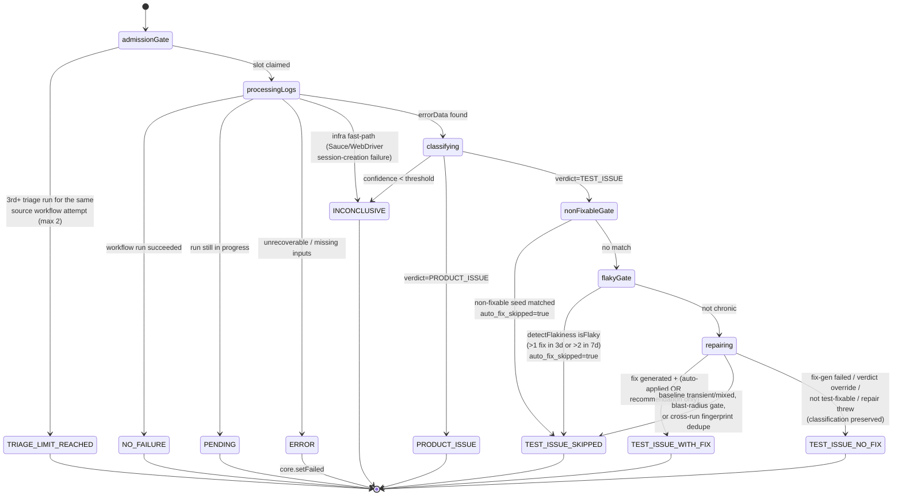
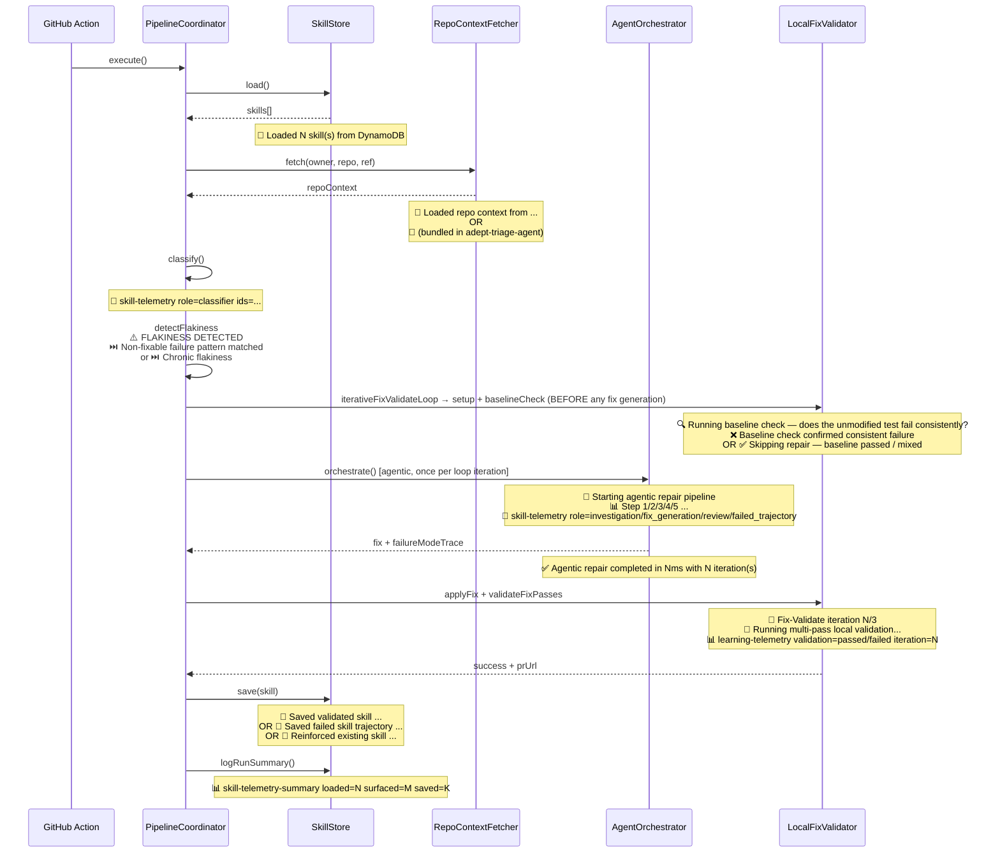

# Adept Triage Agent — Workflow Flowchart

> Visual reference for how a triage run flows end-to-end.
> For textual deep-dive, see [ARCHITECTURE.md](ARCHITECTURE.md).
> **Current version:** v1.55.2

---

## 1. Top-level: trigger → classify → repair → save skill → output

```mermaid
flowchart TB
    subgraph TRIGGER["Trigger Sources"]
        T1["workflow_run<br/>(on: completed + failure)"]
        T2["repository_dispatch<br/>(triage-failed-test) — RECOMMENDED"]
        T3["In-workflow step<br/>(if: failure())"]
    end

    TRIGGER --> GHA["GitHub Action Entry<br/>src/index.ts → run()"]

    GHA --> INPUTS["getInputs()<br/>parse ActionInputs from core.getInput"]
    INPUTS --> DEPS["Init deps:<br/>Octokit, OpenAIClient, ArtifactFetcher"]
    DEPS --> COORDINATOR["new PipelineCoordinator"]
    COORDINATOR --> EXECUTE["coordinator.execute()"]

    EXECUTE --> RUN_GATE{"source-run slot<br/>available?<br/>(max 2 triage runs per<br/>workflow attempt)"}
    RUN_GATE -- no --> LIMIT["setTriageLimitOutput<br/>TRIAGE_LIMIT_REACHED"]
    RUN_GATE -- yes --> LOGS["processWorkflowLogs<br/>fetch logs + artifacts + screenshots"]

    LOGS --> HAS_ERR{"errorData<br/>found?"}
    HAS_ERR -- no --> NO_ERR["handleNoErrorData()<br/>→ NO_FAILURE / PENDING / ERROR"]
    HAS_ERR -- yes --> SKILL_LOAD["SkillStore.load()<br/>(if autoFixTargetRepo<br/>+ persistResults)"]

    SKILL_LOAD --> INFRA{"infra failure<br/>signature?<br/>(Sauce / WebDriver<br/>session creation)"}
    INFRA -- yes --> INFRA_OUT["fast-path INCONCLUSIVE<br/>(no LLM round-trip)"]
    INFRA -- no --> CLASSIFY_STEP["classify()<br/>(synthetic-canary specs skip<br/>the LLM → TEST_ISSUE)"]

    CLASSIFY_STEP --> CONF{"confidence >=<br/>threshold?"}
    CONF -- no --> INCONCL["setInconclusiveOutput"]
    CONF -- yes --> VERDICT{"verdict ==<br/>TEST_ISSUE?"}
    VERDICT -- no --> NON_TEST["setSuccessOutput<br/>(PRODUCT_ISSUE etc.)"]
    VERDICT -- yes --> NONFIX{"non-fixable seed<br/>match?<br/>(findNonFixableMatch:<br/>exact spec + error<br/>Jaccard >= 0.3)"}
    NONFIX -- yes --> NONFIX_OUT["autoFixSkipped=true<br/>setSuccessOutput<br/>(manual intervention required —<br/>no code fix applies)"]
    NONFIX -- no --> FLAKY{"chronically<br/>flaky spec?<br/>(detectFlakiness isFlaky:<br/>&gt;1 fix in 3d or &gt;2 in 7d)"}
    FLAKY -- yes --> CHRONIC["autoFixSkipped=true<br/>setSuccessOutput<br/>(human follow-up)"]
    FLAKY -- no --> REPAIR_STEP["repair()"]

    REPAIR_STEP --> SAVE_SKILL["Persist skill outcome<br/>if fix attempted + terminal<br/>validation result (see §6)"]
    SAVE_SKILL --> OUT["setSuccessOutput<br/>+ action outputs"]

    OUT --> SUMMARY["logRunSummary()<br/>📊 skill-telemetry-summary<br/>(try/finally — fires at every<br/>exit after errorData was found)"]
    INFRA_OUT --> SUMMARY
    INCONCL --> SUMMARY
    NON_TEST --> SUMMARY
    NONFIX_OUT --> SUMMARY
    CHRONIC --> SUMMARY

    style LIMIT fill:#f8d7da,color:#000
    style CHRONIC fill:#fff3cd,color:#000
    style NONFIX_OUT fill:#fff3cd,color:#000
    style INFRA_OUT fill:#fff3cd,color:#000
    style INCONCL fill:#f8d7da,color:#000
    style NO_ERR fill:#f8d7da,color:#000
    style OUT fill:#d4edda,color:#000
    style SUMMARY fill:#cce5ff,color:#000
```

---

## 2. Classification phase

```mermaid
flowchart TB
    START["classify(errorData, skillStore)"]
    START --> FLAK_CHECK["skillStore.detectFlakiness(spec)<br/>3d window: &gt;1 fix<br/>7d window: &gt;2 fixes"]
    FLAK_CHECK --> FLAK_LOG{"isFlaky?"}
    FLAK_LOG -- yes --> WARN["⚠️ FLAKINESS DETECTED"]
    FLAK_LOG -- no --> CLASSIFIER_SKILLS

    WARN --> CLASSIFIER_SKILLS["skillStore.findForClassifier({<br/>framework, spec, errorMessage })<br/>filter: validatedLocally + !retired<br/>+ errSim >= 0.15 when error text<br/>score: +15 spec, +5×sim, +3 recent<br/>top 3"]

    CLASSIFIER_SKILLS --> RENDER["formatSkillsForClassifierContext<br/>📝 skill-telemetry role=classifier"]
    RENDER --> MERGE["Merge:<br/>skillContext + flakinessContext"]
    MERGE --> ANALYZE["analyzeFailure(openai, errorData, context)<br/>→ verdict + confidence + reasoning<br/>+ suggestedSourceLocations if PRODUCT_ISSUE"]

    ANALYZE --> RESULT["ClassificationResult<br/>+ classifierSkillIds"]
```

---

## 3. Agentic repair pipeline — the five-agent orchestrator

Happy path inside `AgentOrchestrator.orchestrate()` (`src/agents/agent-orchestrator.ts`). Wrapped in a `Promise.race` against `totalTimeoutMs = 900000` (15-minute budget for reasoning models). Every LLM stage runs on the single production model `gpt-5.6-sol` at reasoning effort `high` (`OPENAI.MODEL` via `resolveAgentModel`; precedence: explicit per-stage override > `TRIAGE_MODEL_PROFILE=gpt56-candidate` > `AGENT_MODEL` pin). Each fix/review round is additionally gated on remaining wall time (`MIN_FIX_GEN_BUDGET_MS = 180s` + `MIN_REVIEW_BUDGET_MS = 120s`).

```mermaid
flowchart TB
    START["orchestrate(context, errorData,<br/>previousResponseId usually unset,<br/>skills)"]
    START --> SKILL_PROMPT_A["context.skillsPrompt<br/>= formatSkillsForPrompt(skills, 'investigation', flakiness)<br/>(seeds + validated skills only)"]
    SKILL_PROMPT_A --> ANALYSIS["<b>Analysis Agent</b><br/>gpt-5.6-sol high<br/>→ rootCauseCategory, issueLocation,<br/>selectors, confidence"]

    ANALYSIS --> CODE_READ["<b>Code Reading Agent</b><br/>no LLM — direct octokit getContent<br/>→ test file + page objects + support files"]

    CODE_READ --> CHAIN_DECIDE{"analysis.confidence<br/>&lt; 80?"}
    CHAIN_DECIDE -- yes --> CHAIN_YES["investigationChainId =<br/>analysisResult.responseId"]
    CHAIN_DECIDE -- no --> CHAIN_NO["investigationChainId =<br/>undefined (fresh start)"]

    CHAIN_YES --> SKILL_PROMPT_I
    CHAIN_NO --> SKILL_PROMPT_I

    SKILL_PROMPT_I["context.skillsPrompt<br/>= priorInvestigationContext<br/>+ baseInvestigationSkills"]
    SKILL_PROMPT_I --> INVESTIGATION["<b>Investigation Agent</b><br/>gpt-5.6-sol high<br/>→ findings, recommendedApproach,<br/>selectorsToUpdate, isTestCodeFixable,<br/>verdictOverride?"]

    INVESTIGATION --> OVERRIDE{"verdictOverride<br/>APP_CODE or BOTH<br/>with conf >= 70?<br/>(absolute threshold)"}
    OVERRIDE -- yes --> ABORT_APP["ABORT:<br/>confident product-side override —<br/>repair would paper over<br/>a real regression"]
    OVERRIDE -- no --> TEST_FIXABLE{"isTestCodeFixable?"}
    TEST_FIXABLE -- no --> ABORT_TEST["ABORT (conservative):<br/>not test-code-fixable —<br/>fires even when a sub-threshold<br/>override exists"]
    TEST_FIXABLE -- yes --> LOOP_START

    LOOP_START["Fix/Review loop<br/>maxIterations = 3"]
    LOOP_START --> FIX_GEN["<b>Fix Generation Agent</b><br/>gpt-5.6-sol high<br/>+ CYPRESS_PATTERNS / WDIO_PATTERNS<br/>+ failed-trajectory negative evidence<br/>→ changes[], failureModeTrace (4 fields),<br/>confidence, reasoning"]

    FIX_GEN --> AUTO_CORRECT["autoCorrectOldCode<br/>(snap near-miss oldCode to source)"]

    AUTO_CORRECT --> CONF_GATE{"confidence >=<br/>70?"}
    CONF_GATE -- no --> FEEDBACK_CONF["reviewFeedback<br/>= low-confidence msg<br/>→ next iteration"]
    CONF_GATE -- yes --> REVIEW["<b>Review Agent</b><br/>gpt-5.6-sol high<br/>audits: oldCode match, trace quality,<br/>logical strengthening, APP_CODE justification,<br/>verdictOverride alignment,<br/>recommendedApproach honored"]

    REVIEW --> APPROVED{"approved +<br/>reviewer fixConfidence<br/>>= 70?"}
    APPROVED -- yes --> SHIP["return fix<br/>approach: agentic"]
    APPROVED -- no --> BLOCKING{"blocking<br/>CRITICAL?"}
    BLOCKING -- yes --> TRACE_REPLAY["reviewFeedback<br/>+ prior failureModeTrace<br/>replay → next iteration"]
    BLOCKING -- no --> REGULAR_FEEDBACK["reviewFeedback<br/>= issue lines<br/>→ next iteration"]

    FEEDBACK_CONF --> LOOP_CHECK
    TRACE_REPLAY --> LOOP_CHECK
    REGULAR_FEEDBACK --> LOOP_CHECK
    LOOP_CHECK{"iterations<br/>&lt; 3?"}
    LOOP_CHECK -- yes --> FIX_GEN
    LOOP_CHECK -- no --> MAX_ITER["max iterations (3/3)<br/>reached — review<br/>never approved<br/>(v1.52.4+)"]
    MAX_ITER --> FAIL["return error<br/>approach: failed<br/>(review approval mandatory;<br/>no fallback path)"]

    style ABORT_APP fill:#f8d7da,color:#000
    style ABORT_TEST fill:#f8d7da,color:#000
    style SHIP fill:#d4edda,color:#000
    style MAX_ITER fill:#f8d7da,color:#000
    style FAIL fill:#f8d7da,color:#000
```

---

## 4. Prompt composition — per-agent

Applied in `BaseAgent.runAgentTask` for every LLM-calling agent.

```mermaid
flowchart LR
    subgraph SYS["System prompt"]
        ROLE["Agent role + rubric<br/>+ JSON output schema"]
        PATTERNS["(fix-gen only)<br/>CYPRESS_PATTERNS /<br/>WDIO_PATTERNS"]
        REPO_CTX[".adept-triage/context.md<br/>(remote or bundled)<br/>appended when present"]
        ROLE --> PATTERNS
        PATTERNS --> REPO_CTX
    end

    subgraph USER["User prompt"]
        DELEG["delegationContext<br/>(briefing from orchestrator)"]
        ERROR["errorMessage<br/>+ stack + logs<br/>+ screenshots"]
        DIFFS["prDiff + productDiff"]
        SOURCE["sourceFileContent<br/>(line-numbered)"]
        SKILLS["skillsPrompt<br/>(role-specific framing)"]
        PRIOR["Prior attempt context<br/>(iteration N-1 fix + logs)<br/>when retry"]
        ROLE_INSTR["Role-specific instructions"]
        DELEG --> ERROR
        ERROR --> DIFFS
        DIFFS --> SOURCE
        SOURCE --> SKILLS
        SKILLS --> PRIOR
        PRIOR --> ROLE_INSTR
    end

    SYS --> OPENAI["generateWithCustomPrompt<br/>+ screenshots (if includeScreenshots)<br/>+ responseId (intra-run chaining only)"]
    USER --> OPENAI
```

### Skill-memory role framing

```mermaid
flowchart TB
    FOR_PROMPT["formatSkillsForPrompt(skills, role, flakiness)"]
    FOR_PROMPT --> INVEST_ROLE["role='investigation'<br/>header: 'use as background,<br/>do NOT anchor'<br/>trace: HIDDEN"]
    FOR_PROMPT --> FIX_ROLE["role='fix_generation'<br/>header: 'validated approaches<br/>as starting points'<br/>trace: SHOWN (if validated)"]
    FOR_PROMPT --> REV_ROLE["role='review'<br/>header: 'compare current trace<br/>to validated prior'<br/>trace: SHOWN (if validated)"]

    INVEST_ROLE --> GATE
    FIX_ROLE --> GATE
    REV_ROLE --> GATE

    GATE["TRACE RENDERING GATE<br/>(v1.49.2, tightened)<br/>• only for fix_gen + review<br/>• only when isValidated:<br/>  validatedLocally OR successCount > 0<br/>• suppressed when runtime contradicts:<br/>  successCount == 0 AND<br/>  successCount + failCount >= 3"]
```

The orchestrator pre-filters what reaches `formatSkillsForPrompt` to seeds + `validatedLocally: true` skills for every role. Failed trajectories are rendered separately via `formatFailedTrajectoriesForPrompt` (negative evidence, fix-gen + review only: "these fixes were tried and did NOT validate").

---

## 5. Local validation loop

```mermaid
flowchart TB
    START["iterativeFixValidateLoop<br/>FIX_VALIDATE_LOOP.MAX_ITERATIONS = 3<br/>(= GLOBAL_FIX_ATTEMPT_BUDGET)"]

    START --> SETUP["validator.setup()<br/>clone repo + npm ci<br/>+ optional Cypress binary"]
    SETUP --> BASELINE["baselineCheck() FIRST —<br/>before any fix generation<br/>run unmodified test 3×<br/>(VALIDATION_PASS_COUNT = 3)"]
    BASELINE --> BASELINE_DISP{"disposition?"}
    BASELINE_DISP -- all_passed --> RETURN_TRANSIENT["return:<br/>fixRecommendation: null<br/>(transient or flaky/inconclusive —<br/>repair skipped, no LLM spend)"]
    BASELINE_DISP -- mixed --> RETURN_TRANSIENT
    BASELINE_DISP -- all_failed --> GEN

    GEN["generateFixRecommendation<br/>(agentic only; maxFixIterations = 1<br/>per outer iteration;<br/>previousResponseId undefined<br/>across local retries)"]
    GEN --> NULL_CHK{"fix == null?"}
    NULL_CHK -- yes --> BREAK_EMPTY["break"]
    NULL_CHK -- no --> CHG_CHK{"proposedChanges<br/>empty?"}
    CHG_CHK -- yes --> BREAK_EMPTY
    CHG_CHK -- no --> BLAST

    BLAST["requiredConfidence(fix, minConf)<br/>+10 shared code, +5 multi-file<br/>+5 global timeout >=30s<br/>+5 helper contract change (rethrow)<br/>+8 per recent failed trajectory (24h, cap +16)<br/>cap: max(minConf, 95)"]
    BLAST --> CONF_GATE{"fix.confidence<br/>>= requiredConf?"}
    CONF_GATE -- no + scaling --> SKIPPED["autoFixSkipped=true<br/>+ reason"]
    CONF_GATE -- no, no scaling --> BREAK_EMPTY
    CONF_GATE -- yes --> DUP_CHK

    DUP_CHK{"fixFingerprint matches<br/>an earlier failed attempt<br/>in THIS run?"}
    DUP_CHK -- yes --> BREAK_DUP["break<br/>(avoid retry same)"]
    DUP_CHK -- no --> XRUN_DUP{"fingerprint matches a<br/>validatedLocally=false skill<br/>saved on this spec in 24h?<br/>(findRecentFailedFingerprints)"}
    XRUN_DUP -- yes --> SKIPPED
    XRUN_DUP -- no --> APPLY["validator.applyFix(changes)"]

    APPLY --> RUN["validator.validateFixPasses()<br/>🧪 multi-pass local validation —<br/>3 consecutive evidence-bearing<br/>passes required"]
    RUN --> TEST_PASS{"all 3<br/>passes?"}
    TEST_PASS -- yes --> PUSH["pushAndCreatePR<br/>→ branch + commit + PR"]
    PUSH --> PR_OK{"push OK?"}
    PR_OK -- yes --> RETURN_SUCCESS["return: autoFixResult.success=true<br/>+ prUrl + commitSha"]
    PR_OK -- no --> RETURN_PARTIAL["return: success=false<br/>validationStatus=passed<br/>(test works, push failed —<br/>still counts as validated<br/>for the skill store)"]

    TEST_PASS -- no --> RECORD_FAIL["record failed autoFixResult<br/>(validationStatus=failed →<br/>coordinator saves a<br/>validatedLocally=false<br/>failed-trajectory skill)"]
    RECORD_FAIL --> RESET["validator.reset()<br/>git checkout -- .<br/>+ git clean -fd"]
    RESET --> ITER_CHK{"iterations<br/>< 3?"}
    ITER_CHK -- yes --> BUILD_PRIOR["buildNextPreviousAttempt<br/>diff + logs + priorAgentRootCause<br/>+ priorAgentInvestigationFindings<br/>(sourced from THIS iteration's<br/>fixResult, never stale)"]
    BUILD_PRIOR --> GEN
    ITER_CHK -- no --> EXHAUSTED["🛑 All 3 attempts exhausted"]

    EXHAUSTED --> CLEANUP
    RETURN_SUCCESS --> CLEANUP
    RETURN_PARTIAL --> CLEANUP
    RETURN_TRANSIENT --> CLEANUP
    BREAK_EMPTY --> CLEANUP
    BREAK_DUP --> CLEANUP
    SKIPPED --> CLEANUP
    CLEANUP["validator.cleanup()<br/>fs.rmSync workdir<br/>(always, try/finally)"]

    style RETURN_SUCCESS fill:#d4edda,color:#000
    style RETURN_TRANSIENT fill:#d4edda,color:#000
    style RETURN_PARTIAL fill:#fff3cd,color:#000
    style SKIPPED fill:#fff3cd,color:#000
    style EXHAUSTED fill:#f8d7da,color:#000
```

The remote path (`attemptAutoFix`, used when `ENABLE_LOCAL_VALIDATION` is off) applies the same blast-radius gate and cross-run fingerprint dedupe, then applies the fix via the GitHub API, opens a draft PR, and optionally dispatches + awaits a remote validation workflow.

---

## 6. Learning loop — skills + repo context

```mermaid
flowchart TB
    subgraph ON_START["Once per run (start)"]
        LOAD["SkillStore.load()<br/>Query pk=REPO#owner/repo<br/>📝 Loaded N skill(s)"]
        FETCH["RepoContextFetcher.fetch(owner, repo, ref)"]
        BUNDLED{"in BUNDLED_<br/>REPO_CONTEXTS?"}
        FETCH --> BUNDLED
        BUNDLED -- yes --> BUNDLE_RENDER["renderBundled<br/>📘 Loaded repo context<br/>(bundled in adept-triage-agent)"]
        BUNDLED -- no --> REMOTE["octokit.repos.getContent<br/>.adept-triage/context.md"]
        REMOTE --> REMOTE_OK{"200?"}
        REMOTE_OK -- yes --> REMOTE_RENDER["sanitize + cap<br/>📘 Loaded repo context<br/>from owner/repo/...@ref"]
        REMOTE_OK -- no --> EMPTY["return ''<br/>(debug-log 404)"]
    end

    LOAD --> PIPELINE["Coordinator + agents<br/>see §1, §3, §4"]
    BUNDLE_RENDER --> PIPELINE
    REMOTE_RENDER --> PIPELINE
    EMPTY --> PIPELINE

    PIPELINE --> ON_SAVE

    subgraph ON_SAVE["After fix attempt (if skillStore + targetRepo)"]
        WRITE_GATE{"terminal validation<br/>result?<br/>(shouldWriteSkillOutcome —<br/>pending / inconclusive /<br/>changed failure signature<br/>→ skip write)"}
        WRITE_GATE -- no --> SKIP_WRITE["📝 skip skill outcome write"]
        WRITE_GATE -- yes --> REINF{"byte-identical fix on<br/>same spec already stored?<br/>(findReinforcementTarget<br/>by fixFingerprint)"}
        REINF -- yes --> REINFORCE["reinforceSkill(id)<br/>bump counters + lastUsedAt;<br/>promote validatedLocally / prUrl /<br/>confidence on validated reuse<br/>(never downgrades)"]
        REINF -- no --> BUILD["buildSkill({<br/>  spec: normalizeSpec(...),<br/>  errorPattern: normalizeError(...),<br/>  rootCauseCategory, fix, confidence,<br/>  prUrl, validatedLocally = validationPassed,<br/>  fixFingerprint, failureModeTrace,<br/>  investigationFindings,<br/>  failedFixEvidence (on failed validation)<br/>})"]
        BUILD --> SAVE["SkillStore.save(skill)<br/>→ PutCommand<br/>(no auto-prune)"]
        SAVE --> RECORD{"validationPassed?<br/>(validation truth — a push/PR<br/>failure after a passing test<br/>still records success)"}
        RECORD -- yes --> OUTCOME_OK["recordOutcome(skill.id, true)<br/>+ recordClassificationOutcome(<br/>  skill.id, 'correct')<br/>→ counter UpdateCommand only"]
        RECORD -- no --> OUTCOME_FAIL["recordOutcome(skill.id, false)<br/>📝 Saved failed skill trajectory<br/>→ counter UpdateCommand only<br/>(no auto-retire)"]
    end

    OUTCOME_OK --> SUMMARY["logRunSummary()<br/>📊 loaded=N surfaced=M saved=K"]
    OUTCOME_FAIL --> SUMMARY
    REINFORCE --> SUMMARY
    SKIP_WRITE --> SUMMARY
```

### Seed-skill protection

```mermaid
flowchart LR
    SEED["scripts/seed-skill.ts<br/>inserts TriageSkill<br/>with isSeed: true<br/>validatedLocally: true<br/>successCount: 0<br/>classificationOutcome: 'unknown'<br/>optional nonFixable: true<br/>prompt label: curated guidance"]

    SEED --> DYNAMO["DynamoDB<br/>triage-skills-v1-live"]

    DYNAMO --> RETRIEVAL["findRelevant<br/>findForClassifier<br/>(scored like any other skill;<br/>excluded from flakiness counts)"]
    DYNAMO --> NONFIX_GATE["findNonFixableMatch<br/>(coordinator repair short-circuit:<br/>exact spec + error Jaccard >= 0.3)"]
    DYNAMO --> AUDIT["scripts/audit-skills.ts<br/>SKIPS seeds ✔<br/>(per-skill + dedup checks)"]
    DYNAMO --> REMOVAL["scripts/seed-skill.ts --remove<br/>operator-only seed retirement"]

    style AUDIT fill:#d4edda,color:#000
    style REMOVAL fill:#d4edda,color:#000
```

---

## 7. Verdict state machine

The three `TEST_ISSUE_*` terminal states below all emit `verdict=TEST_ISSUE`; they are distinguished by the `fix_recommendation` / `auto_fix_skipped` outputs.

```mermaid
stateDiagram-v2
    [*] --> admissionGate

    admissionGate --> TRIAGE_LIMIT_REACHED : 3rd+ triage run for the same<br/>source workflow attempt (max 2)
    admissionGate --> processingLogs : slot claimed

    processingLogs --> NO_FAILURE : workflow run succeeded
    processingLogs --> PENDING : run still in progress
    processingLogs --> ERROR : unrecoverable / missing inputs
    processingLogs --> INCONCLUSIVE : infra fast-path (Sauce/WebDriver<br/>session-creation failure)
    processingLogs --> classifying : errorData found

    classifying --> INCONCLUSIVE : confidence < threshold
    classifying --> PRODUCT_ISSUE : verdict=PRODUCT_ISSUE
    classifying --> nonFixableGate : verdict=TEST_ISSUE

    nonFixableGate --> TEST_ISSUE_SKIPPED : non-fixable seed matched<br/>auto_fix_skipped=true
    nonFixableGate --> flakyGate : no match

    flakyGate --> TEST_ISSUE_SKIPPED : detectFlakiness isFlaky<br/>(>1 fix in 3d or >2 in 7d)<br/>auto_fix_skipped=true
    flakyGate --> repairing : not chronic

    repairing --> TEST_ISSUE_WITH_FIX : fix generated + (auto-applied OR recommendation only)
    repairing --> TEST_ISSUE_SKIPPED : baseline transient/mixed, blast-radius gate,<br/>or cross-run fingerprint dedupe
    repairing --> TEST_ISSUE_NO_FIX : fix-gen failed / verdict override /<br/>not test-fixable / repair threw<br/>(classification preserved)

    TRIAGE_LIMIT_REACHED --> [*]
    NO_FAILURE --> [*]
    PENDING --> [*]
    ERROR --> [*] : core.setFailed
    INCONCLUSIVE --> [*]
    PRODUCT_ISSUE --> [*]
    TEST_ISSUE_WITH_FIX --> [*]
    TEST_ISSUE_SKIPPED --> [*]
    TEST_ISSUE_NO_FIX --> [*]
```

---

## 8. Log-line quick reference

Top-level spans every stage. Useful for `grep` in CI logs.

```mermaid
sequenceDiagram
    participant GHA as GitHub Action
    participant Coord as PipelineCoordinator
    participant Store as SkillStore
    participant Fetcher as RepoContextFetcher
    participant Orch as AgentOrchestrator
    participant Val as LocalFixValidator

    GHA->>Coord: execute()
    Coord->>Store: load()
    Store-->>Coord: skills[]
    Note over Store: 📝 Loaded N skill(s) from DynamoDB
    Coord->>Fetcher: fetch(owner, repo, ref)
    Fetcher-->>Coord: repoContext
    Note over Fetcher: 📘 Loaded repo context from ...<br/>OR<br/>📘 (bundled in adept-triage-agent)

    Coord->>Coord: classify()
    Note over Coord: 📝 skill-telemetry role=classifier ids=...
    Coord->>Coord: detectFlakiness<br/>⚠️ FLAKINESS DETECTED<br/>⏭️ Non-fixable failure pattern matched<br/>or ⏭️ Chronic flakiness

    Coord->>Val: iterativeFixValidateLoop → setup + baselineCheck (BEFORE any fix generation)
    Note over Val: 🔍 Running baseline check — does the unmodified test fail consistently?<br/>❌ Baseline check confirmed consistent failure<br/>OR ✅ Skipping repair — baseline passed / mixed

    Coord->>Orch: orchestrate() [agentic, once per loop iteration]
    Note over Orch: 🤖 Starting agentic repair pipeline<br/>📊 Step 1/2/3/4/5 ...<br/>📝 skill-telemetry role=investigation/fix_generation/review/failed_trajectory
    Orch-->>Coord: fix + failureModeTrace
    Note over Orch: ✅ Agentic repair completed in Nms with N iteration(s)

    Coord->>Val: applyFix + validateFixPasses
    Note over Val: 🔄 Fix-Validate iteration N/3<br/>🧪 Running multi-pass local validation...<br/>📊 learning-telemetry validation=passed/failed iteration=N

    Val-->>Coord: success + prUrl

    Coord->>Store: save(skill)
    Note over Store: 📝 Saved validated skill ...<br/>OR 📝 Saved failed skill trajectory ...<br/>OR 📝 Reinforced existing skill ...

    Coord->>Store: logRunSummary()
    Note over Store: 📊 skill-telemetry-summary loaded=N surfaced=M saved=K
```

---

**Related**

- [ARCHITECTURE.md](ARCHITECTURE.md) — textual deep-dive.
- [../USAGE_GUIDE.md](../USAGE_GUIDE.md) — operator cookbook.
- [../README.md](../README.md) — features + inputs/outputs table.
