# Skill Store Demo Walkthrough

**Run:** `wdio-9-bidi-mux3` / [24835972873](https://github.com/adept-at/wdio-9-bidi-mux3/actions/runs/24835972873)
**Date:** April 23, 2026
**Outcome:** Skills loaded → surfaced to 3 of 4 LLM agent stages → fix generated → fix applied → validation passed → **PR #78 merged**

This document captures the strongest end-to-end evidence available that the triage agent reads from and writes to the DynamoDB skill store on real production runs. Use it as the source of truth for demos, screenshots, and narration.

---

## TL;DR

> The triage agent reads from a DynamoDB skill store before classifying a test failure, surfaces those skills to three independent LLM agent stages (investigation, fix-generation, review), and the fix it generates gets validated and merged into production code. Every step has a grep-able log line and a public URL behind it.

| Metric | Value |
|---|---|
| Triage start → fix applied | **80 seconds** (12:45:31 → 12:46:51 UTC) |
| Triage start → PR merged | **2h 53m** (most of that is human review of the PR) |
| Skills loaded from DynamoDB | 2 |
| Skills surfaced to LLM prompts | 2 (across investigation + fix-gen + review) |
| New skills written back | 1 |
| Files changed in merged PR | 1 (`test/pageobjects/adept.video.player.ts`, +20/−7) |

---

## Flow Chart

```mermaid
flowchart TD
    A[("⏰ Scheduled run<br/><b>video transcripts workflow</b><br/>24835888362<br/>12:43:46Z")] -->|"Edge fails:<br/>'Transcript entries did not appear after 30s'<br/>(Firefox passed in same run)"| B

    B[("🚨 Triage workflow dispatched<br/><b>adept-triage-agent v1</b><br/>24835972873<br/>12:45:31Z")] --> C

    C["📥 Context gathering<br/>• Fetch commit diff (1 file, +244/−111)<br/>• Fetch product diff (57 files)<br/>• Pull 1 screenshot<br/>• Read 1.2MB artifact logs"] --> D

    D[/"📝 <b>Loaded 2 skill(s) from DynamoDB</b><br/>(triage-skills-v1-live)<br/>line 216 • 12:45:39"/]:::dynamo --> E

    E["🧠 Classifier (gpt-5.3-codex)<br/>verdict: TEST_ISSUE @ 95%"] --> F

    F[/"📝 <b>skill-telemetry role=investigation</b><br/>count=2 ids=99ed0d7e..., d88c016d...<br/>line 223 • 12:45:50"/]:::dynamo --> G

    G["🤖 Agentic repair pipeline starts"] --> G1

    G1["📊 Analysis Agent (8s)<br/>root cause: DATA_DEPENDENCY @ 96%"] --> G2
    G2["📖 Code Reading Agent (2s)<br/>fetched 3 files"] --> G3

    G3[/"📝 <b>skill-telemetry role=investigation</b><br/>count=2 ids=99ed0d7e..., d88c016d...<br/>line 251 • 12:46:00"/]:::dynamo --> G4

    G4["🔍 Investigation Agent (18s)<br/>findings: 3<br/>test code fixable: true<br/>recommendation: handle empty transcript state"] --> G5

    G5[/"📝 <b>skill-telemetry role=fix_generation</b><br/>count=2 ids=99ed0d7e..., d88c016d...<br/>line 259 • 12:46:18"/]:::dynamo --> G6

    G6["🔧 Fix Generation Agent (21s)<br/>2 changes proposed @ 96% confidence<br/>1 SELECTOR_UPDATE + 1 LOGIC_CHANGE"] --> G7

    G7[/"📝 <b>skill-telemetry role=review</b><br/>count=2 ids=99ed0d7e..., d88c016d...<br/>line 293 • 12:46:39"/]:::dynamo --> G8

    G8["✅ Review Agent (10s)<br/>approved on iteration 1<br/>reviewer confidence: 90%"] --> H

    H["📝 Auto-fix applied<br/>branch: fix/triage-agent/test-pageobjects-adept-video-player-ts-20260423-625<br/>commit: c77e02e<br/>line 320 • 12:46:51"] --> I

    I["🧪 Validation workflow triggered<br/>validate-fix.yml<br/>runs --b=firefox,edge against production"] --> J

    J[/"📝 <b>Saved skill 87abeb98 to DynamoDB</b><br/>(3 total in partition)<br/>line 337 • 12:46:58"/]:::dynamo --> K

    K[/"📊 <b>skill-telemetry-summary</b><br/>loaded=2 surfaced=2 saved=1<br/>line 360 • 12:46:58"/]:::dynamo --> L

    L[("✅ Validation run<br/>24836037758<br/>passes in 1m23s")] --> M

    M[("🚀 <b>PR #78 MERGED</b><br/>by Phil Merwin<br/>20 additions / 7 deletions<br/>15:38:13Z (3h after fix)")]:::merged

    classDef dynamo fill:#fef3c7,stroke:#d97706,stroke-width:2px,color:#92400e
    classDef merged fill:#d1fae5,stroke:#059669,stroke-width:3px,color:#065f46
```



---

## Step-by-Step Walkthrough with Evidence

All log line numbers reference the unzipped triage log file. Reproduce locally with:

```bash
gh api "repos/adept-at/wdio-9-bidi-mux3/actions/runs/24835972873/logs" > /tmp/run.zip
unzip -p /tmp/run.zip "0_triage _ triage.txt" | sed -n '216,360p'
```

### Phase 1 — The originating failure (12:43:46Z)

The scheduled `video transcripts` workflow ([run 24835888362](https://github.com/adept-at/wdio-9-bidi-mux3/actions/runs/24835888362)) ran the test `should play video with transcripts` on Sauce Labs against `--b=firefox,edge`.

- **Firefox**: PASSED (found 14 transcript entries)
- **Edge**: FAILED with `Transcript entries (role="button" aria-label^="Jump to timestamp") did not appear after 30s`

The Edge browser landed on a video with no transcript data, so the product showed `"No transcript for this video! Please contact your learning administrator."` and the test's 30-second wait for transcript cue buttons timed out.

That run's failure dispatched the triage workflow.

### Phase 2 — Triage starts and gathers context (12:45:31 → 12:45:39, 8s)

Triage agent v1.51.x (commit `c92e3a7`) starts. Inputs from log lines 36–57:

| Input | Value |
|---|---|
| `repository` | `adept-at/wdio-9-bidi-mux3` |
| `spec` | `./test/specs/skills/skill.video.transcripts.ts` |
| `commit-sha` | `da3d690e424439be7d003de9678a629dda9ba8a1` |
| `enable-auto-fix` | `true` |
| `enable-validation` | `true` |
| `product-repo` | `adept-at/learn-webapp` (for context) |

Then it pulls every piece of context the LLM agents will need:

- **Test repo diff** (line 175): 1 file, +244/−111 — the failing pageobject was just heavily refactored
- **Product repo diff** (line 203): 57 files changed, +8780/−918 (last 5 commits of `learn-webapp`)
- **Screenshot** (line 169): `should-play-video-with-transcripts.png`
- **Artifact logs** (line 182): 1.2 MB of WDIO/Sauce log output

### Phase 3 — Skill store read (12:45:39Z) ← **THE MOMENT THAT MATTERS**

```text
line 216 | 12:45:39  📝 Loaded 2 skill(s) from DynamoDB (triage-skills-v1-live) for adept-at/wdio-9-bidi-mux3
```

This is the first DynamoDB read. The agent loaded **2 skills** from partition `REPO#adept-at/wdio-9-bidi-mux3`. Their IDs are `99ed0d7e-d4d2-4c2a-8275-7479129cfbe7` and `d88c016d-666f-4004-896c-3ce2d2290fc3` (revealed in the next telemetry line).

### Phase 4 — Classification (12:45:39 → 12:45:50, 11s)

The classifier (gpt-5.3-codex) is invoked with the screenshot, error text, and the rendered skill context. It returns `TEST_ISSUE` at 95% confidence.

```text
line 223 | 12:45:50  📝 skill-telemetry role=investigation count=2 ids=99ed0d7e-d4d2-4c2a-8275-7479129cfbe7,d88c016d-666f-4004-896c-3ce2d2290fc3
```

This is the **first proof** the agent didn't just load skills, it actually rendered them into a model's prompt. The grep-stable `skill-telemetry` line emits *only* when `formatSkillsForPrompt` actually serializes skills into a prompt — see `src/services/skill-store.ts:166`.

### Phase 5 — Agentic repair pipeline (12:45:50 → 12:46:49, 59s)

Five LLM-powered agents run in sequence. Three of them get the skill data:

#### Step 1 — Analysis Agent (12:45:50 → 12:45:58, 8s)

```text
line 233-234 | Root cause: DATA_DEPENDENCY
              | Confidence: 96%
```

#### Step 2 — Code Reading Agent (12:45:58 → 12:46:00, 2s)

Fetches 3 files: the pageobject, `wdio.conf.ts`, and `page.ts`.

#### Step 3 — Investigation Agent (12:46:00 → 12:46:18, 18s)

```text
line 251 | 12:46:00  📝 skill-telemetry role=investigation count=2 ids=99ed0d7e...,d88c016d...
line 254 | 12:46:18  [InvestigationAgent] Completed in 18152ms
line 256 |              Test code fixable: true
line 257 |              Recommended approach: Make the transcript test deterministic by controlling
                       data or branching on transcript availability...
```

This is **second proof** — skills surfaced again, this time to the Investigation Agent's specific prompt.

#### Step 4 — Fix Generation Agent (12:46:18 → 12:46:39, 21s)

```text
line 259 | 12:46:18  📝 skill-telemetry role=fix_generation count=2 ids=99ed0d7e...,d88c016d...
line 261 | 12:46:39  [FixGenerationAgent] Completed in 21120ms
line 262 |              Confidence: 96%
line 263 |              Changes: 2
line 265 |              Change 1: test/pageobjects/adept.video.player.ts:656 (SELECTOR_UPDATE)
line 274 |              Change 2: test/pageobjects/adept.video.player.ts:674 (LOGIC_CHANGE)
```

**Third proof** — skills surfaced to the Fix Generation Agent. The agent proposes:

1. Add a new selector for the empty-transcript state
2. Change the wait predicate to accept either cue buttons OR the empty-state message

#### Step 5 — Review Agent (12:46:39 → 12:46:49, 10s)

```text
line 293 | 12:46:39  📝 skill-telemetry role=review count=2 ids=99ed0d7e...,d88c016d...
line 296 | 12:46:49     Approved: true
line 298 |              Fix confidence from reviewer: 90%
line 304 |              ✅ Fix APPROVED by Review Agent on iteration 1
```

**Fourth proof** — same skills, now in the Review Agent's prompt. Approved on first iteration.

### Phase 6 — Auto-fix applied (12:46:49 → 12:46:51, 2s)

```text
line 315 | 12:46:51  Created branch: fix/triage-agent/test-pageobjects-adept-video-player-ts-20260423-625
line 317 |           Modified: test/pageobjects/adept.video.player.ts
line 319 |           Commit SHA: c77e02e6e0bdf277fd81c12049e6bf3870d8f699
line 320 | 12:46:51  ✅ Auto-fix applied successfully!
```

The agent created a branch in the consumer repo and committed the fix. Verify the commit:

```bash
gh api repos/adept-at/wdio-9-bidi-mux3/commits/c77e02e6e0bdf277fd81c12049e6bf3870d8f699 \
  --jq '.commit.message'
# → "fix(test): Adds a selector for the explicit product empty-tra
#     Automated fix generated by adept-triage-agent.
#     Files: test/pageobjects/adept.video.player.ts
#     Confidence: 96%"
```

### Phase 7 — Validation triggered (12:46:51 → 12:46:58)

```text
line 327 | 12:46:51  Triggering validation workflow: validate-fix.yml
line 329 |             Branch: fix/triage-agent/test-pageobjects-adept-video-player-ts-20260423-625
line 330 |             Spec: ./test/specs/skills/skill.video.transcripts.ts
line 331 |             Preview URL: https://learn.adept.at
line 334 | 12:46:58  Validation workflow run ID: 24836037758
```

The agent dispatched [validate-fix.yml run 24836037758](https://github.com/adept-at/wdio-9-bidi-mux3/actions/runs/24836037758) which re-ran the test on Edge + Firefox against the production URL with the candidate fix applied.

### Phase 8 — Skill written back & summary (12:46:58Z)

```text
line 337 | 12:46:58  📝 Saved skill 87abeb98-8633-4bcc-b9f4-9e3455a40a6f to DynamoDB (3 total)
line 360 | 12:46:58  📊 skill-telemetry-summary loaded=2 surfaced=2 saved=1
```

A new skill was written back to DynamoDB capturing this run's investigation findings + fix pattern, so the **next** failure on this spec/error shape benefits from this run's learnings. End-of-run summary confirms the full learning loop closed: **2 in, 2 used, 1 out**.

### Phase 9 — Validation passes & PR merges

- **Validation run 24836037758**: ✓ completed in **1m23s** ([validation run on GitHub](https://github.com/adept-at/wdio-9-bidi-mux3/actions/runs/24836037758))
- **PR #78**: opened by triage agent at 12:48:17Z, **merged by Phil Merwin at 15:38:13Z** ([PR #78 on GitHub](https://github.com/adept-at/wdio-9-bidi-mux3/pull/78))
- Final diff: **20 additions / 7 deletions** in `test/pageobjects/adept.video.player.ts`

---

## One-Command Demo Reproduction

For a video — drop this into a terminal during the demo to show the evidence live:

```bash
RUN=24835972873
REPO=adept-at/wdio-9-bidi-mux3
gh api "repos/$REPO/actions/runs/$RUN/logs" > /tmp/run.zip 2>/dev/null
unzip -p /tmp/run.zip "0_triage _ triage.txt" \
  | grep -E "📝 Loaded.*DynamoDB|skill-telemetry|✅ Auto-fix applied|Saved skill|Validation workflow URL"
```

Expected output (the entire skill-store story in 7 lines):

```text
📝 Loaded 2 skill(s) from DynamoDB (triage-skills-v1-live) for adept-at/wdio-9-bidi-mux3
📝 skill-telemetry role=investigation count=2 ids=99ed0d7e...,d88c016d...
📝 skill-telemetry role=investigation count=2 ids=99ed0d7e...,d88c016d...
📝 skill-telemetry role=fix_generation count=2 ids=99ed0d7e...,d88c016d...
📝 skill-telemetry role=review count=2 ids=99ed0d7e...,d88c016d...
✅ Auto-fix applied successfully!
📝 Saved skill 87abeb98-8633-4bcc-b9f4-9e3455a40a6f to DynamoDB (3 total)
📊 skill-telemetry-summary loaded=2 surfaced=2 saved=1
```

Then: open <https://github.com/adept-at/wdio-9-bidi-mux3/pull/78> in the browser to show the merged human-approved PR.

---

## Suggested Demo Narration (90 seconds)

> *"At 12:45:39 UTC on April 23, our triage agent received a failed test from Sauce Labs. Before doing anything else — before even classifying the failure — it queried our DynamoDB skill store and pulled two relevant skills for this repo. Watch the log line: `Loaded 2 skills from DynamoDB`."*
>
> *"Those two skills then traveled with the request through three independent LLM agents — investigation, fix generation, and review. You can see them surfacing into each prompt — `skill-telemetry role=investigation`, then `role=fix_generation`, then `role=review`. Each agent saw what prior runs had learned about this test and this repo before forming its own judgment."*
>
> *"The fix-generation agent proposed two changes — a new selector and a smarter wait condition. The review agent approved on the first iteration. The auto-fix was applied as a branch and validated against production. Validation passed. Three hours later, a human merged the PR."*
>
> *"And on the way out, the agent wrote a NEW skill back to DynamoDB, capturing what this run learned, so the next failure on this spec benefits from it. Two skills in, two skills used, one skill out. That's the closed loop."*

---

## Reference: Grep-Stable Telemetry Markers

These are the log lines the agent emits — stable across releases and dashboards, so they're safe to grep on indefinitely.

| Marker | Source | Emitted when |
|---|---|---|
| `📝 Loaded N skill(s) from DynamoDB (<table>) for <owner>/<repo>` | `src/services/skill-store.ts:431` | At every run start, after the partition scan |
| `📝 skill-telemetry role=<role> count=<n> ids=<id1>,<id2>,...` | `src/services/skill-store.ts:166` (`logSkillTelemetry`) | When `formatSkillsForPrompt` actually serializes skills into a prompt for `<role>` ∈ `investigation`, `fix_generation`, `review`, `classifier` |
| `📝 N skill(s) available from prior runs` | `src/agents/agent-orchestrator.ts:396` | When the orchestrator hands skills to the investigation agent |
| `📝 Saved skill <id> to DynamoDB (<count> total)` | `src/services/skill-store.ts:518` | When a new skill record is persisted |
| `📊 skill-telemetry-summary loaded=N surfaced=M saved=K` | `src/services/skill-store.ts:861` (`logRunSummary`) | Once per run, in the coordinator's finally block |

## Reference: Public URLs

| Asset | URL |
|---|---|
| Originating failed test run | <https://github.com/adept-at/wdio-9-bidi-mux3/actions/runs/24835888362> |
| Triage run | <https://github.com/adept-at/wdio-9-bidi-mux3/actions/runs/24835972873> |
| Validation run | <https://github.com/adept-at/wdio-9-bidi-mux3/actions/runs/24836037758> |
| Auto-fix branch | `fix/triage-agent/test-pageobjects-adept-video-player-ts-20260423-625` |
| Auto-fix commit | <https://github.com/adept-at/wdio-9-bidi-mux3/commit/c77e02e6e0bdf277fd81c12049e6bf3870d8f699> |
| **Merged PR** | **<https://github.com/adept-at/wdio-9-bidi-mux3/pull/78>** |
